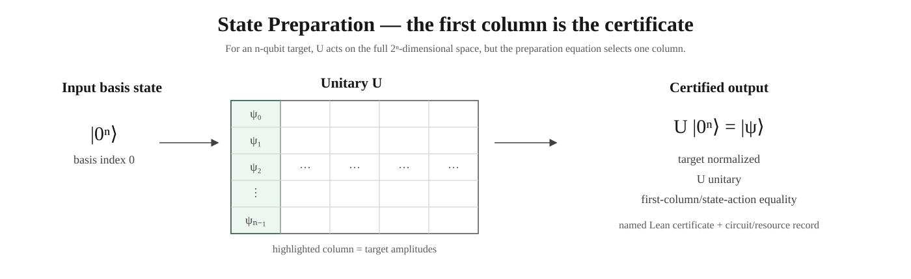
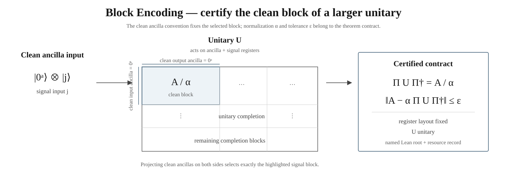
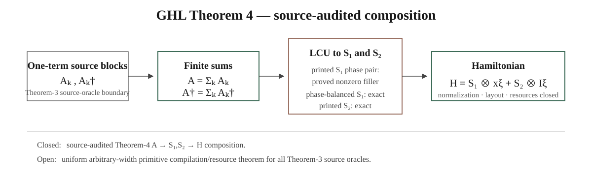

<div align="center">

# ASPBE

### Automatic State Preparation and Block Encoding for Quantum Computing

**From a mathematical state/operator contract to a construction, a human-readable proof, a named Lean certificate, and optional executable artifacts.**

[](https://lean-lang.org/)
[](https://github.com/leanprover-community/mathlib4)
[](https://www.ibm.com/quantum/qiskit)
[](https://dakebu.github.io/Quantum-Computing-Block-Encoding/)
[](LICENSE)

[**Read QuantumComputinglib**](https://dakebu.github.io/Quantum-Computing-Block-Encoding/) ·
[**Example cases**](https://dakebu.github.io/Quantum-Computing-Block-Encoding/example-cases/) ·
[**Lean Library Explorer**](https://dakebu.github.io/Quantum-Computing-Block-Encoding/library/) ·
[**Implementation Map**](https://dakebu.github.io/Quantum-Computing-Block-Encoding/implementation-map/)

</div>

---

## News 🔥

- **April 2026.** The ASPBE/QBE project was already in its conception and early-prototyping stage. This date is retained as project history; it predates the repository's first public/auditable Git timestamp and is therefore not presented as an April public-commit claim.
- **17 May 2026.** The repository's public, auditable record begins with the [initial automation commit `af59b03`](https://github.com/DakeBU/Quantum-Computing-Block-Encoding/commit/af59b03c58c2cedec52b14a80b4d909031d62521) and the timestamped [`MANIFEST.md`](MANIFEST.md). The manifest records the first QBE initialization, agent brief, Lean/LaTeX conversion window, multi-agent run cycles, reviewer handoffs, and trial-memory entries from 17–18 May 2026.
- **May 2026.** The early repository already framed the goal as turning quantum-oracle assumptions into concrete gate-level matrices and Lean-checked block-encoding certificates, with faithful-paper versus exploratory-construction modes. The May history remains available in the Git record even though the public name and website were redesigned later.

These News items intentionally preserve the **early project chronology**. Routine recent engineering and website updates are not added here; current mathematical status is generated from the checkout and shown in QuantumComputinglib and the Implementation Map.

---

ASPBE is designed for a quantum-computing researcher who knows **what state or operator is needed** and **what query oracles are available**, but does not want to hand-design every circuit and proof from scratch.

The project serves two **independent** mathematical routes. State Preparation asks for a unitary that prepares a target state. Block Encoding asks for a larger unitary whose clean projected block equals a scaled target operator.

<p align="center">
  
</p>

> **For block-encoding / state-preparation researchers.** Give ASPBE the target state/operator, available query oracles/gates, register convention, exact/approximate tolerance, and resource priorities. ASPBE evolves **certifiable** candidates and keeps the best candidate it finds under your **lexicographic objective**: optimize priority #1 first; only on ties compare #2, then #3, and so on. It never calls an unproved candidate globally optimal. Outputs can include copyable circuit LaTeX/quantikz, a natural-language derivation, Lean source/proof, and Qiskit/OpenQASM.
>
> **Use it:** [Run with your API →](https://dakebu.github.io/Quantum-Computing-Block-Encoding/task-builder/) · [Use this repo in ChatGPT Work / Claude Code →](AGENTS.md) · [Browse certified cases →](https://dakebu.github.io/Quantum-Computing-Block-Encoding/example-cases/)

---

## ASPBE harness — proof-gated synthesis

ASPBE freezes the mathematical contract, reuses certified formal memory, searches the global proof frontier with generalist Workers, and promotes a construction only after its source, semantic, Lean, integration, and exposition obligations pass.

<p align="center">
  
</p>

**Loop:** contract → formal memory → independent frontier work → mechanical verification → certified LaTeX + Lean + optional circuit/Qiskit outputs.

**Semantic fidelity gate:** every promoted theorem also passes **original text → Lean → blind Lean-only reconstruction**; ASPBE checks normalization/register/ancilla/error/oracle semantics, and any mismatch becomes a **review-gated repair proposal**, never an automatic source edit.

[**Compare the previous and current Harness on QuantumComputinglib →**](https://dakebu.github.io/Quantum-Computing-Block-Encoding/workflow/index.html) · [Protocol details](HARNESS.md)

---

## Route I — State Preparation

**Input.** A normalized target state `|ψ⟩`, the allowed gate/oracle model, and the resources that matter for the application.

**Goal.** Construct a unitary `U` satisfying

```math
U |0^n\rangle = |\psi\rangle.
```

A complete certificate establishes **target normalization**, **unitarity of U**, **the state-action equality**, and the declared circuit/resource record.

<p align="center">
  
</p>

The picture is the finite-matrix form of the same statement: acting on the all-zero basis vector selects column zero of `U`, so the highlighted column must equal the target amplitudes.

### Small complete examples

The textbook route already contains fully checked one-qubit examples:

```math
X|0\rangle = |1\rangle, \qquad H|0\rangle = \frac{|0\rangle + |1\rangle}{\sqrt{2}}.
```

`pauliXVerified` and `hadamardVerified` package the normalized target, Mathlib unitarity proof, state-action theorem, circuit, schedule, and resource record.

[Read the State Preparation chapters →](https://dakebu.github.io/Quantum-Computing-Block-Encoding/state-preparation/)

---

## Route II — Block Encoding

**Input.** An operator `A`, normalization `α`, error tolerance `ε`, the clean ancilla/register convention, the available query oracles, and resource priorities.

**Goal.** Construct a larger unitary `U` satisfying

```math
\lVert A - \alpha \Pi U \Pi^\dagger \rVert \le \varepsilon.
```

For an exact block encoding, `ε = 0`. A complete certificate establishes **register layout**, **unitarity**, **the clean projected block**, **normalization/error**, and the declared resource record.

<p align="center">
  
</p>

The highlighted matrix block is the mathematical object that matters. ASPBE therefore treats register order and the clean ancilla convention as part of the theorem statement, rather than as implementation comments.

### Reusable construction routes

The Lean library contains reusable interfaces and proof leaves for:

- finite and partial permutations;
- one-sparse and structured sparse access;
- LCU and weighted sums;
- products and tensor constructions;
- rational Householder completions;
- Hermitian dilation;
- exact/approximate clean-block promotion;
- typed QSVT consumer boundaries;
- deterministic resource comparison.

[Read the Block Encoding chapters →](https://dakebu.github.io/Quantum-Computing-Block-Encoding/block-encoding/)

---

## Certified block-encoding cases

The examples below are not screenshots of exploratory runs: the advertised mathematical conclusions are linked to named Lean roots.

### BE Case 1 — transfer operator

The target is the finite non-unitary transfer

```math
E_1 = (|0\rangle\langle 1|)_t \otimes (|0\rangle\langle 1|)_s \otimes I_2, \qquad \langle 0|_a U |0\rangle_a = E_1.
```

Inside one expanded logical resource tier, Lean-certified candidates improve

```math
(6,5,1,0) \longrightarrow (4,4,1,0) \longrightarrow (4,2,1,0).
```

The tuple records **gate count, depth, auxiliary qubits, unresolved oracle calls**.

<p align="center">
  
</p>

**Lean roots:** `coldE1Candidate_blockProjection`, `proEqTransferVerified`, `evolvedEqFlipVerified`.

### BE Case 2 — cubic diagonal operator

Let `N = 2^n`. The target is diagonal, so it is safest to state it entrywise:

```math
(D_n)_{jj} = (j/N)^3, \qquad (D_n)_{jk} = 0 \; (j \ne k), \qquad \Pi U_n \Pi^\dagger = D_n.
```

The selected exact family uses **rational Householder completions**. The cold route constructs the cubic branch directly. The hinted route first certifies a linear diagonal supplier:

```math
(O_0)_{jj} = j/N, \qquad (O_0)_{jk} = 0 \; (j \ne k), \qquad D_n = O_0^3.
```

Both routes lead to the same exact cubic Householder root with `α = 1`.

<p align="center">
  
</p>

**Lean root:** `CubicDiagonalOracle.cubicDiagonalHouseholderExactBEContract_complete`.

A finite Qiskit/OpenQASM instance is an implementation export; it is not the proof of the arbitrary-`n` symbolic family.

### GHL Robin — source-audited Theorem 4

The compiled one-dimensional composition follows

```math
A = \sum_k A_k, \qquad A^\dagger = \sum_k A_k^\dagger, \qquad H = S_1 \otimes x_\xi + S_2 \otimes I_\xi.
```

<p align="center">
  
</p>

**Closed in Lean:** the finite-sum/adjoint bridge, the `S₁/S₂` clean-block algebra, final Hamiltonian composition, normalization/layout/resource records, and the source-phase audit.

**Remaining compiler frontier:** uniform arbitrary-width primitive compilation and the claimed resource theorem for the Theorem-3 source oracles.

The source audit also records a genuine subtlety: under a literal full-clean-matrix reading, the first printed `S₁` LCU phase pair leaves a nonzero filler block. Lean proves that obstruction and separately proves a phase-balanced correction giving the intended `S₁`.

<details>
<summary><strong>Replay the public cases</strong></summary>

```bash
python3 tools/replay_public_cases.py
```

The machine-readable record is [`reports/public-case-replay/latest.json`](reports/public-case-replay/latest.json). It reruns the relevant Lean modules and executable exports. Certification still comes from the named Lean roots.

</details>

---

## What the library certifies today

**State Preparation.** Complete Pauli X and Hadamard examples; reusable exact/approximate preparation records; first-column/state-action bridges.

**Block Encoding.** Exact/approximate clean blocks; permutation, sparse, LCU/product, Householder and dilation routes; resources and typed consumers; certified finite and symbolic-family cases.

**Paper-facing formalization.** Source-linked Lean statements, source audits, and explicit compiler frontiers. A compiled local declaration is never silently promoted to a paper-wide reproduction.

For exact status, use the generated [Implementation Map](https://dakebu.github.io/Quantum-Computing-Block-Encoding/implementation-map/).

<details>
<summary><strong>Recent milestones</strong></summary>

- **15 August 2026:** Concept / Math / Lean reading modes and the source-audited GHL Theorem-4 route.
- **12 August 2026:** complete Mathlib-backed Pauli X and Hadamard State Preparation certificates.
- **10 August 2026:** project name **ASPBE** and public library/site name **QuantumComputinglib**.
- **July 2026:** Verso Blueprint and searchable Lean Library Explorer.
- **17 May 2026:** public auditable history begins with commit [`af59b03`](https://github.com/DakeBU/Quantum-Computing-Block-Encoding/commit/af59b03c58c2cedec52b14a80b4d909031d62521) and [`MANIFEST.md`](MANIFEST.md).

</details>

---

## QuantumComputinglib

[QuantumComputinglib](https://dakebu.github.io/Quantum-Computing-Block-Encoding/) is the reader-facing textbook and formal library generated from this repository.

Its primary reading order is:

**Concept → Math → Lean**

- **Concept:** what the state/circuit/oracle construction is doing;
- **Math:** the exact vector, matrix, projection, and resource equations;
- **Lean:** the declaration that certifies the claim and the reusable dependency leaves.

The public site also contains Example Cases, the Implementation Map, searchable declaration pages, the external quantum-Lean atlas, the Verso Blueprint, and the editable case workbench.

<details>
<summary><strong>Formalization workspace</strong></summary>

```bash
python3 -m pip install -r requirements-executable.txt
bash scripts/build-all.sh
python3 website/scripts/ide_server.py --directory _site
```

Then open `http://127.0.0.1:8000/ide/`.

The static workspace renders reviewed mathematics, LaTeX↔Lean mappings, source links, and dependency navigation. The loopback companion additionally runs real `lake env lean` compilation in temporary files.

An optional locally authenticated Codex adapter may propose drafts:

```bash
python3 website/scripts/ide_server.py \
  --directory _site \
  --translator-command "python3 website/scripts/codex_translator.py"
```

A separate user-owned runner can execute ASPBE task packets:

```bash
python3 website/scripts/ide_server.py \
  --directory _site \
  --runner-command "python3 website/scripts/qbe_task_runner.py --execute --cycles 1"
```

Public GitHub Pages never runs untrusted Lean code.

</details>

---

## Evidence and search policy

<details>
<summary><strong>Candidate and evidence classes</strong></summary>

| Evidence class | Meaning | Public theorem claim? |
| --- | --- | --- |
| **Lean-certified** | all advertised named Lean roots compile | **Yes** |
| **Finite executable** | finite Qiskit/NumPy/QASM/exact checks pass but the symbolic root is incomplete | **No** |
| **Insight** | construction idea, failed route, source suggestion, or partial argument | **No** |

Within one semantic and implementation tier, certified candidates are compared lexicographically by gate count, depth, auxiliary qubits, and unresolved oracle calls. Correctness and target fidelity are gates, not weighted score terms.

For the fixed Robin benchmark, the displayed `881`, `312`, and `106` counts are exact `{X, RY, RZ, CX}` primitive-list lengths. They are not identified with a simulator count that leaves multi-controlled rotations undecomposed.

</details>

<details>
<summary><strong>Adaptive capacity and tolerance</strong></summary>

Exact search begins at `ε = 0`. Approximation opens only after the configured exact-stall condition or an explicit external boundary, then moves through the task-declared tolerance ladder one adjacent rung at a time.

Relaxing `ε` cannot change the target state/operator, normalization `α`, register order, clean-state convention, or declared norm.

See [`docs/agent_orchestration.md`](docs/agent_orchestration.md) and [`docs/agent_blueprint_formalization.md`](docs/agent_blueprint_formalization.md).

</details>

<details>
<summary><strong>Optional executable outputs</strong></summary>

A task may independently request:

- Qiskit Python;
- OpenQASM 3;
- canonical backend-neutral IR;
- resource/diagnostic JSON;
- a manifest linking executable artifacts to the matching Lean root.

Both Qiskit and OpenQASM adapters consume the same canonical IR. A floating-point match is never promoted as an exact symbolic-family proof.

</details>

---

## Lean library

```text
QuantumBlockEncoding/
├── Core.lean                    finite matrices and common contracts
├── StatePreparation.lean        exact / approximate preparation certificates
├── Circuit.lean                 gate and circuit syntax
├── CircuitSemantics.lean        circuit evaluation and register semantics
├── PrimitiveCircuit.lean        exact {X, RY, RZ, CX} syntax and resources
├── PrimitiveSemantics.lean      primitive matrices and products
├── ConcreteSemantics.lean       ket / column / clean-projection bridges
├── TextbookStatePreparation.lean
├── BlockEncoding.lean           operator targets and verified block encodings
├── BlockEncodingClassics.lean   permutation, sparse, LCU, product, dilation, QSVT APIs
├── Resources.lean               deterministic resource records
├── TechnicalLemmas.lean         reusable proof leaves
├── MainCase.lean                BE Case 1
├── CubicStatePreparation.lean   cubic diagonal routes
├── GHLHamiltonian.lean          source-audited Hamiltonian composition
├── SemanticFidelityEvidence.lean source↔Lean round-trip audits and review-gated repairs
├── Automation.lean              typed controller contracts
└── OpenProblems.lean            explicit unfinished routes
```

The [Lean Library Explorer](https://dakebu.github.io/Quantum-Computing-Block-Encoding/library/) is the authoritative searchable declaration surface.

<details>
<summary><strong>Build and verify locally</strong></summary>

Linux/macOS:

```bash
python3 -m pip install -r requirements-executable.txt
python3 tools/qbe.py check
bash scripts/build-all.sh
```

Windows PowerShell:

```powershell
python -m pip install -r requirements-executable.txt
python tools/qbe.py check
powershell -ExecutionPolicy Bypass -File scripts/build-all.ps1
```

The complete build runs the Lean gate, tests, proof-trust checks, declaration inventory, public-case replay, Blueprint consistency checks, website build, link/source checks, and local-path leakage scans.

</details>

<details>
<summary><strong>Contribute</strong></summary>

Two supported routes are available:

1. use the [Live Formalization Workspace](https://dakebu.github.io/Quantum-Computing-Block-Encoding/ide/) to prepare a versioned lemma packet; or
2. submit a focused pull request following [`CONTRIBUTING.md`](CONTRIBUTING.md).

A contribution enters public positive retrieval memory only after maintainer review and the full repository gate.

```bash
python3 tools/qbe.py ingest-case path/to/case.json --review-only
python3 tools/qbe.py promote-case case-id --lean-root Namespace.declaration
```

</details>

<details>
<summary><strong>Related systems and design lineage</strong></summary>

ASPBE studies useful engineering ideas from adjacent systems while keeping its mathematical acceptance contracts specific to this repository: durable file-backed state, typed feedback, population evolution, proof-DAG decomposition, natural-language/formal pairing, and readable Blueprint-style documentation.

The README presentation is intentionally figure-first and concise, inspired by clear research-code landing pages such as [EoH](https://github.com/FeiLiu36/EoH); the mathematical diagrams, theorem status, and formalization content here are specific to ASPBE.

External quantum Lean projects such as [quantum-computing-lean](https://github.com/duckki/quantum-computing-lean), [Lean-QuantumInfo](https://github.com/Timeroot/Lean-QuantumInfo), and [lean-quantum](https://github.com/Hayata-Yamasaki-Group/lean-quantum) are recorded in the reference atlas. A linked external theorem is not presented as a local proof unless an explicit compiled adapter imports or re-establishes the required boundary.

[ATLAS v1](https://github.com/facebookresearch/atlas-lean/tree/e8b31c5cb0bec89b487ce33fe525a2c0b0f8b9c6/v1) is available as a pinned, license-aware external textbook memory. Its theorem bodies remain outside this MIT repository; agents can build a local all-lemma index and retrieve one reviewed result at a time:

```bash
python3 tools/qbe.py atlas-verify
python3 tools/qbe.py atlas-search "matrix adjoint" --clean-only
python3 tools/qbe.py atlas-show Matrix.cayleyHamilton_fin_two
```

An ATLAS hit is never labeled an ASPBE theorem until a narrow local adapter
passes the ASPBE Lean and test gates. See
[`research-wiki/external-lean-libraries/atlas-lean.md`](research-wiki/external-lean-libraries/atlas-lean.md)
for the quality statuses and CC BY-NC/no-training boundary.

See [`docs/attribution.md`](docs/attribution.md) and [`NOTICE.md`](NOTICE.md).

</details>

---

## Citation

```bibtex
@misc{aspbe2026,
  author = {Bu, Dake and Huang, Xiajie and Liu, Nana and Nitanda, Atsushi and Wong, Hau-san and Zhang, Qingfu},
  title = {{ASPBE: Automatic State Preparation and Block Encoding for Quantum Computing}},
  year = {2026},
  note = {QuantumComputinglib and project source: \url{https://github.com/DakeBU/Quantum-Computing-Block-Encoding}}
}
```

## License

[MIT](LICENSE). External libraries and cited results retain their own licenses and attribution.