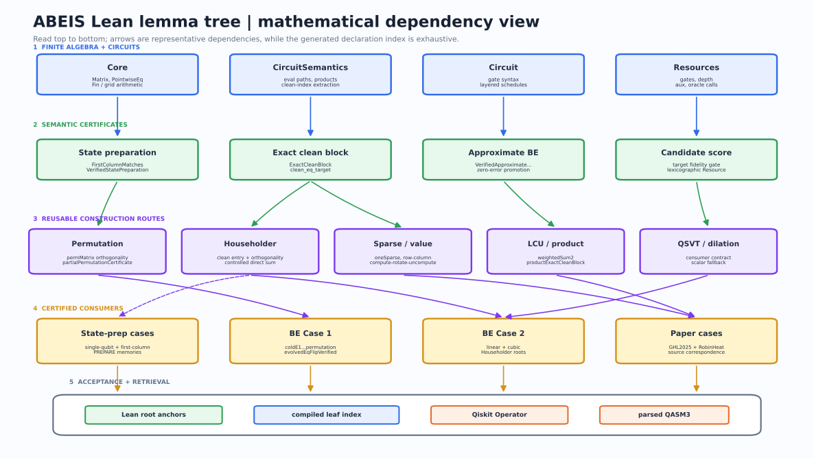
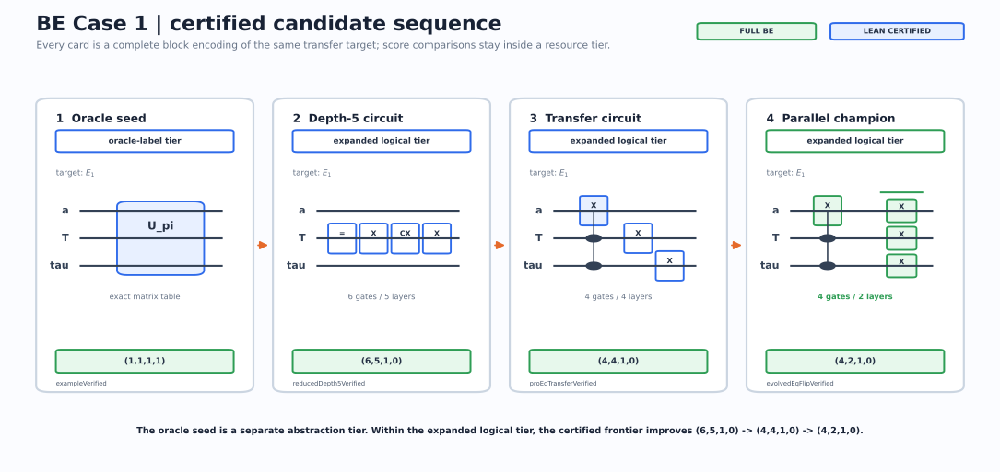
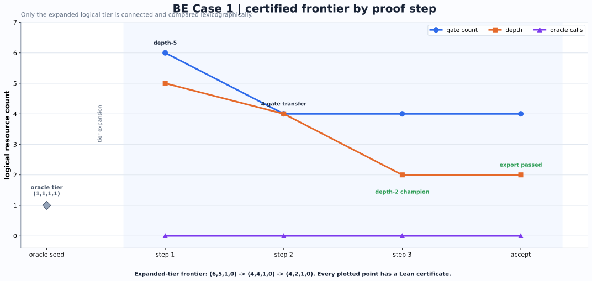
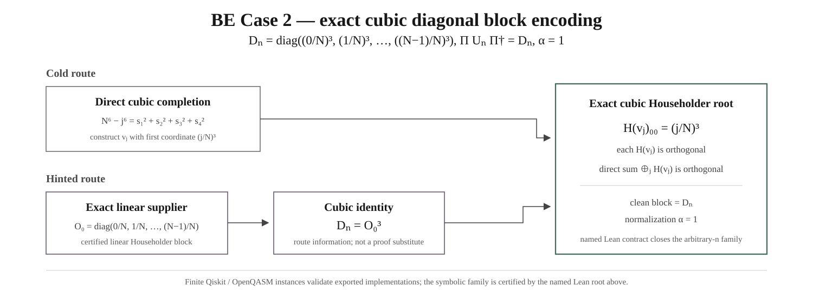
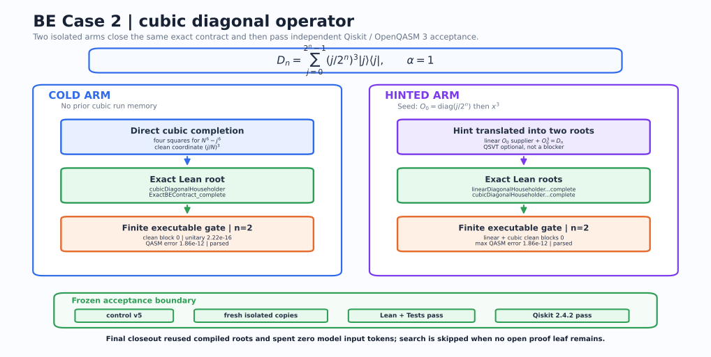

<div align="center">

# ASPBE ⚛️

### Automatic State Preparation and Block Encoding for Quantum Computing 🔬

Lean-checked quantum construction search, executable validation, and the
[QuantumComputinglib](https://dakebu.github.io/Quantum-Computing-Block-Encoding/) textbook and formalization workspace.

[](https://lean-lang.org/)
[](https://github.com/leanprover-community/mathlib4)
[](https://www.ibm.com/quantum/qiskit)
[](https://dakebu.github.io/Quantum-Computing-Block-Encoding/)
[](LICENSE)

[**Read the textbook**](https://dakebu.github.io/Quantum-Computing-Block-Encoding/) ·
[**Explore Lean declarations**](https://dakebu.github.io/Quantum-Computing-Block-Encoding/library/) ·
[**Open the formalization workspace**](https://dakebu.github.io/Quantum-Computing-Block-Encoding/ide/) ·
[**Contribute a lemma**](CONTRIBUTING.md)

</div>

---

## News 🔥

- **12 August 2026.** The textbook track gained complete Mathlib-backed Pauli X
  and Hadamard state-preparation certificates, including normalization,
  unitarity, state action, circuit, schedule, and resource records.
- **10 August 2026.** The project is now named **ASPBE: Automatic State
  Preparation and Block Encoding for Quantum Computing**. Its public teaching,
  declaration, and contribution site is **QuantumComputinglib**. The site now
  keeps the two application contracts separate, includes a local-compilation
  workspace, and provides a reviewable contributor path.
- **July 2026.** The public site gained the Verso
  [Lean Blueprint](https://dakebu.github.io/Quantum-Computing-Block-Encoding/blueprint/html-multi/),
  the searchable [Lean Library Explorer](https://dakebu.github.io/Quantum-Computing-Block-Encoding/library/),
  and a deterministic declaration inventory shared by both views.
- **June 2026.** The public testing preview introduced separate State
  Preparation and Block Encoding directions and the user-facing task builder.
- **17 May 2026.** The repository's auditable priority record begins with the
  [initial automation commit](https://github.com/DakeBU/Quantum-Computing-Block-Encoding/commit/af59b03c58c2cedec52b14a80b4d909031d62521)
  and the timestamped [`MANIFEST.md`](MANIFEST.md). This is the earliest date
  supported by the repository history; the project does not claim an earlier
  date without a corresponding public record.

The News dates record project milestones, not the proof status of every route.
Current mathematical status is generated from the checkout and shown in the
Implementation Map.

ASPBE searches for quantum constructions and admits a result only through a
named Lean certificate. It supports two applications with different contracts:

<table>
  <thead>
    <tr><th>Application</th><th>Contract</th><th>What must be certified</th></tr>
  </thead>
  <tbody>
    <tr>
      <td><strong>State Preparation</strong></td>
      <td><code>U|0ⁿ⟩ = |ψ⟩</code></td>
      <td>Target normalization, unitarity, state action, and circuit resources.</td>
    </tr>
    <tr>
      <td><strong>Block Encoding</strong></td>
      <td><code>‖A − αΠUΠ†‖ ≤ ε</code></td>
      <td>Register layout, clean projection, normalization, unitarity, error, and circuit resources.</td>
    </tr>
  </tbody>
</table>

A state-preparation theorem may supply a `PREPARE` component to a later
block-encoding route. It does not by itself prove a clean projected block.


## QuantumComputinglib 📚

**QuantumComputinglib** is the website built from this repository. It is organized as a
formal quantum-computing textbook rather than a project dashboard:

- a persistent chapter map on the left;
- formulas beside plain-language readings and exact Lean statements;
- continuous lessons adapted from the saved quantum-algorithms lecture notes,
  with learning objectives, hand calculations, checkpoints, and one-click Lean;
- separate State Preparation and Block Encoding learning tracks;
- an exhaustive declaration catalog and implementation map;
- an atlas of ASPBE, Mathlib, and selected external quantum Lean libraries;
- organizers, contribution guidance, and a versioned lemma-packet contract;
- generated Example Cases with explicit target formulas, circuit and score
  evolution, named Lean roots, separate Qiskit exports, and one-click Task
  Builder presets;
- a Live Formalization Workspace for LaTeX, Lean, dependency navigation, and
  local compiler diagnostics;
- the existing Verso Blueprint at `/blueprint/html-multi/`.

The site distinguishes **built here**, **imported**, and **reference atlas**.
External projects are not presented as local proofs merely because QuantumComputinglib
links or explains them.

## Formalization workspace 🧪

Build the site, then start the loopback-only companion server:

```bash
python3 -m pip install -r requirements-executable.txt
bash scripts/build-all.sh
python3 website/scripts/ide_server.py --directory _site
```

Open <http://127.0.0.1:8000/ide/>. The static page always renders mathematics,
reviewed LaTeX↔Lean mappings, and dependency links. The companion server adds
real `lake env lean` compilation in temporary files and never edits repository
source.

An optional local AI adapter can propose Lean drafts:

```bash
python3 website/scripts/ide_server.py \
  --directory _site \
  --translator-command "python3 website/scripts/codex_translator.py"
```

The bundled adapter starts the locally authenticated Codex CLI in an ephemeral,
read-only session and instructs it to inspect current declarations and proof
memory when the local sandbox supports repository reads. Agent output is
labeled as a draft. Compilation proves only that Lean accepts
the submitted code; mathematical equivalence to the LaTeX still receives review.
The workspace can download a contribution packet or open a prefilled GitHub
lemma request. Public GitHub Pages never runs untrusted Lean code.

The **Run with your API** entry is a separate user-owned execution path. Start
the loopback companion with the bundled ASPBE runner bridge:

```bash
python3 website/scripts/ide_server.py \
  --directory _site \
  --runner-command "python3 website/scripts/qbe_task_runner.py --execute --cycles 1"
```

Then open <http://127.0.0.1:8000/task-builder/>. The browser sends the task and
API key to that loopback runner; the key is placed only in the selected child
process environment and is not written to the task packet, repository, or
access log. The runner may write normal ASPBE task, profile, run, and report
artifacts. A public Pages deployment can instead target a user-owned HTTPS
runner implementing the same JSON contract; it does not spend project-owned
model credits.

## What the harness actually does 🧭

ASPBE is a file-backed controller around the Lean project. The durable state is
the task contract, candidate population, proof DAG, source correspondence,
typed feedback, trial memory, and compiled declarations. Chat transcripts are
not treated as the system of record.


### Roles and owned artifacts 🗂️

| Role | Decision boundary | Primary artifacts |
| --- | --- | --- |
| **Upper** | freezes the target; chooses a construction family; authorizes one adjacent capacity or tolerance transition | `tasks/`, `run-presets/`, `runs/*/10_upper_*` |
| **Middle** | maintains candidate populations, retrieves proof memory, refreshes the DAG, and assigns dependency-ordered leaves | `candidate-populations/`, `proof-blueprints/`, `proof-obligations/`, `conversion-windows/` |
| **Lower architect** | states one local mathematical argument and its prerequisites | `proof-attempts/`, current leaf packet |
| **Lower Lean worker** | implements one ready declaration and runs the relevant gate | `QuantumBlockEncoding/`, `ABEISTests/`, verifier feedback |
| **Necessary-condition verifier** | rejects wrong dimensions, register order, matrix entries, normalization, or finite circuit behavior before expensive proof search | diagnostics and `executable-exports/` |
| **Reviewer** | rejects target drift, stale evidence, hidden assumptions, invalid promotion, and unsupported resource claims | `reviews/`, signed feedback, intervention packet |

One worker may fill several roles for a small task. Parallelism increases only
when a current signed decision identifies independent ready leaves or a
specific layer bottleneck.

### One controlled cycle 🔁

```text
1  Freeze and hash the application contract
2  Retrieve compatible compiled lemmas and memory cards
3  Choose one candidate and record propose/retain/retire/mutate/crossover
4  Assign the smallest ready proof-DAG leaf
5  Run cheap exact or Qiskit diagnostics and promote passing routes for proof
6  Compile the named Lean declaration and tests
7  Export the certified construction to the requested executable backends
8  Promote, mutate, change one policy rung, or stop with an intervention packet
```

The next cycle must change at least one of:

- the compiled proof frontier;
- the typed candidate-population action;
- the signed capacity level;
- the adjacent tolerance rung.

Repeating the same leaf against the same Lean-evidence digest is bounded. A
stalled representation bridge is assigned as a prerequisite instead of being
retried by more tactic workers.

### Optional executable outputs ⚛️

Lean is the symbolic acceptance gate, but executable checks can screen a
candidate before proof and users can independently choose final artifacts.
The version-2 task packet separates these decisions:

```text
intermediate check: none | Qiskit Operator | OpenQASM 3 round-trip | both
export artifacts:  canonical IR | Qiskit Python | OpenQASM 3 | metrics | text
```

Both adapters consume one backend-neutral canonical IR with structured exact
angles. Qiskit constructs `x`, `ry`, `rz`, and `cx` gate by gate; the strict
OpenQASM path writes, parses, imports, canonicalizes, and re-evaluates the
supported subset. Depending on the task, ASPBE emits:

- runnable Qiskit Python that constructs the selected circuit;
- OpenQASM 3 for interchange with simulators and hardware toolchains;
- diagnostic JSON with unitarity, prepared-state, or projected clean-block
  errors, register order, package versions, and the matching Lean root;
- a manifest recording normalization, qubit layout, semantic tier, and output
  files.

These backends are useful both during search and after certification. For state
preparation they construct and test the requested preparation circuit. For
block encoding they expose the declared register order and clean ancilla block.
A fast finite check may reject a bad route, rank surviving exploratory routes,
and promote one into the executable-validated population before Lean effort is
allocated. The current logs justify this ordering: individual finite checks
take roughly `0.04--0.95 s`, while the cached multi-module Lean replay takes
about `2.75 s`, and agent-led proof search is much more expensive.

A floating-point match is nevertheless not, by itself, a proof of an exact or
symbolic-family theorem. Final `Lean-certified` promotion requires a named Lean
root. An external backend may participate directly in mathematical
certification when it emits an exact witness or proof certificate that a small
Lean checker verifies; the trusted conclusion still enters through Lean rather
than an unverified tolerance comparison.

```bash
python3 -m pip install -r requirements-executable.txt
python3 tools/replay_public_cases.py

# Individual reproducible exports
python3 executable-exports/QBE-OP-OPTCTRL-001/qiskit/export.py
python3 executable-exports/QBE-MAIN-CASE-HIER-COLD-001/qiskit/export.py
python3 executable-exports/SP-TEXTBOOK-001/qiskit/export.py --case hadamard
```

The following circuit view is generated from the certified BE Case 1 export.
It shows the actual Qiskit gate order: one Toffoli layer followed by three
parallel `X` gates. The clean-block and unitarity errors are both zero for this
finite executable instance.


Generated code and reports live under
[`executable-exports/`](executable-exports/). Task packets may select any
supported subset of `qiskit`, `qasm3`, and other registered executable targets,
or disable post-Lean export when only the formal certificate is required.

### Candidate and evidence policy 🧾

Candidates live in three separate populations:

1. **Certified:** all required named Lean declarations compile.
2. **Finite executable:** Qiskit, NumPy, QASM, or exact finite checks pass, but
   the matching symbolic certificate is incomplete.
3. **Insight:** constructions, external suggestions, failed routes, and partial
   arguments that can guide another proposal.

Finite-executable candidates may be selected as evolutionary parents and may
receive priority for formalization, but must remain visibly provisional.
Within one semantic and implementation tier, certified candidates are compared
lexicographically by gate count, depth, auxiliary qubits, and unresolved oracle
calls. Correctness and target fidelity are gates, not weighted score terms. An
opaque oracle and an expanded logical circuit are never ranked as equal-cost
implementations.

### Adaptive capacity and tolerance 🎚️

The controller stores upper, middle, and lower capacity levels. A privileged
upper/reviewer packet may increase exactly one named layer by one level. Replay
of the same packet is idempotent.

Exact search starts at `epsilon = 0`. Approximation may open only after the
configured exact-stall condition or an explicit external-contract boundary,
then advances one task-declared epsilon rung at a time. It cannot change:

- the target state or operator;
- block-encoding normalization `alpha`;
- register order or clean-state convention;
- the declared state-vector or operator norm.

See [agent orchestration](docs/agent_orchestration.md),
[the proof blueprint](docs/agent_blueprint_formalization.md), and the
[sleep-run guide](docs/sleep_run_guide.md) for the operational protocol.

## Lean library 🧩

```text
QuantumBlockEncoding/
├── Core.lean                    finite matrices and basic contracts
├── StatePreparation.lean        state targets, candidates, exact/approx certificates
├── Circuit.lean                 gate and circuit syntax
├── CircuitSemantics.lean        circuit evaluation and register semantics
├── PrimitiveCircuit.lean        typed exact {X, RY, RZ, CX} syntax and resources
├── PrimitiveSemantics.lean      exact primitive matrices and circuit products
├── PrimitiveRefinement.lean     exact T3 promotion boundary
├── ConcreteSemantics.lean       ket/column and projection bridges
├── TextbookStatePreparation.lean complete Pauli X and Hadamard certificates
├── BlockEncoding.lean           operator targets and verified block encodings
├── BlockEncodingClassics.lean   permutation, sparse, LCU, product, dilation, QSVT contracts
├── Resources.lean               deterministic resource records and comparison
├── TechnicalLemmas.lean         reusable proof leaves
├── MainCase.lean                BE Case 1 certificates
├── CubicStatePreparation.lean   active state-preparation benchmark
├── ColdStartTransferE1.lean     isolated cold-start construction
├── OptimalControl.lean          candidate evolution and resource comparison
├── Automation.lean              compiled harness contracts
└── OpenProblems.lean            typed unfinished routes
```



The external quantum Lean atlas currently records Mathlib,
[quantum-computing-lean](https://github.com/duckki/quantum-computing-lean),
[Lean-QuantumInfo](https://github.com/Timeroot/Lean-QuantumInfo), and
[lean-quantum](https://github.com/Hayata-Yamasaki-Group/lean-quantum). Exact
modules, licenses, and adapter rules are under
[`research-wiki/external-lean-libraries/`](research-wiki/external-lean-libraries/).

## Case studies 🔬

### BE Case 1: transfer operator 🔄

The target is the concrete non-unitary transfer

```text
E_1 = |0><1|_time tensor |0><1|_type tensor I_2,
<0|_a U |0>_a = E_1.
```

One clean signal qubit completes the operator to a permutation unitary. Lean
proves unitarity, every projected-block entry, each resource tuple, and the two
strict comparisons. In one fixed logical `{X,CNOT,Toffoli}` tier, certified
candidates improve `(6,5,1,0) -> (4,4,1,0) -> (4,2,1,0)`.

| Certified candidates | Convergence |
| --- | --- |
|  |  |

### BE Case 2: cubic diagonal operator 📐

For every `n`, the target is

```text
D_n = diag_{0 <= j < 2^n} ((j / 2^n)^3),
Pi U_n Pi^dagger = D_n.
```

Cold and hinted routes close this symbolic family through exact rational
Householder constructions. Lean uses four-square witnesses to prove branch
normalization, rational orthogonality, the clean block, `alpha=1`, and the
logical resource record for arbitrary `n`. A finite Qiskit instance is only an
export. The hinted identity `D_n = O_0^3`, with
`O_0 = diag(j/2^n)`, selects the route; QSVT is not presented as a certified
primitive implementation.

| Candidate route | Cold and hinted progress |
| --- | --- |
|  |  |

These figures show certified candidate and proof milestones, not elapsed time
or model-token curves. Replay the current certificate surface with:

```bash
python3 tools/replay_public_cases.py
```

The machine-readable diagnostic record is
[`reports/public-case-replay/latest.json`](reports/public-case-replay/latest.json).
It rebuilds the relevant Lean modules, replays the controller population gate,
and reruns the State Preparation, BE Case 1, and BE Case 2 Qiskit/QASM exports.
Case certification comes from the named Lean roots, not this record. It does
not claim a new isolated cold-start discovery. Historical figures
change only after a fresh controlled search fixes the model, task, memory
policy, budget, and acceptance gate.

The normalized cubic **state-preparation** benchmark is tracked separately and
is not reported as solved merely because the cubic block-encoding family is
certified.

### Textbook state preparation ⚛️

The one-qubit textbook routes are complete certificates, not interface-only
examples: `pauliXVerified` and `hadamardVerified` each contain a normalized
target, Mathlib unitary-group proof, state-action proof, circuit, schedule, and
resource record. Their runnable Qiskit exports provide the same gate-level
examples used in the introductory chapters, while the named Lean roots remain
the proof authority.

## Build and verify 🛠️

Linux/macOS:

```bash
python3 -m pip install -r requirements-executable.txt
python3 tools/qbe.py check
bash scripts/build-all.sh
```

Windows PowerShell:

```powershell
python -m pip install -r requirements-executable.txt
python tools/qbe.py check
powershell -ExecutionPolicy Bypass -File scripts/build-all.ps1
```

The full site build runs the Lean library and tests, declaration inventory,
proof-trust checks, the model-free Lean/Qiskit public-case replay, Blueprint
consistency, Verso build, QuantumComputinglib generation, internal link and
fragment checks, source-link checks, and local-path leakage scan. Generated
counts are written to `_site/build-report.json`; the replay record is published
at `_site/data/public-case-replay.json`. This README does not hard-code
declaration totals.

## Contribute 🤝

QuantumComputinglib supports two contribution routes:

- use the [Live Formalization Workspace](https://dakebu.github.io/Quantum-Computing-Block-Encoding/ide/)
  to prepare a versioned lemma packet and open a proposal;
- develop a focused branch and submit a pull request under
  [`CONTRIBUTING.md`](CONTRIBUTING.md).

The contribution process has four visible stages: agree on scope, develop in
the owning module, run the pinned whole-repository gates, and submit a focused
PR with provenance and preferred credit. Accepted work is listed on the
QuantumComputinglib Contributors page. A locally compiling snippet is not
listed as integrated until maintainer review and the full repository gate pass.

Complete State Preparation and Block Encoding case packets use the exact
states `draft`, `pendingReview`, `verified`, and `rejected`. Browser saves are
explicit opt-in IndexedDB records and never include API credentials. Repository
ingestion is also explicit:

```bash
python3 tools/qbe.py ingest-case path/to/case.json --review-only
python3 tools/qbe.py promote-case case-id --lean-root Namespace.declaration
```

The promotion command refuses unpublished review states, missing consent,
unknown Lean roots, failed full gates, or missing advertised executable
evidence. Only `verified` packets can enter public positive retrieval memory.

Historical `QBE-*` task IDs, `ABEISBlueprint` module names, and existing URLs
remain unchanged for reproducibility and compatibility. New public prose uses
**ASPBE** for the system and **QuantumComputinglib** for the website.

## Related systems and design lineage 🧬

ASPBE adapts useful mechanisms from adjacent systems, but its acceptance
contracts and proof status remain specific to this repository.

| Work | Relevant design pattern | ASPBE use and boundary |
| --- | --- | --- |
| [ARIS](https://github.com/wanshuiyin/Auto-claude-code-research-in-sleep) | Durable file-based research state and review | Task packets, manifests, run logs, and reviews; chat is not the system of record. |
| [Learning Beyond Gradients](https://github.com/Trinkle23897/learning-beyond-gradients) | Layered feedback and trial memory | Typed upper/middle/lower feedback and bounded policy transitions. |
| [EoH](https://github.com/FeiLiu36/EoH) | Population maintenance, mutation, and recombination | Candidate routes are retained, retired, mutated, or crossed over under one frozen contract. |
| [LeanMarathon](https://github.com/YuanheZ/LeanMarathon) | Proof blueprints and dependency-ordered leaves | Middle agents maintain a proof DAG and assign only ready Lean obligations. |
| [Rethlas](https://github.com/frenzymath/Rethlas) and [Archon](https://github.com/frenzymath/Archon) | Natural-language reasoning paired with formal proof | Natural-language proposals guide search; only named Lean declarations certify results. |
| [QBench](https://arxiv.org/abs/2607.21533) | Quantum theorem-proving evaluation | External task/library declarations are audited and kept isolated by toolchain and evidence class. |
| [quantum-computing-lean](https://github.com/duckki/quantum-computing-lean), [Lean-QuantumInfo](https://github.com/Timeroot/Lean-QuantumInfo), and [lean-quantum](https://github.com/Hayata-Yamasaki-Group/lean-quantum) | Quantum formalization APIs | Recorded in the external atlas; a reference becomes local evidence only through an explicit compiled adapter. |
| [StatsMLlib](https://statsmllib.github.io/) | Textbook navigation and contributor onboarding | Inspires the left-side book map and four-stage contribution path, not theorem content or status data. |
| [Lean Ridgelet](https://shosonoda.github.io/lean-ridgelet/) and [Verso Blueprint](https://github.com/leanprover/verso-blueprint) | Readable formal blueprints | Provide documentation inspiration and rendering infrastructure. |

See [`docs/attribution.md`](docs/attribution.md) and [`NOTICE.md`](NOTICE.md)
for the fuller attribution and evidence boundary.

## Citation 📝

```bibtex
@misc{abeis2026,
  author = {Bu, Dake and Huang, Xiajie and Liu, Nana and Nitanda, Atsushi and Wong, Hau-san and Zhang, Qingfu},
  title = {{ASPBE: Automatic State Preparation and Block Encoding for Quantum Computing}},
  year = {2026},
  note = {QuantumComputinglib and project source: \url{https://github.com/DakeBU/Quantum-Computing-Block-Encoding}}
}
```

## Acknowledgements 🙏

The project thanks Sho Sonoda for the public Lean Ridgelet Blueprint, which
demonstrated a clear way to connect mathematical exposition with formal source.
The documentation uses Verso Blueprint and Verso. The harness comparison above
credits ARIS, Learning Beyond Gradients, EoH, LeanMarathon, Rethlas, Archon,
QBench, and the cited quantum Lean libraries for the specific patterns or
reference APIs studied here. Attribution does not imply that their results are
locally proved or that their licenses transfer to ASPBE.

## License 📄

[MIT](LICENSE). External libraries and cited results retain their own licenses
and attribution; linking or indexing them does not transfer authorship or
proof status.
