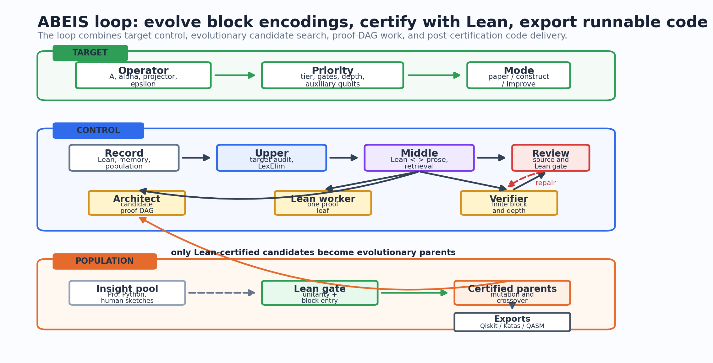
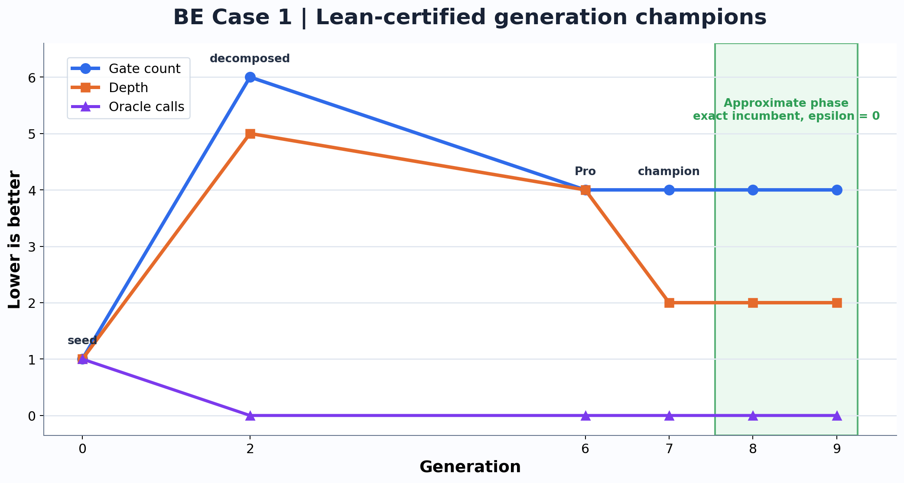

# Auto-Lean-in-Sleep: Block Encoding for Quantum Computing

ABEIS is a Lean 4 project and multi-agent harness for turning a requested
quantum query operator into concrete block-encoding candidates, gate-level
circuit matrices, resource scores, and Lean-checked certificates.

The project is built around one contract:

```text
operator/query-oracle contract A
-> candidate unitary U_A and circuit schedule
-> Lean-checked block-entry and unitarity certificate
-> resource-ranked construction
-> post-Lean executable exports such as Qiskit, QuantumKatas, and QASM
```

ABEIS does not stop at "assume an oracle exists".  A task should state the
operator `A`, normalizer `alpha`, clean ancilla projector, and the desired
exact block-entry equation:

```text
(<0^a| ⊗ I) U_A (|0^a> ⊗ I) = A / alpha
```

It may also state an accepted approximation budget:

```text
|| A - alpha * ((<0^a| ⊗ I) U_A (|0^a> ⊗ I)) || <= epsilon
```

Among Lean-certified candidates, ABEIS ranks constructions by asymptotic tier
first.  Inside the same tier it compares:

```text
(gateCount, depth, auxiliaryQubits, oracleCalls)
```

Paper constructions are treated as baselines and training data.  Once a paper
baseline is formalized, the same system can try to improve the construction
for the same fixed operator target.



## Core Workflow

```mermaid
flowchart LR
  A["user gives A, alpha, projector"] --> B["upper fixes target"]
  A --> A2["user gives resource floor, epsilon, iteration limits"]
  B --> B1["natural-language party explores ideas"]
  B --> B2["Lean party plans formalizable routes"]
  B1 --> P["parliament exchanges insights and sets capacity"]
  B2 --> P
  P --> C["middle keeps Lean <-> natural-language map"]
  C --> D["two-party lower population proposes exact U_A"]
  D --> E["finite/unitarity/block-entry diagnostics"]
  E --> F["Lean exact certificate attempt"]
  F --> G{"meets resource floor before limit?"}
  G -- yes --> H["Scenario 1: approximate-improvement phase"]
  G -- no/stalled --> I["Scenario 2: relaxed approximate search"]
  H --> J["Lean approximate certificate attempt"]
  I --> J
  J --> K["resource score and certified archive"]
  K --> L["post-Lean executable exports"]
  L --> M["Qiskit / QuantumKatas / QASM checks"]
  M --> N["dynamic agent-count audit"]
```



ABEIS uses diagnostics as search signals, not as proofs.  A candidate enters
the certified population only after Lean proves the advertised theorem at the
task's semantic tier.

Human interaction is a first-class upper-layer input, not an out-of-band chat.
ABEIS records three human-facing intervention moments: scheduled 6h closeout,
direct user questions, and user status checks followed by new top-level
instructions.  Upper and middle agents should treat those interventions as
strategy updates, then translate them into task packets, proof obligations, or
candidate-population changes before lower agents continue.

If exact search fails to meet the user-specified resource floor within the
configured budget, the upper layer may switch to approximate BE search.  If a
fixed number of generations does not improve the population, the upper layer
may increase upper/middle/lower parallel agent counts up to the configured
maximum.  More agents are not assumed to be better; the increase is itself a
controlled experiment.

## Main Case Study

The current technical-report case study is the operator task
`QBE-OP-OPTCTRL-001`:

```text
E_k = |0><k|_time ⊗ |0><1|_type ⊗ I
```

The run demonstrates the intended loop:

1. fix the operator target;
2. start from a correct one-ancilla block-encoding seed;
3. maintain a population of candidate completions;
4. keep Pro/simulator/Python ideas in the insight pool until Lean promotes
   them;
5. after exact convergence, enter the approximate phase with the exact
   champion as an `epsilon = 0` incumbent;
6. plot only Lean-certified candidates.

Current certified logical champion:

```text
evolved-eq-flip-r1-k1
Lean certificate = OptimalControl.evolvedEqFlipVerified
zero-error approximate certificate = OptimalControl.evolvedEqFlipZeroErrorApprox
comparison tuple = (gateCount, depth, auxiliaryQubits, oracleCalls) = (4, 2, 1, 0)
```

Certified metric curve, in the EoH-style sense that each plotted point is a
generation champion and lower values are better.  Blue is exact search; green
is the post-convergence approximate phase:



Lean-certified storyboard:


This is a concrete `r = 1, k = 1` logical reversible permutation-matrix
certificate.  It is not claimed as a hardware-decomposed theorem, a general
arbitrary-register theorem, or a Lean-proved global optimality theorem.

## Active Hard Benchmark

`QBE-OP-CUBIC-STATEPREP-001` is the first Scenario 2 benchmark:

```text
O_n |0^n> = sum_j (j / 2^n)^3 |j>
```

The vector on the right is not normalized, so the Lean target is the rank-one
operator `O_n = |v_n><0^n|`.  ABEIS should try exact candidates briefly, then
switch to approximate block-encoding search with the requested tolerance
`epsilon = 1e-10`.

Current status:

- Lean target declarations compile in `QuantumBlockEncoding.CubicStatePreparation`;
- the task, proof blueprint, proof obligations, candidate population, and
  verifier feedback are initialized;
- dense executable checks are treated as small-instance diagnostics, while the
  intended scalable route is symbolic arithmetic plus Lean family proof;
- no final approximate block-encoding candidate has been promoted yet.

Human-readable diagnostics:

```text
reports/cubic-stateprep/latest.md
reports/cubic-stateprep/zh_summary.md
```

## Why Lean For Block Encodings

Executable quantum tooling such as Qiskit, QuantumKatas, and QASM evaluators is
very useful for small concrete circuits: it can run a statevector, materialize
a unitary, or check a sample OpenQASM program.  That is not enough for many
block-encoding papers, where the real claim is a symbolic family of circuits
indexed by register sizes, sparse-access promises, normalizers, and ancilla
cleanup conditions.

For an `r`-qubit time register, dense statevector/unitary validation pays the
Hilbert-space dimension directly.  Even a structurally simple family like

```text
E_k = |0><k|_time ⊗ |0><1|_type ⊗ I_state
```

requires a dense `2^(r+3) × 2^(r+3)` matrix if we insist on checking it by
materializing the full unitary.  ABEIS instead aims to prove symbolic Lean
theorems about the circuit family.  The proof checker follows the proof
structure; it does not need to enumerate the whole Hilbert space for every
larger `r`.


At `r = 20`, a full dense complex128 unitary for this simple family would
already require about `1 PiB` of memory.  At `r = 32`, it is about `16 ZiB`.
This is where ABEIS should stop asking a simulator to materialize the whole
matrix and instead ask Lean for a symbolic theorem about the circuit family.

ABEIS still uses finite executable checks when they help.  They are useful as
small-instance checks, counterexample generators, and necessary-condition
diagnostics.  They are not promoted to scientific claims until the
advertised block-entry, unitarity, cleanup, and resource statements are closed
by Lean.

After a Lean certificate closes, ABEIS can emit runnable artifacts for users:
Qiskit Python circuits with exact finite assertions, QuantumKatas-style task
and test files, and OpenQASM transcripts with parser and fixed-instance checks.  These
exports are engineering deliverables, not replacements for the Lean theorem.
For symbolic families, the exported code records the concrete instantiation it
implements; the Lean theorem remains the reusable, parameterized certificate.

Current Qiskit exports:

- `executable-exports/QBE-OP-OPTCTRL-001/qiskit/export.py`: exported from a
  Lean-certified exact concrete champion.
- `executable-exports/QBE-OP-CUBIC-STATEPREP-001/qiskit/export.py`: finite
  dense baseline for small `n`; useful evidence, not a symbolic certificate.

Current executable-export self-tests:

| Task | Qiskit artifact | Status | What it checks |
| --- | --- | --- | --- |
| `QBE-OP-OPTCTRL-001` | `executable-exports/QBE-OP-OPTCTRL-001/qiskit/export.py` | passed: clean block error `0`, unitary error `0` | the exported four-qubit Qiskit circuit matches the Lean-certified concrete clean block and resources `(4,2,1,0)` |
| `QBE-OP-CUBIC-STATEPREP-001` | `executable-exports/QBE-OP-CUBIC-STATEPREP-001/qiskit/export.py` | passed for finite `n=3`; clean block error about `2.8e-17` | a dense fixed-instance baseline only; not a symbolic family certificate |

## Why The ABEIS Harness

Qiskit QuantumKatas and QASM-Eval are good at testing submitted executable
artifacts.  QUASAR and AI-Mandel are useful examples of tool-feedback loops
for quantum artifacts.  Local public artifacts checked so far do not expose a
direct generic BE constructor for "given operator `A`, synthesize and prove a
symbolic block-encoding family."  ABEIS targets that stricter task:

```text
given an oracle/operator requirement A,
construct a candidate block-encoding unitary U_A,
prove the block-entry theorem in Lean,
and improve the construction by gate count, depth, and ancilla cost.
```

The harness is designed around that task:

- **Upper agents** keep the mathematical target fixed, so the search does not
  drift into proving an easier oracle.
- **Middle agents** translate between Lean, natural-language proof plans, and
  reusable memory, so failed proof attempts become searchable guidance instead
  of discarded chat logs.
- **Lower agents** maintain a candidate population: natural-language architects
  propose proof decompositions, Lean workers close proof leaves, and verifier
  workers run small finite diagnostics before expensive theorem work.
- **Reviewer agents** reject hidden assumptions, wrong resource tuples,
  simulator-only claims, and unverified candidates.

This makes ABEIS closer to an automated theorem-proving laboratory for quantum
block encodings than to a circuit simulator benchmark.  It can borrow Qiskit
or QASM-style feedback as a front-end filter, but the final artifact is a
Lean-checked certificate that can be reused by later papers and larger
parameterized constructions.

Detailed timing, route-ablation, and external-verifier records are kept in
`reports/`.  They are intentionally not the main README narrative.

## Benchmark Paper Cases

Paper reproduction remains important, but as benchmark data for the core
operator-construction system.

The first active paper benchmark is:

- Guseynov--Huang--Liu,
  [Quantum framework for simulating linear PDEs with Robin boundary conditions](https://arxiv.org/abs/2506.20478).

The benchmark Lean file is:

```text
QuantumBlockEncoding/GHL2025.lean
```

Paper-benchmark mode should reproduce the paper construction and resource
score first.  Any improvement search belongs in a separate operator task with
the same target operator.

## Quick Start

```bash
cd /path/to/Auto-Quantum-Computing-Bloack-Encoding-In-Sleep

python3 tools/qbe.py init
python3 tools/qbe.py list-literature
python3 tools/qbe.py next-task
python3 tools/qbe.py check
```

The mandatory acceptance gate is:

```bash
lake build && lake build Tests
```

## Use ABEIS

ABEIS has three equivalent user entrypoints.  All three must produce the same kind of task packet, agent profile, run logs, Lean gate, human-language summary, Pro-prompt, and optional post-Lean executable exports.  The intended rule is: if the same model backend and prompt profile are used, the CLI template, an AI chat window, and the website should differ only in convenience, not in scientific target or acceptance criteria.

1. **Local CLI template.**  Download the repository, replace the operator text in a template command, and run `tools/qbe.py`.
2. **AI chat window.**  Download the repository and tell Codex, Claude, GLM, Gemini, Minimax, or another coding agent: “Use the ABEIS system in this repository to solve the following operator block-encoding problem.”  The agent should call the same `ingest-user-problem`, `sleep-run`, and `check` commands as the CLI template.
3. **Website task builder.**  Use the static website in `web/` or a deployed public site to paste the oracle description, choose the report language, choose agent backends, and generate the same task packet and agent profile.  Like LLM4AD_Next-style web front ends, the public ABEIS page should be a low-entry interface; model execution uses the user's own API keys or local CLI wrappers, and Lean remains the verification authority.

Main local CLI workflow:

```bash
python3 tools/qbe.py new-task QBE-OP-001 \
  --kind operatorBlockEncoding \
  --title "Construct a block encoding for my query operator" \
  --target-lean "QuantumBlockEncoding/MyOperator.lean"

python3 tools/qbe.py sleep-run QBE-OP-001 \
  --cycles 2 \
  --agent-profile codex-parallel.example.json \
  --execute \
  --check-each-cycle
```

ABEIS exposes two compatible harness profiles.  The classic tri-role profile keeps the earlier lower layer: natural-language architect, Lean implementation worker, and necessary-condition verifier, with middle agents coordinating their handoffs.  The optional `--party-parliament` profile creates two cooperating parties: a natural-language opposition party for broad proof/construction ideas and a Lean governing party for formalization.  A parliament/chief-justice layer compares the two parties, preserves useful uncertified ideas as insight population, decides whether to increase party sizes for a fixed generation budget, and decides whether exact search should switch to approximate search.  Both profiles are retained because different block-encoding tasks may favor different organization patterns; route-ablation runs should test them side by side under the same model and budget.  For both profiles, a successful user-facing run must export a step-by-step LaTeX block-encoding proof after the Lean certificate closes and then emit checked executable code such as Qiskit, QuantumKatas-style tests, or QASM for the certified construction.

The harness is vendor-neutral: a profile under `agent-profiles/` can dispatch roles to Codex, Claude, GPT/OpenAI wrappers, Gemini, GLM, Minimax, or local tools.  For comparable results across the three entrypoints, keep the same task id, raw source artifact, report language, agent profile, active-budget policy, and Lean gate.  Long runs write summaries in the user's chosen language and export a problem-specific LaTeX proof note at `paper-notes/problem-exports/<task-id>/latest.tex`.

Users can also request post-certification executable outputs.  The static web
builder and task packets support Qiskit, QuantumKatas-style exercises, and
OpenQASM/QASM exports.  The harness should generate and check those artifacts
only after the corresponding Lean certificate is accepted, unless a task
explicitly marks them as pre-Lean diagnostics.  See
[`docs/executable_exports.md`](docs/executable_exports.md).

Progress during a run is visible in these files:

- `runs/<run-id>/dialogue.md`: role-tagged upper/middle/lower/reviewer handoffs.
- `runs/<run-id>/summary.md` and `zh_summary.md` or the selected-language equivalent: human-readable closeout.
- `runs/<run-id>/chatgpt_pro_prompt.md`: self-contained prompt for external deep reasoning if unresolved leaves remain.
- `runs/<run-id>/todo.md` and `memory_digest.md`: compact next-cycle state.
- `runs/logs/*.log`: raw execution log.
- `paper-notes/problem-exports/<task-id>/latest.tex`: user-copyable proof note after closeout.

Project layout:

- `QuantumBlockEncoding/`: Lean definitions, circuits, resources, and theorem
  certificates.
- `tasks/`: operator or paper-benchmark contracts.
- `candidate-populations/`: Lean-certified candidates and rejected routes.
- `conversion-windows/`, `proof-blueprints/`, `proof-obligations/`: compact
  proof state and Lean/natural-language correspondence.
- `executable-exports/`: post-Lean Qiskit, QuantumKatas, QASM, and related
  runnable artifacts for certified constructions.
- `tools/qbe.py`: orchestration CLI.
- `docs/`: deployment and long-run guides.

## Related Work And Similar Patterns

ABEIS adapts patterns from adjacent systems, but specializes them to
gate-level quantum block-encoding certificates.

| Work | Similar pattern | ABEIS use |
| --- | --- | --- |
| [ARIS][aris] | Plain-file autonomous research workflow and review. | Task files, skills, manifests, reviews, run logs. |
| [Learning Beyond Gradients][lbg] | Layered feedback and trial memory. | Upper/middle/lower/reviewer loops and compact summaries. |
| [EoH][eoh] | Evolutionary candidate populations. | Mutate/recombine candidate block-encoding circuits under a fixed target. |
| [LeanMarathon][leanmarathon] | Proof blueprint, dynamic leaves, CI gates. | Proof-blueprint snapshots and focused theorem-closure work. |
| [MathCode][mathcode] | Proof diagnostics and theorem reuse. | Hidden-assumption scans and reusable proof-attempt memory. |
| [Lean4Agent][lean4agent-paper] | Workflow/trajectory verification. | Lean-side process contracts in `Automation.lean`. |
| [Lean-QuantumInfo][lean-quantuminfo], [lean-quantum][lean-quantum] | Quantum formalization references. | Style and semantic references for finite-dimensional quantum objects. |
| [QASM-Eval][qasm-eval], [Qiskit QuantumKatas][qiskit-quantumkatas] | Typed circuit/test feedback and executable Qiskit/QASM checks. | ABEIS distinguishes inspired feedback, optional exact finite Qiskit checks, and Lean-certified theorem closure. |
| [QUASAR][quasar-paper], [AI-Mandel][ai-mandel-paper] | Tool-feedback loops for quantum artifacts. | Search signals only; not proof certificates. |
| [LLM4AD_Next][llm4ad-next] | Low-entry-barrier web interface. | Static oracle-to-task-packet builder. |
| [Lexicographic bandits][lexelim-bandits] | Lexicographic active-set filtering. | Prioritize correctness, diagnostics, asymptotic tier, and cost tuple. |
| [Hierarchical provers][hierarchical-provers], [statistical provability][statistical-provability] | Reusable proof cuts and finite-budget proof progress. | Named proof-DAG nodes and run-efficiency metrics. |

More detail is in [`docs/automation_deployment.md`](docs/automation_deployment.md),
[`docs/attribution.md`](docs/attribution.md), and [`NOTICE.md`](NOTICE.md).

## Literature Roadmap

The source of truth is `QuantumBlockEncoding/Literature.lean`.

Selected block-encoding and oracle-construction targets:

| Status | Paper | Target |
| --- | --- | --- |
| `active` | Guseynov--Huang--Liu, [Quantum framework for simulating linear PDEs with Robin boundary conditions](https://arxiv.org/abs/2506.20478) | `QuantumBlockEncoding/GHL2025.lean` |
| `planned` | Guseynov--Huang--Liu, [Efficient explicit gate construction of block-encoding for Hamiltonians needed for simulating partial differential equations](https://arxiv.org/abs/2405.12855) | `QuantumBlockEncoding/GHL2025.lean` |
| `planned` | Camps--Lin--Van Beeumen--Yang, [Explicit quantum circuits for block encodings of certain sparse matrices](https://arxiv.org/abs/2203.10236) | `QuantumBlockEncoding/Circuit.lean` |
| `planned` | Camps--Van Beeumen, [FABLE: Fast Approximate Quantum Circuits for Block-Encodings](https://arxiv.org/abs/2205.00081) | `QuantumBlockEncoding/Circuit.lean` |
| `planned` | Gilyen--Su--Low--Wiebe, [Quantum singular value transformation and beyond](https://arxiv.org/abs/1806.01838) | `QuantumBlockEncoding/BlockEncoding.lean` |
| `planned` | Childs--Wiebe, [Hamiltonian simulation using linear combinations of unitary operations](https://arxiv.org/abs/1202.5822) | `QuantumBlockEncoding/BlockEncoding.lean` |

## Citation

```bibtex
@misc{abeis2026,
  author = {{Anonymous ABEIS Contributors}},
  title = {{Auto-Lean-in-Sleep: Block Encoding for Quantum Computing}},
  year = {2026},
  note = {Project page: \url{https://github.com/DakeBU/Quantum-Computing-Block-Encoding}}
}
```

[aris]: https://github.com/wanshuiyin/Auto-claude-code-research-in-sleep
[lbg]: https://github.com/Trinkle23897/learning-beyond-gradients
[eoh]: https://github.com/FeiLiu36/EoH
[leanmarathon]: https://github.com/YuanheZ/LeanMarathon
[mathcode]: https://github.com/math-ai-org/mathcode
[llm4ad-next]: https://github.com/Optima-CityU/LLM4AD_Next
[lexelim-bandits]: https://xueb1996.github.io/pdf/AAAI-2026-Xue.pdf
[lean4agent-paper]: https://arxiv.org/abs/2606.06523
[quasar-paper]: https://arxiv.org/abs/2510.00967
[qasm-eval]: https://github.com/fuzhenxiao/QASM-Eval
[qiskit-quantumkatas]: https://github.com/qiskit-community/Qiskit-QuantumKatas
[ai-mandel-paper]: https://arxiv.org/abs/2511.11752
[hierarchical-provers]: https://arxiv.org/abs/2602.10512
[statistical-provability]: https://arxiv.org/abs/2602.10538
[lean-quantuminfo]: https://github.com/Timeroot/Lean-QuantumInfo
[lean-quantum]: https://github.com/Hayata-Yamasaki-Group/lean-quantum
