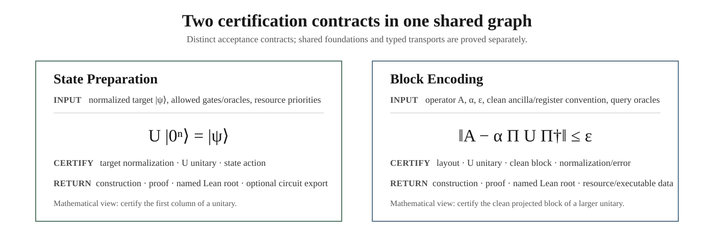
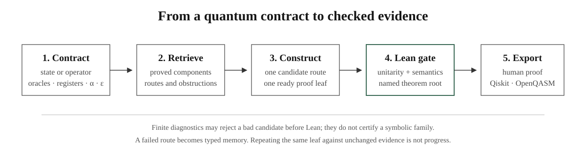
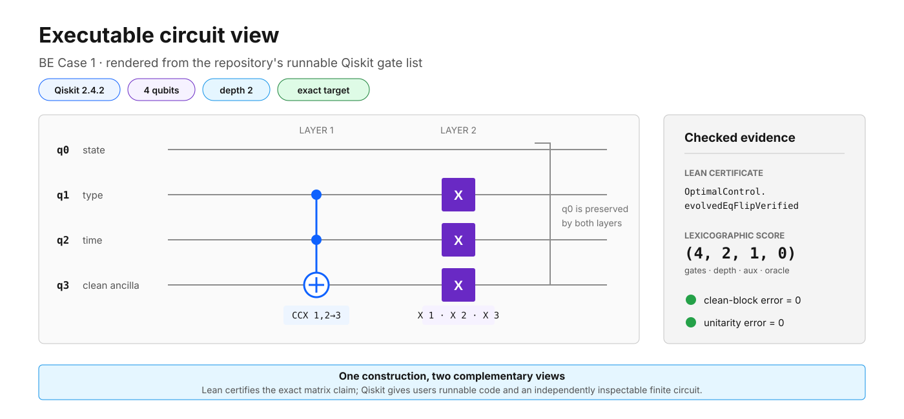

<div align="center">

# ASPBE ⚛️

### Automatic State Preparation and Block Encoding for Quantum Computing 🔬

Lean-checked quantum construction search, executable validation, and the
[QuantumComputinglib](https://dakebu.github.io/Quantum-Computing-Block-Encoding/) textbook and formalization workspace.

[](https://lean-lang.org/)
[](https://github.com/leanprover-community/mathlib4)
[](https://www.ibm.com/quantum/qiskit)
[](https://dakebu.github.io/Quantum-Computing-Block-Encoding/)
[](LICENSE)

[**Read the textbook**](https://dakebu.github.io/Quantum-Computing-Block-Encoding/) ·
[**Explore Lean declarations**](https://dakebu.github.io/Quantum-Computing-Block-Encoding/library/) ·
[**Open the formalization workspace**](https://dakebu.github.io/Quantum-Computing-Block-Encoding/ide/) ·
[**Contribute a lemma**](CONTRIBUTING.md)

</div>

---

## News 🔥

- **15 August 2026.** QuantumComputinglib now starts each core chapter with a
  concept-first quantum-computing lesson and persistent **Concept / Math / Lean**
  reading modes, including circuit-style visualizations and textbook/source
  anchors. The Guseynov--Huang--Liu Robin track also closes the paper's
  Theorem-4 composition from `A_k` and `A_k†` through `A`, `A†`, `S₁`, `S₂`,
  and the one-dimensional Hamiltonian `H`. The source audit also proves that the
  literal printed first `S₁` LCU phase pair leaves a nonzero filler block and
  records the phase-balanced correction; the remaining GHL frontier is the
  uniform arbitrary-width primitive compiler/resource theorem for the source
  one-term oracles, not the Hamiltonian composition itself.
- **12 August 2026.** The textbook track gained complete Mathlib-backed Pauli X
  and Hadamard state-preparation certificates, including normalization,
  unitarity, state action, circuit, schedule, and resource records.
- **10 August 2026.** The project is now named **ASPBE: Automatic State
  Preparation and Block Encoding for Quantum Computing**. Its public teaching,
  declaration, and contribution site is **QuantumComputinglib**. The site now
  keeps the two application contracts separate, includes a local-compilation
  workspace, and provides a reviewable contributor path.
- **July 2026.** The public site gained the Verso
  [Lean Blueprint](https://dakebu.github.io/Quantum-Computing-Block-Encoding/blueprint/html-multi/),
  the searchable [Lean Library Explorer](https://dakebu.github.io/Quantum-Computing-Block-Encoding/library/),
  and a deterministic declaration inventory shared by both views.
- **June 2026.** The public testing preview introduced separate State
  Preparation and Block Encoding directions and the user-facing task builder.
- **17 May 2026.** The repository's auditable priority record begins with the
  [initial automation commit](https://github.com/DakeBU/Quantum-Computing-Block-Encoding/commit/af59b03c58c2cedec52b14a80b4d909031d62521)
  and the timestamped [`MANIFEST.md`](MANIFEST.md). This is the earliest date
  supported by the repository history; the project does not claim an earlier
  date without a corresponding public record.

The News dates record project milestones, not the proof status of every route.
Current mathematical status is generated from the checkout and shown in the
Implementation Map.

ASPBE searches for quantum constructions and admits a result only through a
named Lean certificate. It supports two applications with different contracts:

<table>
  <thead>
    <tr><th>Application</th><th>Contract</th><th>What must be certified</th></tr>
  </thead>
  <tbody>
    <tr>
      <td><strong>State Preparation</strong></td>
      <td><code>U|0ⁿ⟩ = |ψ⟩</code></td>
      <td>Target normalization, unitarity, state action, and circuit resources.</td>
    </tr>
    <tr>
      <td><strong>Block Encoding</strong></td>
      <td><code>‖A − αΠUΠ†‖ ≤ ε</code></td>
      <td>Register layout, clean projection, normalization, unitarity, error, and circuit resources.</td>
    </tr>
  </tbody>
</table>

A state-preparation theorem may supply a `PREPARE` component to a later
block-encoding route. It does not by itself prove a clean projected block.



## QuantumComputinglib 📚

**QuantumComputinglib** is the website built from this repository. It is organized as a
formal quantum-computing textbook rather than a project dashboard:

- a persistent chapter map on the left;
- a beginner-first **Concept / Math / Lean** switch on core chapters: Concept
  explains qubits, amplitudes, gates, circuits, measurement, state preparation,
  and block encoding visually; Math reveals the equations; Lean reveals the
  machine-checked declarations and proof objects;
- circuit-style teaching diagrams before the formal declaration cards, including
  a Bell-pair introduction and visual PREPARE/SELECT/UNPREPARE and clean-block
  pictures;
- short attributed textbook/source anchors from the standard learning path,
  with the surrounding exposition written specifically for QuantumComputinglib;
- formulas beside plain-language readings and exact Lean statements;
- continuous lessons adapted from the saved quantum-algorithms lecture notes,
  with learning objectives, hand calculations, checkpoints, and one-click Lean;
- separate State Preparation and Block Encoding learning tracks;
- an exhaustive declaration catalog and implementation map;
- an atlas of ASPBE, Mathlib, and selected external quantum Lean libraries;
- organizers, contribution guidance, and a versioned lemma-packet contract;
- generated Example Cases with explicit target formulas, circuit and score
  evolution, named Lean roots, separate Qiskit exports, copyable English-proof
  LaTeX, visible circuit rendering, and editable live-preview `quantikz` for
  every displayed stage;
- a per-case reader workbench where formulas, proof language, proof steps, and
  circuit notation can be edited and previewed before copying;
- a Live Formalization Workspace for bidirectional LaTeX-to-Lean and
  Lean-to-LaTeX drafts, dependency navigation, copying, and local compiler
  diagnostics;
- the existing Verso Blueprint at `/blueprint/html-multi/`.

The site distinguishes **built here**, **imported**, and **reference atlas**.
External projects are not presented as local proofs merely because QuantumComputinglib
links or explains them.

## Formalization workspace 🧪

Build the site, then start the loopback-only companion server:

```bash
python3 -m pip install -r requirements-executable.txt
bash scripts/build-all.sh
python3 website/scripts/ide_server.py --directory _site
```

Open <http://127.0.0.1:8000/ide/>. The static page always renders mathematics,
reviewed LaTeX↔Lean mappings, and dependency links. With the optional local
translator, users can draft in either direction and copy both panes. The
companion server adds
real `lake env lean` compilation in temporary files and never edits repository
source.

An optional local AI adapter can propose Lean drafts:

```bash
python3 website/scripts/ide_server.py \
  --directory _site \
  --translator-command "python3 website/scripts/codex_translator.py"
```

The bundled adapter starts the locally authenticated Codex CLI in an ephemeral,
read-only session and instructs it to inspect current declarations and proof
memory when the local sandbox supports repository reads. Agent output is
labeled as a draft. Compilation proves only that Lean accepts
the submitted code; mathematical equivalence to the LaTeX still receives review.
The workspace can download a contribution packet or open a prefilled GitHub
lemma request. Public GitHub Pages never runs untrusted Lean code.

The **Run with your API** entry is a separate user-owned execution path. Start
the loopback companion with the bundled ASPBE runner bridge:

```bash
python3 website/scripts/ide_server.py \
  --directory _site \
  --runner-command "python3 website/scripts/qbe_task_runner.py --execute --cycles 1"
```

Then open <http://127.0.0.1:8000/task-builder/>. The browser sends the task and
API key to that loopback runner; the key is placed only in the selected child
process environment and is not written to the task packet, repository, or
access log. The runner may write normal ASPBE task, profile, run, and report
artifacts. A public Pages deployment can instead target a user-owned HTTPS
runner implementing the same JSON contract; it does not spend project-owned
model credits.

## What the harness actually does 🧭

ASPBE is a file-backed controller around the Lean project. The durable state is
the task contract, candidate population, proof DAG, source correspondence,
typed feedback, trial memory, and compiled declarations. Chat transcripts are
not treated as the system of record.



### Roles and owned artifacts 🗂️

| Role | Decision boundary | Primary artifacts |
| --- | --- | --- |
| **Upper** | freezes the target; chooses a construction family; authorizes one adjacent capacity or tolerance transition | `tasks/`, `run-presets/`, `runs/*/10_upper_*` |
| **Middle** | maintains candidate populations, retrieves proof memory, refreshes the DAG, and assigns dependency-ordered leaves | `candidate-populations/`, `proof-blueprints/`, `proof-obligations/`, `conversion-windows/` |
| **Lower architect** | states one local mathematical argument and its prerequisites | `proof-attempts/`, current leaf packet |
| **Lower Lean worker** | implements one ready declaration and runs the relevant gate | `QuantumBlockEncoding/`, `ABEISTests/`, verifier feedback |
| **Necessary-condition verifier** | rejects wrong dimensions, register order, matrix entries, normalization, or finite circuit behavior before expensive proof search | diagnostics and `executable-exports/` |
| **Reviewer** | rejects target drift, stale evidence, hidden assumptions, invalid promotion, and unsupported resource claims | `reviews/`, signed feedback, intervention packet |

One worker may fill several roles for a small task. Parallelism increases only
when a current signed decision identifies independent ready leaves or a
specific layer bottleneck.

### One controlled cycle 🔁

```text
1  Freeze and hash the application contract
2  Retrieve compatible compiled lemmas and memory cards
3  Choose one candidate and record propose/retain/retire/mutate/crossover
4  Assign the smallest ready proof-DAG leaf
5  Run cheap exact or Qiskit diagnostics and promote passing routes for proof
6  Compile the named Lean declaration and tests
7  Export the certified construction to the requested executable backends
8  Promote, mutate, change one policy rung, or stop with an intervention packet
```

The next cycle must change at least one of:

- the compiled proof frontier;
- the typed candidate-population action;
- the signed capacity level;
- the adjacent tolerance rung.

Repeating the same leaf against the same Lean-evidence digest is bounded. A
stalled representation bridge is assigned as a prerequisite instead of being
retried by more tactic workers.

### Optional executable outputs ⚛️

Lean is the symbolic acceptance gate, but executable checks can screen a
candidate before proof and users can independently choose final artifacts.
The version-2 task packet separates these decisions:

```text
intermediate check: none | Qiskit Operator | OpenQASM 3 round-trip | both
export artifacts:  canonical IR | Qiskit Python | OpenQASM 3 | metrics | text
```

Both adapters consume one backend-neutral canonical IR with structured exact
angles. Qiskit constructs `x`, `ry`, `rz`, and `cx` gate by gate; the strict
OpenQASM path writes, parses, imports, canonicalizes, and re-evaluates the
supported subset. Depending on the task, ASPBE emits:

- runnable Qiskit Python that constructs the selected circuit;
- OpenQASM 3 for interchange with simulators and hardware toolchains;
- diagnostic JSON with unitarity, prepared-state, or projected clean-block
  errors, register order, package versions, and the matching Lean root;
- a manifest recording normalization, qubit layout, semantic tier, and output
  files.

These backends are useful both during search and after certification. For state
preparation they construct and test the requested preparation circuit. For
block encoding they expose the declared register order and clean ancilla block.
A fast finite check may reject a bad route, rank surviving exploratory routes,
and promote one into the executable-validated population before Lean effort is
allocated. The current logs justify this ordering: individual finite checks
take roughly `0.04--0.95 s`, while the cached multi-module Lean replay takes
about `2.75 s`, and agent-led proof search is much more expensive.

A floating-point match is nevertheless not, by itself, a proof of an exact or
symbolic-family theorem. Final `Lean-certified` promotion requires a named Lean
root. An external backend may participate directly in mathematical
certification when it emits an exact witness or proof certificate that a small
Lean checker verifies; the trusted conclusion still enters through Lean rather
than an unverified tolerance comparison.

```bash
python3 -m pip install -r requirements-executable.txt
python3 tools/replay_public_cases.py

# Individual reproducible exports
python3 executable-exports/QBE-OP-OPTCTRL-001/qiskit/export.py
python3 executable-exports/QBE-MAIN-CASE-HIER-COLD-001/qiskit/export.py
python3 executable-exports/SP-TEXTBOOK-001/qiskit/export.py --case hadamard
```

The following circuit view is generated from the certified BE Case 1 export.
It shows the actual Qiskit gate order: one Toffoli layer followed by three
parallel `X` gates. The clean-block and unitarity errors are both zero for this
finite executable instance.



Generated code and reports live under
[`executable-exports/`](executable-exports/). Task packets may select any
backend subset; unavailable optional backends are reported rather than silently
substituted. The acceptance gate remains Lean.

## Repository layout 🧩

```text
QuantumBlockEncoding/        Lean library and certificates
QuantumBlockEncoding/Robin/  Robin fixed-N source/evolved T2/T3 certificates
ABEISTests/                  Lean regression and QBench integration tests
ABEISBlueprint/              Generated Verso declaration catalog
website/                     QuantumComputinglib source and teaching content
web/                         Generated library explorer data
scripts/                     Build and catalog scripts
tools/                       ASPBE controller, proof-trust checks, exporters
run-presets/                 Warm/cold controlled comparison contracts
runs/                        Auditable controller runs
paper-notes/                 Source-faithful paper correspondence notes
executable-exports/           Canonical/Qiskit/OpenQASM artifacts and metrics
```

## Reproduce the public site ✅

```bash
python3 -m pip install -r requirements-executable.txt
python3 website/scripts/run_lean_gate.py
python3 tools/qbe.py harness-check
python3 tools/test_proof_trust.py
python3 tools/check_proof_trust.py
python3 tools/check_technical_lemma_registry.py
python3 tools/replay_public_cases.py
python3 scripts/generate-blueprint-catalog.py --check
bash scripts/build-blueprint.sh
bash scripts/build-website.sh
```

The generated site is `_site/index.html`. The GitHub Pages workflow runs the
same path and refuses to publish if the Lean gate, declaration inventory,
proof-trust checks, executable evidence checks, Blueprint, or site checks fail.

## Current verified scope 📌

The public site is the easiest way to inspect status because it links each row
to the exact declaration and source line. At a high level, the repository now
contains:

- exact textbook state-preparation certificates for Pauli X and Hadamard;
- exact and approximate state-preparation interfaces;
- explicit circuit-to-matrix semantics and projection bridges;
- exact partial-permutation and product block-encoding routes;
- BE Case 1 certificates, including evolved candidates with Lean-proved
  lexicographic resource improvements;
- a cubic diagonal Case 2 route with exact rational Householder construction;
- a fixed-N8 Guseynov--Huang--Liu Robin reproduction at the exact primitive
  tier, plus a Lean-certified XOR four-slot construction that is strictly
  better under the frozen same-tier resource order;
- the GHL Theorem-4 source-audited LCU composition from one-term `A_k` / `A_k†`
  ingredients to `A`, `A†`, `S₁`, `S₂`, and
  `H = S₁ ⊗ x_ξ + S₂ ⊗ I_ξ`, including a Lean-refuted literal phase pair and
  a Lean-certified phase-balanced `S₁` correction;
- executable Qiskit and OpenQASM evidence tied back to named Lean roots;
- a generated paper/example atlas and searchable declaration inventory.

Open research includes general nonseparable multivariate coefficient oracles,
QSVT phase/error certification, tighter normalization proofs, and uniform
arbitrary-width primitive compilers for some source oracle families. The
one-dimensional GHL Theorem-4 Hamiltonian composition itself is no longer
listed as open.

## Contributing 🤝

See [`CONTRIBUTING.md`](CONTRIBUTING.md) and the generated
[Contribute](https://dakebu.github.io/Quantum-Computing-Block-Encoding/community/)
page. The project accepts small checked lemmas, bridge theorems, circuits,
paper-reproduction cases, and carefully scoped research extensions.
