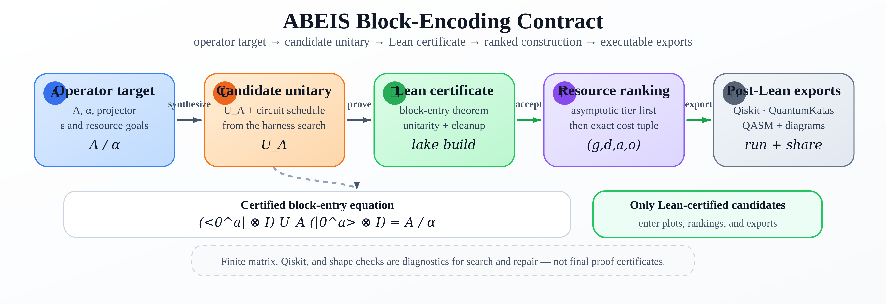
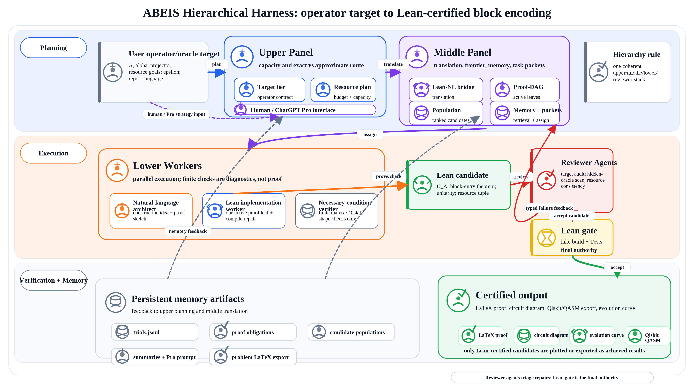
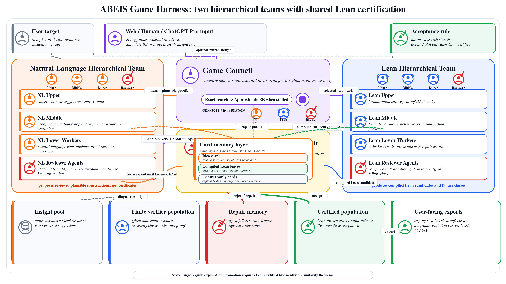
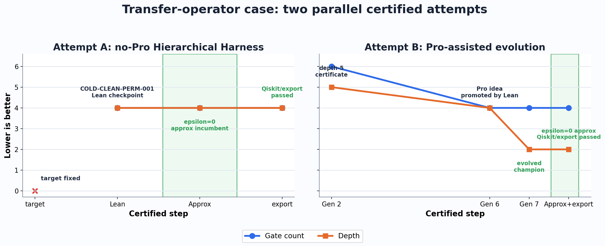
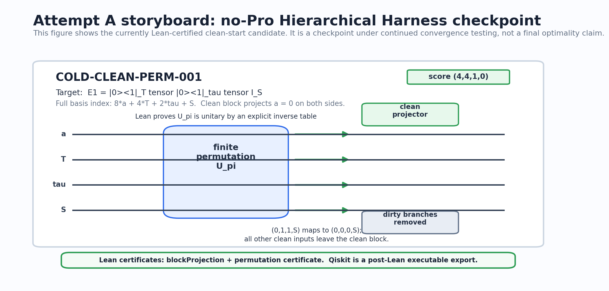
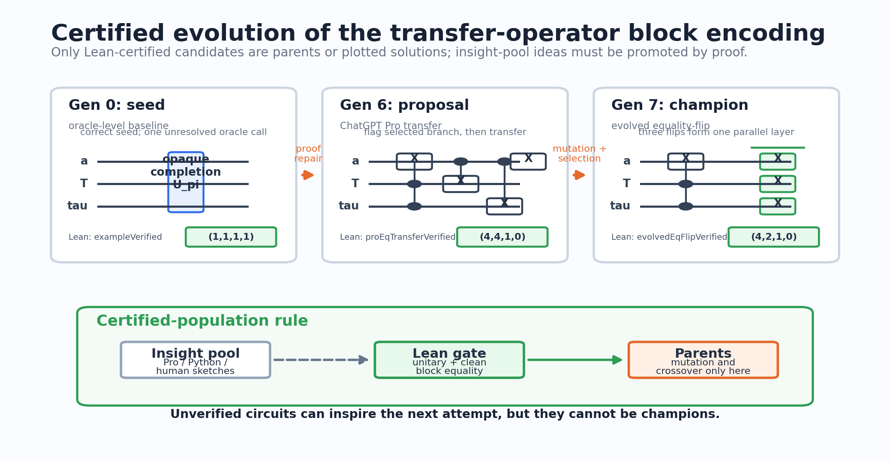
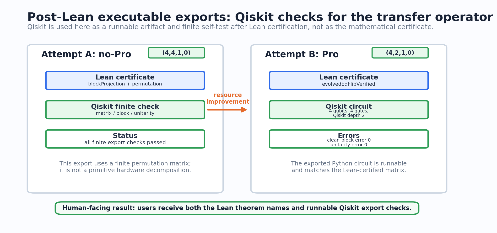
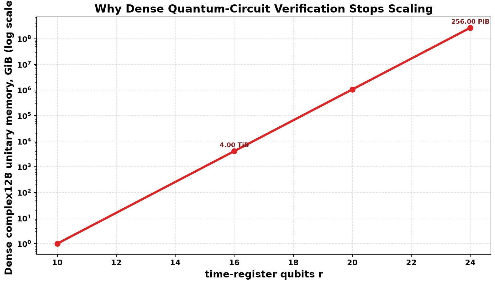

<div align=center>

# Auto-Lean-in-Sleep: Block Encoding for Quantum Computing

<h3 align="center">
A Platform of Automatic Block-Encolding for Quantum Query Operator (Lean-validated Theorem + Software Tools).
</h3>

[![Github][Github-image]][Github-url]
[![License][License-image]][License-url]


[Github-image]: https://img.shields.io/badge/github-12100E.svg?style=flat-square
[License-image]: https://img.shields.io/badge/License-MIT-orange?style=flat-square


[Github-url]: https://github.com/DakeBU/Quantum-Computing-Block-Encoding
[License-url]: https://github.com/DakeBU/Quantum-Computing-Block-Encoding/blob/main/LICENSE


</div>

## News 🔥

* **June 2026.** ABEIS is now public as a testing preview for Lean-certified block-encoding construction.  The API-user website placeholder is available at https://dakebu.github.io/Quantum-Computing-Block-Encoding/ while the hosted workflow is still being tested.  Feedback, issue reports, and suggested operator/oracle benchmarks are welcome.


---
ABEIS is a Lean 4 project and multi-agent harness for turning a requested
quantum query operator into concrete block-encoding candidates, gate-level
circuit matrices, resource scores, and Lean-checked certificates.




The project is built around one contract:

```text
operator/query-oracle contract A
-> candidate unitary U_A and circuit schedule
-> Lean-checked block-entry and unitarity certificate
-> resource-ranked construction
-> post-Lean executable exports such as Qiskit, QuantumKatas, and QASM
```


ABEIS does not stop at "assume an oracle exists".  A task should state the
operator `A`, normalizer `alpha`, clean ancilla projector, and the desired
exact block-entry equation:

```text
(<0^a| ⊗ I) U_A (|0^a> ⊗ I) = A / alpha
```

It may also state an accepted approximation budget:

```text
|| A - alpha * ((<0^a| ⊗ I) U_A (|0^a> ⊗ I)) || <= epsilon
```

Among Lean-certified candidates, ABEIS ranks constructions by asymptotic tier
first.  Inside the same tier it compares:

```text
(gateCount, depth, auxiliaryQubits, oracleCalls)
```

Paper constructions are treated as baselines and training data.  Once a paper
baseline is formalized, the same system can try to improve the construction
for the same fixed operator target.

ABEIS currently exposes two harness profiles.  Users can run either profile, or
run both in isolated workspaces and compare the certified population curves.





## Core Workflow

```mermaid
flowchart LR
  A["user gives A, alpha, projector"] --> B["upper fixes target"]
  A --> A2["user gives resource floor, epsilon, iteration limits"]
  B --> B1["Natural-Language Team explores ideas"]
  B --> B2["Lean Team plans formalizable routes"]
  B1 --> P["Game Council exchanges insights and sets capacity"]
  B2 --> P
  P --> C["middle keeps Lean <-> natural-language map"]
  C --> D["Game Harness lower population proposes exact U_A"]
  D --> E["finite/unitarity/block-entry diagnostics"]
  E --> F["Lean exact certificate attempt"]
  F --> G{"meets resource floor before limit?"}
  G -- yes --> H["Scenario 1: approximate-improvement phase"]
  G -- no/stalled --> I["Scenario 2: relaxed approximate search"]
  H --> J["Lean approximate certificate attempt"]
  I --> J
  J --> K["resource score and certified archive"]
  K --> L["post-Lean executable exports"]
  L --> M["Qiskit / QuantumKatas / QASM checks"]
  M --> N["dynamic agent-count audit"]
```



ABEIS uses diagnostics as search signals, not as proofs.  A candidate enters
the certified population only after Lean proves the advertised theorem at the
task's semantic tier.

## Block-Encoding Textbook Memory

ABEIS uses Lin Lin's lecture notes
([arXiv:2201.08309](https://arxiv.org/abs/2201.08309)) as the current
block-encoding textbook backbone.  The memory library is meant to feel like an
exam-prep notebook for agents and new users: each classic construction has a
short intuition card, a Lean theorem anchor when formalized, and a
paper-facing LaTeX proof sketch when exported.

```text
new oracle/operator target
-> upper agents read textbook memories and brainstorm plausible routes
-> middle agents split the chosen routes into proof-DAG leaves and insight-pool candidates
-> lower Lean/natural-language workers try the leaves
-> reviewer accepts only Lean-certified claims, then may request proof cleanup
```

Most exact block-encoding proofs reduce to the clean-entry habit
`U(clean row, clean col) = A(row,col)/alpha`.  The library helps agents decide
which familiar route is worth trying; it is not a rigid decision tree.

| Classic route | Good first examples | Proof intuition | Where to read |
| --- | --- | --- | --- |
| Entrywise clean block | any explicit finite candidate | prove every clean matrix entry | [`BE.EntrywiseExact.CleanBlock`](research-wiki/block-encoding-library/cards/BE.EntrywiseExact.CleanBlock.md) |
| Partial permutation | `|dst><src| ⊗ I`, reset maps, basis injections | complete a partial map to a permutation; non-target branches leave the clean block | [`BE.PartialPermutation.MatrixUnitTensorId`](research-wiki/block-encoding-library/cards/BE.PartialPermutation.MatrixUnitTensorId.md) |
| One-sparse support | one nonzero row per column | value oracle gives the amplitude; support permutation gives the row; a delta leaf collapses the entry | [`BE.Sparse.OneSparsePermutation`](research-wiki/block-encoding-library/cards/BE.Sparse.OneSparsePermutation.md) |
| Sparse access | column/row location oracles plus value oracle | prepare a uniform slot state, then collapse finite delta sums by uniqueness | [`BE.Sparse.ColumnOracle`](research-wiki/block-encoding-library/cards/BE.Sparse.ColumnOracle.md), [`BE.Sparse.RowColumnOracle`](research-wiki/block-encoding-library/cards/BE.Sparse.RowColumnOracle.md) |
| LCU / PREPARE--SELECT | finite sums of known blocks | prepare weights, select a block, project back to get the weighted sum | [`BE.LCU.PrepareSelect`](research-wiki/block-encoding-library/cards/BE.LCU.PrepareSelect.md) |
| Dilation fallback | dense contraction or small fallback seed | build a larger unitary from 2-by-2 contraction rotations | [`BE.Contraction.SVDDilation`](research-wiki/block-encoding-library/cards/BE.Contraction.SVDDilation.md) |
| Qubitization / QSVT consumer | polynomial transforms after a BE already exists | consume a proved BE; do not hide the original oracle construction inside QSVT | [`BE.QSVT.ConsumerContract`](research-wiki/block-encoding-library/cards/BE.QSVT.ConsumerContract.md) |

The detailed proof-DAG map is in
[`proof-network.md`](research-wiki/block-encoding-library/proof-network.md);
the route-intuition guide is in
[`route-selector.md`](research-wiki/block-encoding-library/route-selector.md);
compiled leaves are mainly in
[`BlockEncodingClassics.lean`](QuantumBlockEncoding/BlockEncodingClassics.lean).
The human-facing LaTeX proof templates are collected in
[`classic_leaves.tex`](paper-notes/block-encoding-library/classic_leaves.tex).
A card marked `contract-only` or `obligation` can guide brainstorming, but it
does not become a theorem until its Lean declaration compiles.

Human interaction is a first-class upper-layer input, not an out-of-band chat.
ABEIS records three human-facing intervention moments: scheduled 6h closeout,
direct user questions, and user status checks followed by new top-level
instructions.  Upper and middle agents should treat those interventions as
strategy updates, then translate them into task packets, proof obligations, or
candidate-population changes before lower agents continue.

If exact search fails to meet the user-specified resource floor within the
configured budget, the upper layer may switch to approximate BE search.  If a
fixed number of generations does not improve the population, the upper layer
may increase upper/middle/lower parallel agent counts up to the configured
maximum.  More agents are not assumed to be better; the increase is itself a
controlled experiment.
Once Scenario 2 approximate search is opened, that is a phase lock: old exact
leaves may remain as bounded dependencies or negative evidence, but the active
objective must name an epsilon tier, an error budget, and a Lean-checkable
approximate statement.

## Main Case Study

The current technical-report case study is the transfer-operator task:

```text
E_k = |0><k|_time ⊗ |0><1|_type ⊗ I
```

ABEIS records two parallel attempts for the concrete `r = 1, k = 1` instance.
Both report only Lean-certified candidates as achieved points, and both include
a post-Lean Qiskit export check.

| Run | Harness and inputs | Certified result | Score |
| --- | --- | --- | --- |
| `QBE-OP-OPTCTRL-COLD-CLEAN-001` | no-Pro Hierarchical Harness attempt | `coldE1Candidate_blockProjection`, `coldE1CandidateImage_permutation_certificate` | `(4,4,1,0)`; Qiskit export passed |
| `QBE-OP-OPTCTRL-001` | Pro-assisted evolution attempt | `OptimalControl.evolvedEqFlipVerified`, `OptimalControl.evolvedEqFlipZeroErrorApprox` | `(4,2,1,0)`; Qiskit export passed |

The no-Pro attempt shows the base harness recovering a correct finite
permutation block encoding from the operator contract.  The Pro-assisted
attempt shows the same acceptance rule with an external idea placed into the
insight pool and promoted only after Lean proves the advertised certificate.



Circuit storyboards and Qiskit export checks:







This is a concrete `r = 1, k = 1` logical reversible permutation-matrix
certificate.  It is not claimed as a hardware-decomposed theorem, a general
arbitrary-register theorem, or a Lean-proved global optimality theorem.

Detailed human-readable status:

```text
reports/QBE-OP-OPTCTRL-COLD-CLEAN-001/latest.md
reports/QBE-OP-OPTCTRL-COLD-CLEAN-001/zh_summary.md
paper-notes/problem-exports/QBE-OP-OPTCTRL-COLD-CLEAN-001/latest.tex
reports/QBE-OP-OPTCTRL-001/latest.md
paper-notes/problem-exports/QBE-OP-OPTCTRL-001/latest.tex
executable-exports/QBE-OP-OPTCTRL-COLD-CLEAN-001/qiskit/export.py
executable-exports/QBE-OP-OPTCTRL-001/qiskit/export.py
```

## Active Hard Benchmark

`QBE-OP-CUBIC-STATEPREP-001` is the first Scenario 2 benchmark:

```text
O_n |0^n> = sum_j (j / 2^n)^3 |j>
```

The vector on the right is not normalized, so the Lean target is the rank-one
operator `O_n = |v_n><0^n|`.  ABEIS should try exact candidates briefly, then
switch to approximate block-encoding search with the requested tolerance
`epsilon = 1e-10`.

Current status:

- Lean target declarations compile in `QuantumBlockEncoding.CubicStatePreparation`;
- the task, proof blueprint, proof obligations, candidate population, and
  verifier feedback are initialized;
- dense executable checks are treated as small-instance diagnostics, while the
  intended scalable route is symbolic arithmetic plus Lean family proof;
- no final approximate block-encoding candidate has been promoted yet.

Human-readable diagnostics:

```text
reports/cubic-stateprep/latest.md
reports/cubic-stateprep/zh_summary.md
```

## Why Lean For Block Encodings

Executable quantum tooling such as Qiskit, QuantumKatas, and QASM evaluators is
very useful for small concrete circuits: it can run a statevector, materialize
a unitary, or check a sample OpenQASM program.  That is not enough for many
block-encoding papers, where the real claim is a symbolic family of circuits
indexed by register sizes, sparse-access promises, normalizers, and ancilla
cleanup conditions.

For an `r`-qubit time register, dense statevector/unitary validation pays the
Hilbert-space dimension directly.  Even a structurally simple family like

```text
E_k = |0><k|_time ⊗ |0><1|_type ⊗ I_state
```

requires a dense `2^(r+3) × 2^(r+3)` matrix if we insist on checking it by
materializing the full unitary.  ABEIS instead aims to prove symbolic Lean
theorems about the circuit family.  The proof checker follows the proof
structure; it does not need to enumerate the whole Hilbert space for every
larger `r`.



At `r = 20`, a full dense complex128 unitary for this simple family would
already require about `1 PiB` of memory.  At `r = 32`, it is about `16 ZiB`.
This is where ABEIS should stop asking a simulator to materialize the whole
matrix and instead ask Lean for a symbolic theorem about the circuit family.

ABEIS still uses finite executable checks when they help.  They are useful as
small-instance checks, counterexample generators, and necessary-condition
diagnostics.  They are not promoted to scientific claims until the
advertised block-entry, unitarity, cleanup, and resource statements are closed
by Lean.

After a Lean certificate closes, ABEIS can emit runnable artifacts for users:
Qiskit Python circuits with exact finite assertions, QuantumKatas-style task
and test files, and OpenQASM transcripts with parser and fixed-instance checks.  These
exports are engineering deliverables, not replacements for the Lean theorem.
For symbolic families, the exported code records the concrete instantiation it
implements; the Lean theorem remains the reusable, parameterized certificate.

Current Qiskit exports:

- `executable-exports/QBE-OP-OPTCTRL-001/qiskit/export.py`: exported from a
  Lean-certified exact concrete champion.
- `executable-exports/QBE-OP-OPTCTRL-COLD-CLEAN-001/qiskit/export.py`:
  exported from the no-Pro Lean-certified cold-clean checkpoint.
- `executable-exports/QBE-OP-CUBIC-STATEPREP-001/qiskit/export.py`: finite
  dense baseline for small `n`; useful evidence, not a symbolic certificate.

Current executable-export self-tests:

| Task | Qiskit artifact | Status | What it checks |
| --- | --- | --- | --- |
| `QBE-OP-OPTCTRL-001` | `executable-exports/QBE-OP-OPTCTRL-001/qiskit/export.py` | passed: clean block error `0`, unitary error `0` | the exported four-qubit Qiskit circuit matches the Lean-certified concrete clean block and resources `(4,2,1,0)` |
| `QBE-OP-OPTCTRL-COLD-CLEAN-001` | `executable-exports/QBE-OP-OPTCTRL-COLD-CLEAN-001/qiskit/export.py` | passed: clean block error `0`, unitary error `0`, export error `0` | the no-Pro finite permutation export matches the Lean-certified clean block and resources `(4,4,1,0)` |
| `QBE-OP-CUBIC-STATEPREP-001` | `executable-exports/QBE-OP-CUBIC-STATEPREP-001/qiskit/export.py` | passed for finite `n=3`; clean block error about `2.8e-17` | a dense fixed-instance baseline only; not a symbolic family certificate |

## Why The ABEIS Harness

Qiskit QuantumKatas and QASM-Eval are good at testing submitted executable
artifacts.  QUASAR and AI-Mandel are useful examples of tool-feedback loops
for quantum artifacts.  Local public artifacts checked so far do not expose a
direct generic BE constructor for "given operator `A`, synthesize and prove a
symbolic block-encoding family."  ABEIS targets that stricter task:

```text
given an oracle/operator requirement A,
construct a candidate block-encoding unitary U_A,
prove the block-entry theorem in Lean,
rank certified candidates by resources,
and then export runnable circuits for users.
```

ABEIS currently tests two compatible harness profiles.  Neither is declared
better in advance.

| Harness | Organization | When it may help |
| --- | --- | --- |
| **Hierarchical Harness** | One upper/middle/lower/reviewer stack, with human and ChatGPT Pro as upper-level intervention channels.  The lower layer has a natural-language architect, a Lean worker, and a necessary-condition verifier.  Middle agents coordinate their handoffs and maintain the insight population. | Targets where one coherent planner can keep the natural-language and Lean tracks synchronized without much duplicated strategy work. |
| **Game Harness** | Two semi-independent hierarchical teams plus a Game Council.  The Natural-Language Team has its own upper/middle/lower stack and competes by producing reviewer-plausible human proofs.  The Lean Team has its own upper/middle/lower stack and competes by producing compiled Lean certificates.  The independent team directors and middle curators can run in parallel; the Game Council then transfers insights both ways, decides capacity increases, and controls exact-to-approximate phase switches. | Targets where strategic diversity matters, or where natural-language insight and Lean formalization keep failing to reuse each other. |

Both harnesses use the same acceptance rule: only Lean-certified constructions
enter the certified population or appear as achieved points in evolution
curves.  Natural-language sketches, simulator checks, Qiskit tests, and Pro
answers can guide search, but they are not final certificates.

Both harnesses also have the same user-facing closeout and external-insight rule.  Users may inject their own strategy notes, ChatGPT Pro answers, external AI suggestions, candidate block encodings, or natural-language proofs.  These inputs enter the insight pool.  In the Game Harness, the Game Council decides whether to route them to the Natural-Language Team for proof review, to the Lean Team for formalization, to both in parallel, or to rejected-route memory.  They are never accepted, plotted, or exported as achieved solutions until Lean certifies them.

If the Lean Team closes a certificate, the Natural-Language Team translates it into a human-readable proof note.  If the Natural-Language Team finds a reviewer-plausible construction first, the Game Council sends it to the Lean Team for formalization.  After a Lean certificate closes, ABEIS should export:

- a step-by-step LaTeX block-encoding statement and proof that a user can copy
  into a paper;
- circuit diagrams and evolution curves for every Lean-certified exact or
  approximate candidate used in the case study;
- checked executable artifacts such as Qiskit, QuantumKatas-style tests, or
  QASM for the certified construction.
- a proof-DAG figure showing the root target, dependencies, verified leaves,
  rejected leaves, and postponed external contracts such as QSVT.

Detailed timing, route-ablation, external-verifier records, and harness-profile
comparisons are kept in `reports/` and run directories.  The README states the
scientific contract and the user workflow; the detailed evidence belongs in the
technical report and generated case-study summaries.

## Benchmark Paper Cases

Paper reproduction remains important, but as benchmark data for the core
operator-construction system.

The first active paper benchmark is:

- Guseynov--Huang--Liu,
  [Quantum framework for simulating linear PDEs with Robin boundary conditions](https://arxiv.org/abs/2506.20478).

The benchmark Lean file is:

```text
QuantumBlockEncoding/GHL2025.lean
```

Paper-benchmark mode should reproduce the paper construction and resource
score first.  Any improvement search belongs in a separate operator task with
the same target operator.

## Quick Start

```bash
cd /path/to/Auto-Quantum-Computing-Bloack-Encoding-In-Sleep

python3 tools/qbe.py init
python3 tools/qbe.py list-literature
python3 tools/qbe.py next-task
python3 tools/qbe.py check
```

The mandatory acceptance gate is:

```bash
lake build && lake build Tests
```

## Use ABEIS

ABEIS has three equivalent user entrypoints.  All three must produce the same kind of task packet, agent profile, run logs, Lean gate, human-language summary, Pro-prompt, and optional post-Lean executable exports.  The intended rule is: if the same model backend and prompt profile are used, the CLI template, an AI chat window, and the website should differ only in convenience, not in scientific target or acceptance criteria.

1. **Local CLI template.**  Download the repository, replace the operator text in a template command, and run `tools/qbe.py`.
2. **AI chat window.**  Download the repository and tell Codex, Claude, GLM, Gemini, Minimax, or another coding agent: “Use the ABEIS system in this repository to solve the following operator block-encoding problem.”  The agent should call the same `ingest-user-problem`, `sleep-run`, and `check` commands as the CLI template.
3. **Website task builder and dashboard.**  Use the website in `web/` in either
   local mode or hosted mode.  Local mode means: download the repository, serve
   `web/` in a browser, paste the oracle description, then run the generated
   local CLI/runner command with Codex, Claude, GLM, Gemini, Minimax, or a
   custom wrapper installed on that machine.  Hosted mode means: use the public
   page without downloading first, but provide a user-owned API key or
   self-hosted runner endpoint.  In both modes, the page generates the same task
   packet and renders the same dashboard artifacts: exact/approximate curves,
   certified circuit storyboards, selected-language summaries, Pro prompts, and
   post-Lean Qiskit/QuantumKatas/QASM export status.

Main local CLI workflow:

```bash
python3 tools/qbe.py new-task QBE-OP-001 \
  --kind operatorBlockEncoding \
  --title "Construct a block encoding for my query operator" \
  --target-lean "QuantumBlockEncoding/MyOperator.lean"

python3 tools/qbe.py sleep-run QBE-OP-001 \
  --cycles 2 \
  --agent-profile codex-parallel.example.json \
  --execute \
  --check-each-cycle
```

`sleep-run` uses adaptive capacity by default: it starts with a small queue
(upper director, middle coordinator, one lower worker, reviewer/build gate) and
expands upper, middle, or lower capacity only after upper/reviewer memory
records stagnation.  For operator construction, the default
`--exact-stall-cycles 2` allows the controller to open Scenario 2 approximate
search after a short exact-search patience budget when no Lean-certified exact
candidate exists.  Add `--fixed-capacity` only for ablation runs where every
cycle should consume the requested full panel and lower-agent counts.

Choose a harness profile explicitly when you want controlled comparisons:

```bash
# Hierarchical Harness, the default
python3 tools/qbe.py sleep-run QBE-OP-001 \
  --cycles 2 \
  --hierarchical-harness \
  --agent-profile codex-parallel.example.json \
  --execute \
  --check-each-cycle

# Game Harness
python3 tools/qbe.py sleep-run QBE-OP-001 \
  --cycles 2 \
  --game-harness \
  --natural-lower-count 2 \
  --lean-lower-count 2 \
  --agent-profile codex-parallel.example.json \
  --execute \
  --check-each-cycle
```

The harness-specific lower counts above are maxima under adaptive capacity, not
a promise to run every listed agent in every cycle.  The controller starts
small, expands only on recorded stagnation, and writes the effective capacity
policy into each run's `00_context.md`.

Case-study hyperparameters are recorded under `run-presets/`.  In particular,
`run-presets/main_case_hierarchical_reproduction.md` is the current public
entry point for replaying the transfer-operator main case with isolated no-Pro
and Pro-insight Hierarchical Harness arms.  The cubic-diagonal hard case is
recorded in `run-presets/hard_hier_hinted_exact_to_approx.md`.

For a fair profile comparison, run both harnesses in isolated worktrees with
the same task packet, model profile, report language, active-time budget, and
Lean gate.  Both profiles must produce the same closeout artifacts: selected-
language summaries, ChatGPT Pro prompt if unresolved, a user-copyable LaTeX BE
proof after Lean closure, and checked executable exports such as Qiskit,
QuantumKatas-style tests, or QASM.

The harness is vendor-neutral: a profile under `agent-profiles/` can dispatch roles to Codex, Claude, GPT/OpenAI wrappers, Gemini, GLM, Minimax, or local tools.  The web page is not a public model-credit service.  In local-web mode it helps a downloaded checkout run local CLIs and then renders runner JSON.  In hosted-web mode it uses the user's API key or self-hosted runner endpoint.  For comparable results across the three entrypoints, keep the same task id, raw source artifact, report language, agent profile, active-budget policy, and Lean gate.  Long runs write summaries in the user's chosen language and export a problem-specific LaTeX proof note at `paper-notes/problem-exports/<task-id>/latest.tex`.

Users can also request post-certification executable outputs.  The static web
builder and task packets support Qiskit, QuantumKatas-style exercises, and
OpenQASM/QASM exports.  The harness should generate and check those artifacts
only after the corresponding Lean certificate is accepted, unless a task
explicitly marks them as pre-Lean diagnostics.  See
[`docs/executable_exports.md`](docs/executable_exports.md).

Progress during a run is visible in these files:

- `runs/<run-id>/dialogue.md`: role-tagged upper/middle/lower/reviewer handoffs.
- `runs/<run-id>/summary.md` and `zh_summary.md` or the selected-language equivalent: human-readable closeout.
- `runs/<run-id>/chatgpt_pro_prompt.md`: self-contained prompt for external deep reasoning if unresolved leaves remain.
- `runs/<run-id>/todo.md` and `memory_digest.md`: compact next-cycle state.
- `runs/logs/*.log`: raw execution log.
- `paper-notes/problem-exports/<task-id>/latest.tex`: user-copyable proof note after closeout.
- `reports/<task-id>/dashboard.json`, `evolution.json`, and
  `circuit_storyboard.json`: optional web-dashboard inputs for rendering
  champion status, exact/approximate curves, BE diagrams, and executable export
  checks.
- `reports/<task-id>/figures/`: reader-facing PNGs for the same information:
  evolution curve, certified-circuit storyboard, Qiskit/export status, and
  proof-DAG blueprint.  Only Lean-certified candidates may be plotted as
  achieved solutions.

Project layout:

- `QuantumBlockEncoding/`: Lean definitions, circuits, resources, and theorem
  certificates.
- `tasks/`: operator or paper-benchmark contracts.
- `candidate-populations/`: Lean-certified candidates and rejected routes.
- `research-wiki/block-encoding-library/`: reusable construction memory cards
  and route selector for partial permutations, LCU, product/tensor arithmetic,
  sparse-access, dilation, QSVT consumers, and approximate dense/structured
  block encodings.
- `conversion-windows/`, `proof-blueprints/`, `proof-obligations/`: compact
  proof state and Lean/natural-language correspondence.
- `executable-exports/`: post-Lean Qiskit, QuantumKatas, QASM, and related
  runnable artifacts for certified constructions.
- `tools/qbe.py`: orchestration CLI.
- `docs/`: deployment and long-run guides.

## Related Work And Similar Patterns

ABEIS adapts patterns from adjacent systems, but specializes them to
gate-level quantum block-encoding certificates.

| Work | Similar pattern | ABEIS use |
| --- | --- | --- |
| [ARIS][aris] | Plain-file autonomous research workflow and review. | Task files, skills, manifests, reviews, run logs. |
| [Learning Beyond Gradients][lbg] | Layered feedback and trial memory. | Upper/middle/lower/reviewer loops and compact summaries. |
| [EoH][eoh] | Evolutionary candidate populations. | Mutate/recombine candidate block-encoding circuits under a fixed target. |
| [LeanMarathon][leanmarathon] | Proof blueprint, dynamic leaves, CI gates. | Proof-blueprint snapshots and focused theorem-closure work. |
| [MathCode][mathcode] | Proof diagnostics and theorem reuse. | Hidden-assumption scans and reusable proof-attempt memory. |
| [Visored][visored-paper], [repo][visored-repo] | Controlled-natural-language proof surface with localized diagnostics and optional Lean emission. | Structured proof packets as a two-way exchange format between natural-language construction, Lean proof work, and human proof exports. |
| [Lean4Agent][lean4agent-paper] | Workflow/trajectory verification. | Lean-side process contracts in `Automation.lean`. |
| [Lean-QuantumInfo][lean-quantuminfo], [lean-quantum][lean-quantum] | Quantum formalization references. | Style and semantic references for finite-dimensional quantum objects. |
| [QASM-Eval][qasm-eval], [Qiskit QuantumKatas][qiskit-quantumkatas] | Typed circuit/test feedback and executable Qiskit/QASM checks. | ABEIS distinguishes inspired feedback, optional exact finite Qiskit checks, and Lean-certified theorem closure. |
| [QUASAR][quasar-paper], [AI-Mandel][ai-mandel-paper] | Tool-feedback loops for quantum artifacts. | Search signals only; not proof certificates. |
| [LLM4AD_Next][llm4ad-next] | Low-entry-barrier web interface. | Static oracle-to-task-packet builder. |
| [Lexicographic bandits][lexelim-bandits] | Lexicographic active-set filtering. | Prioritize correctness, diagnostics, asymptotic tier, and cost tuple. |
| [Hierarchical provers][hierarchical-provers], [statistical provability][statistical-provability] | Reusable proof cuts and finite-budget proof progress. | Named proof-DAG nodes and run-efficiency metrics. |

More detail is in [`docs/automation_deployment.md`](docs/automation_deployment.md),
[`docs/attribution.md`](docs/attribution.md), and [`NOTICE.md`](NOTICE.md).

## Literature Roadmap

The source of truth is `QuantumBlockEncoding/Literature.lean`.

Selected block-encoding and oracle-construction targets:

| Status | Paper | Target |
| --- | --- | --- |
| `active` | Guseynov--Huang--Liu, [Quantum framework for simulating linear PDEs with Robin boundary conditions](https://arxiv.org/abs/2506.20478) | `QuantumBlockEncoding/GHL2025.lean` |
| `planned` | Guseynov--Huang--Liu, [Efficient explicit gate construction of block-encoding for Hamiltonians needed for simulating partial differential equations](https://arxiv.org/abs/2405.12855) | `QuantumBlockEncoding/GHL2025.lean` |
| `planned` | Camps--Lin--Van Beeumen--Yang, [Explicit quantum circuits for block encodings of certain sparse matrices](https://arxiv.org/abs/2203.10236) | `QuantumBlockEncoding/Circuit.lean` |
| `planned` | Camps--Van Beeumen, [FABLE: Fast Approximate Quantum Circuits for Block-Encodings](https://arxiv.org/abs/2205.00081) | `QuantumBlockEncoding/Circuit.lean` |
| `planned` | Gilyen--Su--Low--Wiebe, [Quantum singular value transformation and beyond](https://arxiv.org/abs/1806.01838) | `QuantumBlockEncoding/BlockEncoding.lean` |
| `planned` | Childs--Wiebe, [Hamiltonian simulation using linear combinations of unitary operations](https://arxiv.org/abs/1202.5822) | `QuantumBlockEncoding/BlockEncoding.lean` |
| `planned` | Low--Chuang, [Hamiltonian Simulation by Qubitization](https://quantum-journal.org/papers/q-2019-07-12-163/) | `QuantumBlockEncoding/BlockEncoding.lean` |
| `planned` | Sunderhauf--Campbell--Camps, [Block-encoding structured matrices for data input in quantum computing](https://arxiv.org/abs/2302.10949) | `QuantumBlockEncoding/Circuit.lean` |

The construction memory library is in
`research-wiki/block-encoding-library/`.  It is organized as a route selector
plus theorem cards, so an agent can recognize when a target should be solved by
partial permutation, LCU, product/tensor arithmetic, sparse-access Gram
construction, density/purification, dilation, QSVT consumer contracts, or
approximate dense/structured synthesis.

## Citation

```bibtex
@misc{abeis2026,
  author = {Bu, Dake and Huang, Xiajie and Liu, Nana and Zhang, Qingfu and Wong, Hau-san and Nitanda, Atsushi},
  title = {{Auto-Lean-in-Sleep: Block Encoding for Quantum Computing}},
  year = {2026},
  note = {Project page: \url{https://github.com/DakeBU/Quantum-Computing-Block-Encoding}}
}
```

[aris]: https://github.com/wanshuiyin/Auto-claude-code-research-in-sleep
[lbg]: https://github.com/Trinkle23897/learning-beyond-gradients
[eoh]: https://github.com/FeiLiu36/EoH
[leanmarathon]: https://github.com/YuanheZ/LeanMarathon
[mathcode]: https://github.com/math-ai-org/mathcode
[visored-paper]: https://arxiv.org/abs/2606.17581
[visored-repo]: https://github.com/xiyuzhai-husky-lang/visored
[llm4ad-next]: https://github.com/Optima-CityU/LLM4AD_Next
[lexelim-bandits]: https://xueb1996.github.io/pdf/AAAI-2026-Xue.pdf
[lean4agent-paper]: https://arxiv.org/abs/2606.06523
[quasar-paper]: https://arxiv.org/abs/2510.00967
[qasm-eval]: https://github.com/fuzhenxiao/QASM-Eval
[qiskit-quantumkatas]: https://github.com/qiskit-community/Qiskit-QuantumKatas
[ai-mandel-paper]: https://arxiv.org/abs/2511.11752
[hierarchical-provers]: https://arxiv.org/abs/2602.10512
[statistical-provability]: https://arxiv.org/abs/2602.10538
[lean-quantuminfo]: https://github.com/Timeroot/Lean-QuantumInfo
[lean-quantum]: https://github.com/Hayata-Yamasaki-Group/lean-quantum
