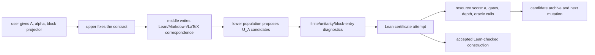
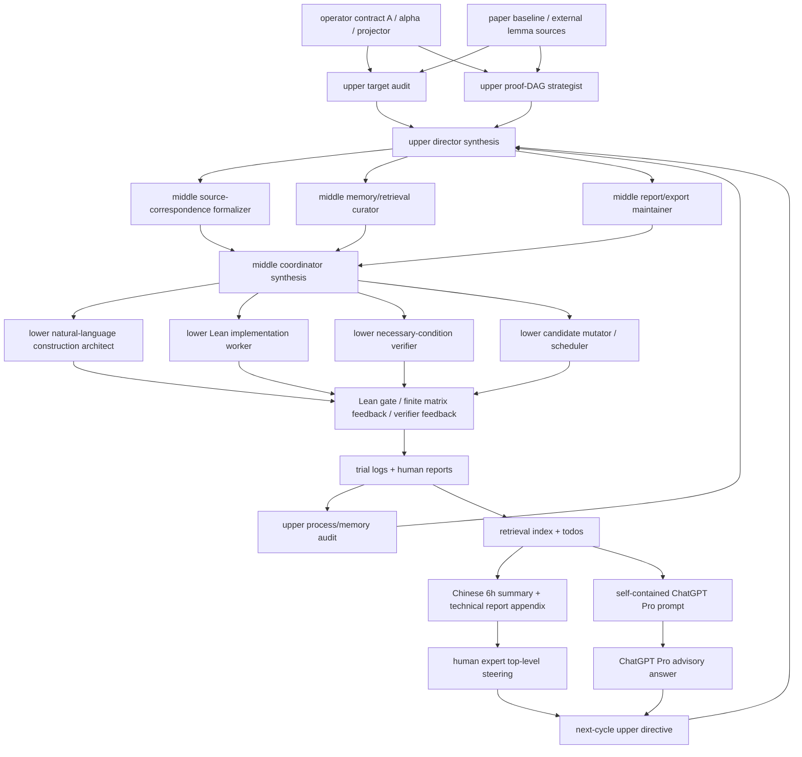

# Auto-Lean-in-Sleep: Block Encoding for Quantum Computing

Lean 4 project for turning a requested quantum query operator into concrete
block-encoding candidates, gate-level circuit matrices, resource scores, and
Lean-checked certificates.

The project target is:

```text
operator/query-oracle contract A
-> candidate unitary U_A and circuit schedule
-> Lean-checked block-entry and unitarity certificate
-> resource-ranked construction
```

The project explicitly avoids stopping at "assume an oracle exists".  ABEIS
asks for the actual operator `A`, a normalizer `alpha`, an ancilla projector,
and a candidate unitary `U_A` satisfying a block-entry statement such as:

```text
(<0^a| ⊗ I) U_A (|0^a> ⊗ I) = A / alpha
```

The search target is not only correctness.  Among Lean-checkable candidates,
ABEIS ranks constructions by:

1. auxiliary qubits `a`, smaller is better;
2. gate count, smaller is better;
3. depth when gate count ties, smaller is better because parallel layers are
   preferable to sequential gates;
4. unresolved oracle calls, smaller is better until they are expanded.

Thus paper constructions are baselines and training data, not the whole
purpose of the project.  After a paper baseline is formalized, the same system
can try to improve the construction for the same operator target.


## Core Workflow

ABEIS is an auto-Lean-in-sleep system for operator-to-block-encoding
construction:



The universal one-ancilla completion

```text
U_A = [[A, (I - A† A)^(1/2)],
       [(I - A† A)^(1/2), -A†]]
```

is a useful existence baseline when `A` is properly scaled, but it is usually
not the construction ABEIS wants to stop at.  The system should search for
structured circuits with fewer gates, shallower schedules, fewer unresolved
oracle calls, or clearer reusable proof components.

## Benchmark Paper Cases

Paper reproduction remains important, but as benchmark data for the core
operator-construction system.  The first benchmark case is the Robin-boundary
PDE simulation construction:

- Guseynov--Huang--Liu 2025,
  [Quantum framework for simulating linear PDEs with Robin boundary conditions](https://arxiv.org/abs/2506.20478),
  arXiv 2025 / published 2026. Status: `active paper benchmark`.

The first-case Lean file is:

```text
QuantumBlockEncoding/GHL2025.lean
```

## Quick Start

```bash
cd /path/to/Auto-Quantum-Computing-Bloack-Encoding-In-Sleep

python3 tools/qbe.py init
python3 tools/qbe.py list-literature
python3 tools/qbe.py next-task
python3 tools/qbe.py check
```

The mandatory acceptance gate is always:

```bash
lake build && lake build Tests
```

## What This Repository Contains

Compiled Lean source of truth:

- `QuantumBlockEncoding/Core.lean`: base finite index and grid helpers.
- `QuantumBlockEncoding/Circuit.lean`: circuit and gate-level placeholders.
- `QuantumBlockEncoding/BlockEncoding.lean`: operator targets, candidate
  block encodings, verified certificates, and `BlockEncodingCost`.
- `QuantumBlockEncoding/Resources.lean`: auxiliary qubits, gate counts,
  oracle-call counts, and depth/schedule resource bookkeeping.
- `QuantumBlockEncoding/GHL2025.lean`: first paper-benchmark case.
- `QuantumBlockEncoding/Literature.lean`: clickable literature registry.
- `QuantumBlockEncoding/OpenProblems.lean`: Lean-registered open problems.
- `QuantumBlockEncoding/Automation.lean`: compiled automation contracts.

Automation and knowledge artifacts:

- `tools/qbe.py`: no-dependency project CLI.
- `tasks/`: task contracts.
- `conversion-windows/`: synchronized Lean/LaTeX/Markdown workspaces.
- `proof-obligations/`: explicit proof and oracle gaps.
- `proof-blueprints/`: compact task system-of-record snapshots for long runs.
- `open-problem-proposals/`: draft open problems.
- `runs/`: prompt decks, dialogue boards, context packs, efficiency reports,
  trial logs, and summaries.
- `agent-briefs/`: generated context packets for agents.
- `research-wiki/`: persistent paper/idea/claim/gap memory.

Shared external development references live outside this repository:

- `../outer_papers/quantum/`: quantum-computing paper PDFs/TeX sources used by
  ABEIS during source-dependency audits.
- `../outer_papers/sampling_theory_sde/`: statistical learning, sampling,
  Langevin/SDE, and propagation-of-chaos paper sources shared with
  [ASTIS](https://github.com/DakeBU/Auto-Sampling-Theory-In-Sleep).
- `../outer_papers/automation_systems/`: automation-system papers such as
  [LeanMarathon][leanmarathon] and [ARIS][aris].
- `../outer_repos/automation_systems/`: local checkouts of reference systems
  such as [ARIS][aris], [Learning Beyond Gradients][lbg], [EoH][eoh],
  [LeanMarathon][leanmarathon], and [MathCode][mathcode].
- `../outer_repos/quantum/`: quantum-formalization references such as
  [Lean-QuantumInfo][lean-quantuminfo].
- `../outer_repos/sampling_theory_sde/`:
  [ASTIS](https://github.com/DakeBU/Auto-Sampling-Theory-In-Sleep)-facing
  statistical-learning and
  sampling/SDE formalization references.
- `../outer_repos/mathematics_open_problems/`: open-problem registry and
  benchmark references such as [optimizationproblems][optimizationproblems].

The shared roots are intentionally classified: `../outer_papers/` and
`../outer_repos/` should contain only topic folders, not duplicate flat copies
or compatibility symlinks.

Public ABEIS/QBE artifacts cite upstream GitHub repositories, arXiv URLs,
theorem/equation anchors, or bundled paper notes. They should not depend on a
machine-specific absolute path.

## Agent Automation

QBE adapts the [ARIS][aris] plain-file automation pattern to Lean proof work:

```text
operator contract -> candidate unitary search -> resource score -> Lean proof -> review -> docs
```

The implementation also borrows the trial-memory pattern from
[Learning Beyond Gradients][lbg]: append detailed JSONL trial records and
rewrite a compact summary CSV after every attempt.

QBE's automation stack is layered:

| Layer | Similar pattern | QBE role |
|---|---|---|
| Plain-file substrate | [ARIS][aris] | Skills, task files, conversion windows, manifests, wiki pages, reviews, and run logs. |
| Iterative controller | [Learning Beyond Gradients][lbg] | Upper/middle/lower plus reviewer cycles, trial memory, failure compression, and proof-system maintenance. |
| Candidate search | [EoH][eoh] | Candidate populations for block-encoding unitaries/circuits after the operator target is fixed. |
| Lean harness control | [LeanMarathon][leanmarathon] | Proof-blueprint snapshots, target review, dynamic leaves, refiner-style repair, and deterministic gates. |
| Proof diagnostics | [MathCode][mathcode] | Hidden-assumption scans, theorem-reuse memory, and proof-attempt diagnostics. |
| Typed verifier feedback | [QASM-Eval][qasm-eval] and [Qiskit QuantumKatas][qiskit-quantumkatas] | Parser/build/finite-matrix/test-style fields used as pre-Lean diagnostics, never as theorem closure. |
| Reusable cuts / lemma DAGs | [Sonoda--Akiyama--Uezato 2026][hierarchical-provers] | Do not flatten repeated circuit-entry proofs; introduce source-faithful intermediate lemmas and memoize them in the proof DAG. |
| Statistical provability | [Sonoda--Akiyama--Uezato 2026][statistical-provability] | Track finite-budget proof success, verifier-call cost, average truncated proof length, and repeated-state failures as harness metrics. |
| Conjecture/prove loops | [Conjecturing-Proving Loop][cpl-paper] and [LeanConjecturer][leanconjecturer-paper] | Generate candidate unitary/circuit conjectures separately from proof attempts, then filter by Lean syntax, non-triviality, dimensions, resource score, and block-entry diagnostics. |

The [LeanMarathon][leanmarathon]-like control layer does not replace the
[Learning Beyond Gradients][lbg]-like hierarchy or the [EoH][eoh]-like
candidate-population layer.  It makes those existing loops more reliable by forcing
agents to work from a current proof blueprint and by retiring stale dynamic
leaves before lower agents spend more proof-search tokens.  For long theorem
closure runs, QBE can split planning and translation roles into bounded panels.
The upper panel performs source/visual audit, proof-DAG strategy,
process/memory audit, and director synthesis.  The middle panel separates
source correspondence, retrieval/memory curation, report/export maintenance,
and coordinator synthesis.  The 6h wrapper runs these panels at the final
audit by default, while inner proof-search cycles stay lightweight.

QBE absorbs external automation ideas only when they solve a failure observed
in block-encoding runs.  Long GHL2025 cycles showed three recurring problems:
agents re-expanded the same circuit-entry algebra, middle summaries drifted
away from the source circuit diagram, and lower agents sometimes used
finite-matrix checks as if they were formal proofs.  The adopted response is
domain-specific:

| Observed QBE failure | Absorbed mechanism | Not absorbed |
| --- | --- | --- |
| Repeated circuit-entry proofs and stale local algebra. | LeanMarathon-style dynamic leaves plus Sonoda--Akiyama--Uezato-style reusable proof cuts. | A flat transcript loop that asks every lower agent to rederive the same matrix entry. |
| Need to search for better `U_A` candidates for a fixed operator. | EoH-style candidate populations and CPL/LeanConjecturer-style candidate generation, controlled by `BlockEncodingCost`. | Hidden extra assumptions, changed operator targets, or reward-only acceptance. |
| Expensive Lean attempts on wrong circuit transcripts. | QASM/Qiskit-style typed pre-Lean diagnostics: parser, support, finite entry, dimension, unitarity, block-entry, and schedule checks. | Treating simulator/test success as theorem closure. |
| Human and agent confusion about source-paper correspondence. | ARIS-style plain files plus LBG-style long/compact memory split and middle Lean/Markdown/LaTeX windows. | A hidden database or opaque chat-only memory that collaborators cannot audit. |

The resulting QBE-specific workflow is:

```text
operator A, alpha, and block projector
-> candidate U_A family and circuit/layer schedule
-> BlockEncodingCost and baseline comparison
-> finite necessary-condition diagnostics
-> one lower Lean leaf for unitarity or block-entry correctness
-> Lean gate
-> candidate archive, Markdown/LaTeX correspondence, and next active leaf
```


### ABEIS Memory and Proof-Feedback Loop



The current roles are compiled in `QuantumBlockEncoding/Automation.lean`:

- Upper director: chooses strategy and compresses memory.
- Upper target/source auditor: checks the operator `A`, normalizer `alpha`,
  projector, paper baseline if any, register transcript, and ancilla cleanup
  before Lean work is assigned.
- Upper proof-DAG strategist: chooses the root theorem, active leaf, candidate
  family to mutate, stale leaves to retire, and necessary-condition checks.
- Upper process/memory auditor: checks whether reports, verifier feedback,
  trial memory, rejected routes, and human summaries are current.
- Middle coordinator: turns upper decisions into lower-1 proof-DAG, lower-2
  Lean, and lower-3 verifier packets.

### Human And Pro Review Entry Points

After a long run, the human-facing entry points are intentionally narrow:

- Chinese status: `paper-notes/GHL2025/markdown/cycle-summaries/latest.md`.
- ChatGPT Pro prompt: `runs/pro-prompts/QBE-AUTO-002-latest.md`.
- Policy: [`docs/pro_prompt_policy.md`](docs/pro_prompt_policy.md).
- Blueprint/workflow formalization notes:
  [`docs/agent_blueprint_formalization.md`](docs/agent_blueprint_formalization.md).

The Pro prompt is self-contained because ChatGPT Pro cannot read local files.
It includes public paper links, the current theorem target, open GHL
contribution obligations, open external technical lemmas, and recent verifier
feedback.
The human expert entry point is separate: after reading the Chinese summary
and any Pro answer, the user records top-level source, modeling, and priority
guidance for the next upper-director cycle.  Both inputs are advisory.  They
must be translated into a Lean-checkable active leaf, source anchor, or
explicit obligation before they can change the proof state.
- Middle source-correspondence formalizer: maps operator contracts, source TeX,
  equations, figures, and cited primitives to Lean-facing contracts.
- Middle memory/retrieval curator: retires stale targets, updates retrieval
  packets, verifier-feedback fields, and rejected-route memory.
- Middle report/export maintainer: updates Chinese status, Markdown/LaTeX proof
  maps, and technical-report status only at the right cadence.
- Lower natural-language construction architect: translates the active operator
  target or source proof fragment into a candidate/proof DAG and ordered lemma
  list.
- Lower Lean implementation worker: proves exactly one ready Lean leaf.
- Lower necessary-condition verifier: runs finite matrix, path-support,
  branch-vanish, unitarity, block-entry, shape/register, schedule/depth, or
  convention diagnostics that must pass if the Lean leaf is true.
- Lower refiner/reducer, optional: after a concrete Lean failure, isolates a
  smaller lemma or repairs a specific route such as `maxRecDepth`.
- Reviewer: checks Lean build, hidden oracle assumptions, resources, links, and
  whether the panel outputs were followed.

Documentation-writing agents also use
`.agents/skills/qbe-math-writing/SKILL.md`.  The skill keeps mathematical prose
compact: definitions before theorem statements, precise justifications and
citations, Markdown math with `$...$`/`$$...$$`, and no hidden assumptions.
For repeated proof work, agents use
`.agents/skills/qbe-hierarchical-proof-dag/SKILL.md`, which encodes the lesson
of Sonoda--Akiyama--Uezato
([arXiv:2602.10512v2][hierarchical-provers]), also circulated under the
cut-elimination framing "Don't Eliminate Cut": successful theorem proving
should reuse named proof blocks as a DAG rather than repeatedly flattening the
same local proof trace.
A DAG is a directed acyclic graph: nodes are definitions, lemmas, external
contracts, and theorem targets; an edge `A -> B` means that `B` depends on
`A`.  QBE schedules lower agents on active leaves of this graph.  When
`QBE_LOWER_COUNT=3`, lower 1 is expected to write the natural-language proof
decomposition and dependency table, lower 2 turns one ready leaf into compiling
Lean, and lower 3 runs necessary-condition diagnostics before another large
Lean proof attempt.  Use lower 4 only as a refiner after a specific Lean
failure has been classified.
For Lean proof diagnostics, agents use
`.agents/skills/qbe-proof-diagnostics/SKILL.md`, influenced by similar
diagnostic patterns in [MathCode][mathcode]:
placeholder scans, hidden-axiom checks, proof statistics, theorem-store-like
reuse memory, and fast feedback loops.  In QBE these diagnostics are advisory;
the final acceptance gate remains the Lean theorem plus the explicit
block-encoding proof obligations.
For typed attempt feedback, agents use
`.agents/skills/qbe-verifier-feedback/SKILL.md`, influenced by non-Lean
quantum-circuit evaluation systems such as [QASM-Eval][qasm-eval] and
[Qiskit QuantumKatas][qiskit-quantumkatas].  QBE records fields such as
`source_correspondence_ok`, `finite_matrix_ok`, `block_entry_ok`,
`error_class`, and `next_route` in `runs/trials.jsonl` and
`runs/trials_summary.csv`.  These fields help upper and middle agents choose
the next leaf; they do not prove a block encoding.
For finite-budget evaluation, QBE also records metrics motivated by
[statistical provability][statistical-provability]: active agent time, Lean
gate calls, repeated stale leaves, and whether the average proof attempt is
getting shorter because reusable lemmas are being introduced rather than
inlined.
For long-horizon Lean control, agents use
`.agents/skills/qbe-proof-blueprint/SKILL.md`, influenced by similar
blueprint/DAG-control patterns in
[LeanMarathon][leanmarathon] and its
[paper](https://arxiv.org/abs/2606.05400).  QBE adapts the idea as
`proof-blueprints/<task-id>.md`: a compact snapshot of the active directive,
dynamic proof leaves, proof obligations, Lean declarations, correspondence
artifacts, and latest dialogue signal.

ABEIS also adopts the compact control-surface discipline used in the sibling
[Auto-Sampling-Theory-In-Sleep](https://github.com/DakeBU/Auto-Sampling-Theory-In-Sleep)
project: before or after long runs, agents can write status, context, and
efficiency artifacts instead of replaying the full history.

```bash
python3 tools/qbe.py blueprint-status QBE-AUTO-002 --refresh
python3 tools/qbe.py write-context-pack QBE-AUTO-002 --cycle 1
python3 tools/qbe.py efficiency-report --task QBE-AUTO-002
```

QBE now distinguishes three strategy modes:

- Operator block-encoding construction: the user supplies an operator/matrix
  `A`, a normalizer `alpha`, and the block projector.  Agents search over
  candidate unitaries `U_A`, prove the block-entry and unitarity contracts in
  Lean, and rank candidates by `BlockEncodingCost`.
- Paper benchmark: reproduce a paper construction as a source-faithful
  baseline candidate.  The paper construction is not mutated while it is being
  formalized.  Once the baseline and its score exist, a separate operator task
  can try to improve the same target.
- Exploratory improvement: improve a fixed operator target or paper baseline.
  This mode uses [Learning Beyond Gradients][lbg]-like memory plus an
  [EoH][eoh]-like candidate population.  Candidates may be mutated or
  recombined, but each candidate must keep the same acceptance predicate.

The acceptance rule is the same in all modes: diagnostics and scores guide
search, but only Lean closes the block-encoding certificate.  A lower auxiliary
dimension, shallower depth, or smaller gate count is not accepted if the
block-entry theorem or unitarity theorem is missing.

## Sibling System Comparison

| System | Mathematical domain | Domain-specific proof object | Paper mode | New-problem mode |
| --- | --- | --- | --- | --- |
| [ABEIS/QBE](https://github.com/DakeBU/Quantum-Computing-Block-Encoding) | Quantum block encoding | operator targets, candidate unitaries, circuits, cost scores, block-entry invariants | Build paper baselines without mutating the source construction. | Search for better block encodings of a fixed operator target. |
| [ASTIS](https://github.com/DakeBU/Auto-Sampling-Theory-In-Sleep) | Sampling theory and stochastic analysis | SDEs, distributions, KL/FI/LSI/PI chains, convergence bounds | Reproduce sampling papers with Lean statements and source-aligned proof maps. | Prove new sampling or diffusion claims from the accumulated library. |
| [AGTIS](https://github.com/DakeBU/Auto-Colored-Graph-Theory-In-Sleep) | Colored graph theory | labels/SRLGs, labelled cuts, dual walks, winding, algorithmic obstruction certificates | Reproduce WDV2023 first, then label-cut and multigraph papers. | Prove new labelled-cut, SRLG, coloring, or labelled-matching statements with Lean verification. |

The shared rule is: the repository must contain both the Lean code and the
human-readable mathematical proof translation.  Lean verifies correctness;
the natural-language proof keeps the result inspectable by humans.


## For Operator And Oracle Authors

Use this repository when you can describe the operator your algorithm needs,
but you do not yet have a concrete block-encoding circuit that is both
resource-conscious and formally verified.  The preferred task input is:

- the matrix/operator `A`,
- the normalizer `alpha`,
- the block projector or clean ancilla state,
- any allowed free parameters,
- whether the encoding must be exact or approximate,
- the resource baseline to beat, if one is known.

### Construct A Block Encoding For A Given Operator

This is the default ABEIS use case.

1. Register a task:

```bash
python3 tools/qbe.py new-task QBE-OP-001 \
  --kind operatorBlockEncoding \
  --mode operatorBlockEncoding \
  --title "Construct a block encoding for my query operator" \
  --source "operator supplied by user / arXiv:XXXX.XXXXX" \
  --target-lean "QuantumBlockEncoding/MyOperator.lean"
```

2. Fill the `Operator Contract` section in `tasks/QBE-OP-001.md`.

At minimum, state:

```text
A : Matrix (2^n) (2^n)
alpha : normalizer
target block: (<0^a| ⊗ I) U_A (|0^a> ⊗ I) = A / alpha
allowed free parameters: ...
```

3. Create the conversion window:

```bash
python3 tools/qbe.py conversion-window QBE-OP-001 \
  --title "Operator-to-block-encoding workspace"
```

4. Run a candidate-search loop:

```bash
python3 tools/qbe.py update-task QBE-OP-001 --status active --active
python3 tools/qbe.py sleep-run QBE-OP-001 \
  --cycles 6 \
  --lower-count 3 \
  --parallel-lower \
  --agent-cmd 'cd {root} && codex exec --dangerously-bypass-approvals-and-sandbox "$(cat {prompt})"' \
  --execute \
  --check-each-cycle
```

Expected outputs:

- Lean declarations in `QuantumBlockEncoding/MyOperator.lean`,
- candidate records in `candidate-populations/`,
- candidate scores `(auxiliaryQubits, gateCount, depth, oracleCalls)`,
- tests under `Tests/`,
- a symbol map in `conversion-windows/QBE-OP-001.md`,
- readable derivations in `paper-notes/`,
- remaining gaps in `proof-obligations/`,
- run memory in `runs/trials.jsonl` and `runs/trials_summary.csv`.

### Use A Paper Construction As Baseline

Use paper-benchmark mode when a paper already gives a construction and you want
ABEIS to formalize it first as a baseline.  The baseline task should not
optimize or mutate the construction; it should recover the paper's `U_A`,
normalizer, ancilla layout, and resource score.  Then open a separate
`operatorBlockEncoding` or `exploratoryConstruction` task to improve that same
operator target.

```bash
python3 tools/qbe.py new-task QBE-PAPER-001 \
  --kind paperBenchmark \
  --mode paperBenchmark \
  --title "Benchmark my paper's block encoding" \
  --source "arXiv:XXXX.XXXXX" \
  --target-lean "QuantumBlockEncoding/MyPaperBaseline.lean"
```

### Improve A Baseline Construction

Use exploratory construction mode when your theoretical algorithm needs an
oracle or when a paper baseline exists but you want a better construction for
the same `A`.

1. Draft the open problem:

```bash
python3 tools/qbe.py new-open-problem QBE-EXP-001 \
  --title "Block encoding for my new oracle condition" \
  --motivation "Theory assumes an oracle; no concrete circuit is known."
```

2. Create a task:

```bash
python3 tools/qbe.py new-task QBE-EXP-001 \
  --kind exploratoryConstruction \
  --mode exploratoryConstruction \
  --title "Improve a block encoding for my operator target" \
  --source "open problem / arXiv:XXXX.XXXXX" \
  --target-lean "QuantumBlockEncoding/OpenProblems.lean"
```

3. State the Lean-checkable acceptance predicate before running agents.  A good
target says:

- the target matrix/operator `A`,
- the allowed auxiliary registers and initial clean state,
- the required block entry or projector,
- the normalizer,
- the baseline candidate score, if any,
- what counts as an improvement under `BlockEncodingCost`.

4. Run multiple lower agents only after the target is precise:

```bash
python3 tools/qbe.py sleep-run QBE-EXP-001 \
  --cycles 6 \
  --lower-count 3 \
  --agent-cmd 'cd {root} && codex exec --dangerously-bypass-approvals-and-sandbox "$(cat {prompt})"' \
  --execute \
  --check-each-cycle
```

In exploratory mode, failed attempts are first-class results.  They should be
logged, summarized, and either turned into better lemmas or promoted into open
problem statements.

Create one prompt deck:

```bash
python3 tools/qbe.py run-cycle QBE-AUTO-001 --cycle 1 --lower-count 3
```

Create repeated prompt decks for an overnight dry run:

```bash
python3 tools/qbe.py sleep-run QBE-AUTO-001 --cycles 8 --lower-count 3 --dry-run
```

Append role messages to the shared dialogue board:

```bash
python3 tools/qbe.py agent-note latest --role upper \
  --message "Cycle objective: define the target operator and score two candidate block encodings."
```

Log trial memory:

```bash
python3 tools/qbe.py trial-log \
  --task QBE-AUTO-001 \
  --role lower \
  --kind attempt \
  --status blocked \
  --lean-gate not-run \
  --from-git \
  --feedback-field auxiliary_qubits=1 \
  --feedback-field gate_count=unknown \
  --feedback-field depth=unknown \
  --feedback-field error_class=block_entry_gap \
  --notes "Candidate unitary has the right dimension, but the block-entry proof is still missing."

python3 tools/qbe.py trial-summary
```

Full guide:

- [Agent orchestration](docs/agent_orchestration.md)
- [Sleep run guide](docs/sleep_run_guide.md)
- [Article to Lean workflow](docs/article_to_lean_workflow.md)
- [ASTIS reference notes](docs/astis_reference_notes.md)

## Benchmark Case: GHL2025 Robin Operator

For the first paper-benchmark case, use `QBE-AUTO-002` as the infrastructure
task that makes the GHL2025 Robin operator and circuit semantics concrete.
This is a baseline task: reproduce the paper construction and its resource
score first, then open a separate operator/improvement task if you want a
shallower or lower-gate construction for the same operator.

```bash
cd /path/to/Auto-Quantum-Computing-Bloack-Encoding-In-Sleep
python3 tools/qbe.py update-task QBE-AUTO-002 --status active --active
python3 tools/qbe.py blueprint-status QBE-AUTO-002 --refresh
python3 tools/qbe.py write-context-pack QBE-AUTO-002 --cycle 1

mkdir -p runs/logs
nohup bash -lc '
QBE_HOURS=6 \
QBE_LOWER_COUNT=3 \
QBE_PARALLEL_LOWER=1 \
QBE_UPPER_PANEL_FINAL=1 \
QBE_UPPER_PANEL_INNER=0 \
QBE_MIDDLE_PANEL_FINAL=1 \
QBE_MIDDLE_PANEL_INNER=0 \
QBE_AGENT_CMD='"'"'cd {root} && codex exec --dangerously-bypass-approvals-and-sandbox "$(cat {prompt})"'"'"' \
bash tools/qbe_run_theorem_closure.sh QBE-AUTO-002
' > runs/logs/codex-qbe-auto-002-$(date +%Y%m%d-%H%M%S).log 2>&1 &
```

`QBE_HOURS=6` is an active-agent-time budget: retry sleep caused by quota or
temporary API failures is recorded separately and does not count against the
six hours.  With `QBE_LOWER_COUNT=3` and `QBE_PARALLEL_LOWER=1`, lower 1 is a
natural-language proof architect, lower 2 is a Lean implementation worker, and
lower 3 is a necessary-condition verifier.  Lower 3 should try exact finite
matrix/path/support checks, not broad theorem closure.
`QBE_UPPER_PANEL_FINAL=1` runs the source/visual, proof-DAG, and process/memory
upper specialists at the final audit before the director synthesizes the next
human-facing plan.  `QBE_UPPER_PANEL_INNER=0` keeps ordinary proof-search
cycles cheap; set it to `1` only when the run is repeatedly stuck on source
interpretation, figure correspondence, stale leaves, or memory drift.
`QBE_MIDDLE_PANEL_FINAL=1` makes the final audit split middle work into source
correspondence, memory/retrieval, and report/export maintenance before the
middle coordinator writes the next lower packet.  `QBE_MIDDLE_PANEL_INNER=0`
prevents routine proof-search cycles from spending time on report/export work.
The intended flow is:

```text
upper panel audits source/visual facts, proof-DAG frontier, and process memory
  -> upper director chooses root theorem and active proof-DAG leaves
  -> middle panel separates source map, compact memory, and report/export work
  -> middle coordinator writes narrow lower-1, lower-2, and lower-3 packets
  -> lower 1 writes the natural-language dependency proof for one leaf
  -> lower 2 proves that leaf in Lean and runs the gate
  -> lower 3 checks finite/path/support necessary conditions and typed feedback
  -> reviewer rejects stale leaves, contract drift, or undocumented Lean changes
```

Human and agent status should start from the compact reports, not from raw logs:

- [`HUMAN_STATUS.md`](HUMAN_STATUS.md): current verdict, build/sorry status, active leaves.
- [`REPORTS.zh.md`](REPORTS.zh.md): which report or log to read for each purpose.
- [`paper-notes/GHL2025/markdown/unresolved-failures.zh.md`](paper-notes/GHL2025/markdown/unresolved-failures.zh.md): source-aligned GHL unfinished proof map.
- [`paper-notes/GHL2025/markdown/fig4-visual-audit.zh.md`](paper-notes/GHL2025/markdown/fig4-visual-audit.zh.md): visual audit of GHL Fig. 4, including the distinction between the full circuit transcript and the seven-gate backend component.

## Lean/LaTeX/Markdown Conversion

Every serious operator target or paper benchmark should use a conversion
window.


Create one:

```bash
python3 tools/qbe.py conversion-window QBE-AUTO-001 \
  --title "Robin one-term block encoding"
```

The conversion window has three synchronized panes:

- LaTeX: exact theorem/proof notation from the paper or user-facing theorem.
- Markdown: operator contract, construction explanation, design choices,
  candidate scores, and rejected paths.
- Lean: declaration names, target files, and buildable code.

Any symbol that cannot be mapped to Lean becomes a proof obligation or an open
problem. It should not remain an implicit oracle assumption.

When updating Markdown or LaTeX, reuse existing Lean declarations and notation
tables instead of redefining the same object in several places.  The reviewer
agent is expected to flag duplicated definitions and prose that violates the
math-writing skill.

## Command Reference

| Command | Purpose |
| --- | --- |
| `python3 tools/qbe.py init` | Initialize workflow files and state. |
| `python3 tools/qbe.py check` | Run `lake build && lake build Tests`. |
| `python3 tools/qbe.py status` | Show git status and run build gates. |
| `python3 tools/qbe.py list-literature` | Print literature entries with links. |
| `python3 tools/qbe.py list-tasks` | List task files in `tasks/`. |
| `python3 tools/qbe.py next-task` | Suggest the next task. |
| `python3 tools/qbe.py new-task ...` | Create a task contract. |
| `python3 tools/qbe.py update-task ...` | Update task status and active task. |
| `python3 tools/qbe.py conversion-window ...` | Create a Lean/LaTeX/Markdown window. |
| `python3 tools/qbe.py blueprint-refresh ...` | Refresh a compact task proof blueprint. |
| `python3 tools/qbe.py blueprint-status ...` | Write the current blueprint control status as Markdown and JSON. |
| `python3 tools/qbe.py write-context-pack ...` | Write a compact long-run context pack. |
| `python3 tools/qbe.py efficiency-report ...` | Summarize recent long-run efficiency, quota/build signals, and next controls. |
| `python3 tools/qbe.py cycle-zh-summary ...` | Write the Chinese source-aligned audit page. The 6h wrapper runs this once at the final audit; use `sleep-run --summary-each-cycle` only for short debugging runs. |
| `python3 tools/qbe.py cycle-pro-prompt ...` | Write a self-contained ChatGPT Pro prompt for the remaining unresolved leaves. |
| `python3 tools/qbe.py memory-refresh ...` | Refresh `memory_digest.md`, cycle todo, benchmark/paper todo, technical-lemma todo, and the compact retrieval JSON. |
| `python3 tools/qbe.py human-status ...` | Refresh `HUMAN_STATUS.md`, the single human-facing dashboard for the latest run. |
| `python3 tools/qbe.py project-article-update ...` | Write the article-facing cycle packet and mirror generated status into the technical report. |
| `python3 tools/qbe.py new-open-problem ...` | Draft an open problem proposal. |
| `python3 tools/qbe.py agent-brief ...` | Generate an agent context packet. |
| `python3 tools/qbe.py run-cycle ... --upper-panel --middle-panel` | Create one multi-agent prompt deck; panel flags also create specialist upper and middle prompts. |
| `python3 tools/qbe.py sleep-run ... --upper-panel --middle-panel` | Create or execute repeated agent cycles. By default it refreshes compact memory each cycle but does not archive a Chinese summary each cycle; panel flags run specialist audits whenever that layer is scheduled. |
| `python3 tools/qbe.py agent-note ...` | Append to a run dialogue board. |
| `python3 tools/qbe.py trial-log ...` | Append one JSONL trial record. |
| `python3 tools/qbe.py trial-summary` | Rewrite and print trial summaries. |

## Literature Roadmap

The source of truth is `QuantumBlockEncoding/Literature.lean`. This README
mirrors the initial checklist with clickable links.

First paper-benchmark case:

| Status | Paper | Target |
| --- | --- | --- |
| `skeleton` | Guseynov, Huang, Liu, [Quantum framework for simulating linear PDEs with Robin boundary conditions](https://arxiv.org/abs/2506.20478) | `QuantumBlockEncoding/GHL2025.lean` |

Explicit block-encoding and oracle-construction papers:

| Status | Paper | Target |
| --- | --- | --- |
| `planned` | Guseynov, Huang, Liu, [Efficient explicit gate construction of block-encoding for Hamiltonians needed for simulating partial differential equations](https://arxiv.org/abs/2405.12855) | `QuantumBlockEncoding/GHL2025.lean` |
| `planned` | Kharazi, Alkadri, Liu, Mandadapu, Whaley, [Explicit block encodings of boundary value problems for many-body elliptic operators](https://arxiv.org/abs/2407.18347) | `QuantumBlockEncoding/OpenProblems.lean` |
| `planned` | Camps, Lin, Van Beeumen, Yang, [Explicit quantum circuits for block encodings of certain sparse matrices](https://arxiv.org/abs/2203.10236) | `QuantumBlockEncoding/Circuit.lean` |
| `planned` | Camps, Van Beeumen, [FABLE: Fast Approximate Quantum Circuits for Block-Encodings](https://arxiv.org/abs/2205.00081) | `QuantumBlockEncoding/Circuit.lean` |
| `planned` | Li, Ni, Ying, [On efficient quantum block encoding of pseudo-differential operators](https://arxiv.org/abs/2301.08908) | `QuantumBlockEncoding/OpenProblems.lean` |
| `planned` | Guseynov, Liu, [Efficient explicit circuit for quantum state preparation of piece-wise continuous functions](https://arxiv.org/abs/2411.01131) | `QuantumBlockEncoding/OpenProblems.lean` |

Core composition and QSVT framework:

| Status | Paper | Target |
| --- | --- | --- |
| `planned` | Gilyen, Su, Low, Wiebe, [Quantum singular value transformation and beyond](https://arxiv.org/abs/1806.01838) | `QuantumBlockEncoding/BlockEncoding.lean` |
| `planned` | Low, Chuang, [Optimal Hamiltonian simulation by quantum signal processing](https://arxiv.org/abs/1606.02685) | `QuantumBlockEncoding/OpenProblems.lean` |
| `planned` | Childs, Wiebe, [Hamiltonian simulation using linear combinations of unitary operations](https://arxiv.org/abs/1202.5822) | `QuantumBlockEncoding/BlockEncoding.lean` |
| `planned` | Berry, Childs, Cleve, Kothari, Somma, [Exponential improvement in precision for simulating sparse Hamiltonians](https://arxiv.org/abs/1312.1414) | `QuantumBlockEncoding/Resources.lean` |
| `planned` | Rossi, Chuang, [Multivariable quantum signal processing (M-QSP)](https://arxiv.org/abs/2205.06261) | `QuantumBlockEncoding/OpenProblems.lean` |

PDE simulation and Schrodingerisation context:

| Status | Paper | Target |
| --- | --- | --- |
| `planned` | Jin, Liu, Yu, [Quantum simulation of partial differential equations via Schrodingerization](https://arxiv.org/abs/2212.13969) | `QuantumBlockEncoding/OpenProblems.lean` |
| `planned` | Hu, Jin, Liu, Zhang, [Quantum circuits for partial differential equations via Schrodingerisation](https://arxiv.org/abs/2403.10032) | `QuantumBlockEncoding/OpenProblems.lean` |

Arithmetic subroutines for concrete oracle implementation:

| Status | Paper | Target |
| --- | --- | --- |
| `planned` | Draper, Kutin, Rains, Svore, [A logarithmic-depth quantum carry-lookahead adder](https://arxiv.org/abs/quant-ph/0406142) | `QuantumBlockEncoding/Circuit.lean` |
| `planned` | Haener, Roetteler, Svore, [Optimizing quantum circuits for arithmetic](https://arxiv.org/abs/1805.12445) | `QuantumBlockEncoding/Circuit.lean` |

Seed citation graph:

- [Google Scholar citation set supplied by the project owner](https://scholar.google.com/scholar?oi=bibs&hl=zh-CN&cites=14261843797372216914,13308862874802569087)

## Reference Works And Source Links

This repository cites external work by original source link:

- [wanshuiyin/Auto-claude-code-research-in-sleep][aris]:
  [ARIS][aris]-style plain-file research automation, artifact contracts, and review
  gates. QBE adapts the pattern to Lean proof automation.
- [Learning Beyond Gradients][lbg]
  and its [artifact repository][lbg]:
  trial JSONL logs, summary CSVs, and iterative upper/middle/lower plus
  reviewer maintenance of a proof system.
- [FeiLiu36/EoH][eoh]:
  similar pattern for evolutionary candidate search with initialization,
  mutation, recombination/crossover, selection pressure, and archives. QBE
  uses this for operator-block-encoding candidate populations under a fixed
  Lean target; paper-benchmark mode does not mutate paper constructions.
- [Timeroot/Lean-QuantumInfo][lean-quantuminfo]:
  style reference for finite-dimensional quantum information formalization.
- [teorth/optimizationproblems][optimizationproblems]:
  style reference for open mathematical problem registries.
- [math-ai-org/mathcode][mathcode]:
  similar pattern for Lean proof diagnostics, theorem reuse memory, persistent
  proof feedback, skills, tools, plugins, and tree-of-subgoals proving. QBE
  adapts those ideas to gate-level quantum block-encoding formalization; see
  [MathCode][mathcode] [Reference Notes](docs/mathcode_reference_notes.md).
- [YuanheZ/LeanMarathon][leanmarathon] and
  [arXiv:2606.05400](https://arxiv.org/abs/2606.05400):
  similar pattern for Lean blueprint-as-system-of-record design, target review,
  dynamic proof-DAG leaves, bounded worker/refiner scopes, and deterministic
  gates. QBE adapts those ideas to domain-specific block-encoding proof
  snapshots; see [LeanMarathon][leanmarathon] [Reference Notes](docs/leanmarathon_reference_notes.md).

See [Attribution](docs/attribution.md) and [NOTICE](NOTICE.md).
For the sibling auto-Lean control-surface comparison, see
[ASTIS Reference Notes](docs/astis_reference_notes.md).

## Citation

If you use [ARIS][aris] in your research, please cite:

```bibtex
@misc{abeis2026,
  author = {{Anonymous ABEIS Contributors}},
  title = {{Auto-Lean-in-Sleep: Block Encoding for Quantum Computing}},
  year = {2026},
  month = {May},
  note = {Project page: \url{https://github.com/DakeBU/Quantum-Computing-Block-Encoding}}
}
```

## Design Lineage

QBE is a Lean-first proof-engineering workflow for a narrow problem class:
turning oracle assumptions in theoretical quantum algorithms into gate-level
circuit matrices and block-encoding certificates.  The comparison below records
similar design patterns with adjacent AI-research systems while keeping the
task boundary explicit.

| Similar pattern | Where it appears | QBE adaptation | Task boundary |
| --- | --- | --- | --- |
| LLM-readable workflow packets | [ARIS][aris] uses single-purpose `SKILL.md` files for empirical research workflows. | `tools/qbe.py run-cycle` generates task-specific role prompts for upper, middle, lower, and reviewer agents. | [ARIS][aris] targets literature, experiments, reviews, and paper writing; QBE targets Lean-checked circuit/oracle formalization. |
| Plain-file project memory | [ARIS][aris] uses Markdown templates, `MANIFEST.md`, research wiki pages, and review artifacts instead of a database. | `tasks/`, `conversion-windows/`, `paper-notes/`, `proof-obligations/`, `runs/`, and `research-wiki/` are plain files that humans and agents can inspect and edit. | QBE adds a stricter Lean/LaTeX/Markdown correspondence layer because theorem proving must preserve source-paper notation. |
| Independent review loop | [ARIS][aris] uses reviewer models to check claims, experiments, citations, and writing. | The reviewer agent checks Lean build status, hidden oracle assumptions, normalizers, ancilla layout, `BlockEncodingCost`, citations, and mode discipline. | In QBE, review cannot accept a claim merely because it reads well; the Lean gate and explicit proof obligations control completion. |
| Trial memory and feedback compression | [Learning Beyond Gradients][lbg] records policy attempts in `trials.jsonl`, `summary.csv`, videos, logs, and rejected directions. | QBE records proof/circuit attempts in `runs/trials.jsonl` and `runs/trials_summary.csv`; rejected constructions become proof obligations or open problems. | [Learning Beyond Gradients][lbg] optimizes empirical behavior of heuristic policies; QBE uses similar memory discipline to organize theorem-proving attempts whose final target is formal verification. |
| Hierarchical proof-system maintenance | [Learning Beyond Gradients][lbg] treats code, tests, logs, summaries, and failure traces as the learnable system, not neural weights. | QBE keeps an upper/middle/lower plus reviewer hierarchy: upper chooses strategy, middle maintains Lean/Markdown/LaTeX and memory, lower proves local leaves, reviewer gates claims. | QBE's maintained object is not a game policy or controller; it is a formal library for oracle/block-encoding construction. |
| Population-style candidate evolution | [EoH][eoh] evolves heuristic algorithms with initialization, mutation, crossover, parent selection, objective evaluation, and population archives. | QBE uses a similar idea for operator-block-encoding construction: maintain families of candidate unitaries/circuits, vary them, evaluate them against necessary diagnostics and Lean-checkable obligations, and keep rejected designs as memory. | [EoH][eoh] is designed for automatic heuristic algorithm design under empirical objective scores; QBE cannot use score alone as correctness. A construction is accepted only when the Lean target and proof obligations are satisfied. |
| Selection and archive pressure | [EoH][eoh] keeps populations and best individuals in JSON files after objective evaluation. | QBE keeps candidate scores, trial summaries, proof-obligation status, and reusable Lean lemmas so future agents prefer lower-ancilla, lower-gate, shallower constructions that also reduce formal gaps. | Paper-benchmark mode should not use evolutionary mutation to change the paper construction; population search belongs to operator construction or improvement tasks after the acceptance predicate is explicit. |
| Lean proof diagnostics and theorem reuse | [MathCode][mathcode] provides Lean proof-analysis tools, theorem-store-like reuse, persistent REPL/LSP feedback, tree-of-subgoals proving, multi-planner search, and skills/plugins. | QBE uses a similar idea for reviewer scans, proof-attempt memory, reusable projection/gate lemmas, and future focused-check tooling. | [MathCode][mathcode] is a general math formalization agent; QBE is a domain-specific system for quantum oracle/block-encoding circuit matrices. QBE must not accept stored assumptions or proof-search scores as theorem closure. |
| Blueprint and dynamic proof-DAG control | [LeanMarathon][leanmarathon] and its [paper](https://arxiv.org/abs/2606.05400) use an evolving Lean blueprint, target review, dynamic leaves, worker/refiner roles, and CI gates for long-horizon Lean autoformalization. | QBE adds `proof-blueprints/`, `blueprint-refresh`, `blueprint-status`, compact context packs, and efficiency reports as system-of-record control artifacts over Lean declarations, conversion windows, proof obligations, cited-results memory, and latest dialogue. | [LeanMarathon][leanmarathon] targets general research-math autoformalization. QBE specializes the idea to quantum block-encoding/oracle-circuit proofs, where source-paper registers, normalizers, ancilla cleanup, and resource contracts must remain explicit. |
| Blueprint generation and refinement | [Goedel-Architect][goedel-architect-paper] uses a blueprint DAG, preserves solved nodes, and refines failed nodes by diagnosis. | QBE now treats post-cycle memory, Pro prompts, and active leaves as a diagnosis pipeline: wrong statement, missing dependency, proof too hard, or stale route. | Goedel-Architect is a general Lean proving architecture; QBE specializes the blueprint to quantum oracle/circuit source correspondence. |
| Workflow and trajectory verification | [Lean4Agent][lean4agent-paper] models agent workflows and trajectories in Lean. | QBE records a future route for Lean-checking the orchestration layer itself: required artifacts, role pre/postconditions, and stale-route trajectory checks. | Workflow verification audits the process; it never replaces Lean proof of the quantum theorem. |
| Quantum circuit generation evaluation taxonomy | [Generative AI for Quantum Circuits and Quantum Code][quantum-circuit-review] organizes circuit-generation systems by artifact type, training regime, and syntax/semantic/hardware evaluation layers. | QBE uses the taxonomy to separate pre-Lean diagnostics from proof closure: syntax, dimension, finite simulation, block-entry, unitarity, and schedule checks are useful search signals, while Lean theorems remain the final certificate. | The review concerns generated QASM/Qiskit/circuit artifacts; QBE targets operator-to-block-encoding construction with formal certificates. |
| Tool-server and hierarchical reward feedback | [QUASAR][quasar] uses tool-augmented quantum simulators and hierarchical reward feedback for quantum assembly generation. | QBE borrows the idea of structured search signals for lower agents, but translates them into proof-DAG leaves, verifier-feedback fields, and rejected-route memory. | [QUASAR][quasar] optimizes generated circuit programs; QBE cannot treat reward as proof. |
| Typed verifier fields | [QASM-Eval][qasm-eval] validates OpenQASM-3 programs with syntax, state, and timeline checks. | QBE mirrors this as `verifier-feedback/` fields and as lower 3, a necessary-condition verifier for finite matrix/path/support checks before Lean theorem closure. | QASM-Eval validates executable programs; QBE uses such checks only before Lean theorem closure. |
| Kata-style deterministic tests | [Qiskit QuantumKatas][qiskit-quantumkatas] adapts [Microsoft QuantumKatas][microsoft-quantumkatas] into deterministic LLM evaluation tasks. | QBE treats this as a model for future `BlockEncodingKatas`: small deterministic operator/candidate/unitarity/block-entry lemmas that teach agents and humans before full paper benchmarks. | Kata tests are excellent pedagogy and regression checks, but they do not replace block-encoding proof obligations. |
| Natural-language idea to tool-executable loop | [AI-Mandel][ai-mandel] turns literature-derived quantum-physics ideas into tool-executable configurations. | QBE keeps a natural-language proof architect lower agent that translates source proofs into dependency DAGs before the Lean implementation worker attacks one leaf; lower 3 checks necessary finite/tool feedback before large proof search. | AI-Mandel targets executable physics designs; QBE targets Lean-checked oracle/block-encoding certificates. |

The analogy is:

```text
[ARIS][aris] empirical paper pipeline:
papers -> ideas -> experiments -> review -> paper

[Learning Beyond Gradients][lbg] heuristic loop:
state/test/log feedback -> code edit -> trial record -> summary -> next edit

[EoH][eoh] algorithm-design loop:
population -> mutation/crossover -> objective evaluation -> selection/archive

[MathCode][mathcode] proof-agent loop:
goal -> Lean formalization -> proof diagnostics -> theorem reuse -> repair loop

[LeanMarathon][leanmarathon] blueprint loop:
source proof + target statements -> reviewed blueprint -> dynamic proof leaves -> CI gate -> refiner repair

QBE proof pipeline:
operator A + alpha + projector
  -> candidate U_A and circuit schedule
  -> necessary diagnostics and BlockEncodingCost
  -> Lean block-entry/unitarity check
  -> review and proof map
```

The practical split is:

```text
operatorBlockEncoding:
fixed operator target + EoH-like candidate population + Lean certificate

paperBenchmark:
paper-fixed baseline + LBG-like proof memory + no construction mutation

exploratoryConstruction:
fixed target or baseline + candidate mutation/recombination + resource improvement
```

The [LeanMarathon][leanmarathon]-like control layer in QBE is the proof blueprint:

```bash
python3 tools/qbe.py blueprint-refresh QBE-AUTO-002
python3 tools/qbe.py blueprint-status QBE-AUTO-002 --refresh
python3 tools/qbe.py write-context-pack QBE-AUTO-002 --cycle 1
```

Then generate a prompt deck or sleep run with:

```bash
python3 tools/qbe.py sleep-run QBE-AUTO-002 \
  --cycles 12 \
  --lower-count 1 \
  --context-mode focused \
  --blueprint-refresh \
  --upper-every 6 \
  --middle-every 6 \
  --reviewer-every 6 \
  --upper-panel \
  --middle-panel \
  --check-each-cycle
```

This manual pattern runs the upper and middle panels only every sixth cycle
because specialist audits are planning and synchronization work, not local
proof search.  For the standard 6h active-time wrapper, leave
`QBE_UPPER_PANEL_INNER=0` and `QBE_MIDDLE_PANEL_INNER=0`, then rely on the
final panel audit unless a repeated blocker needs source/visual,
proof-DAG, correspondence, or memory intervention inside the batch.

QBE's many Markdown files are therefore not decoration.  They play the same
operational role that [ARIS][aris] skills, templates, manifests, and research-wiki
pages play: they are the stable interface between humans, agents, and the next
cycle.  The extra QBE-specific layers are the Lean/LaTeX/Markdown conversion
window, candidate-score archive, and proof blueprint, because a
block-encoding project must preserve the operator contract, candidate
construction, source-paper notation when a benchmark is used, and checked
declaration dependencies.

## Cited Result Memory

Papers often use previous theorems or "standard" circuit primitives inside a
proof.  QBE records those dependencies under
[`research-wiki/cited-results/`](research-wiki/cited-results/) so future
paper-benchmark, operator-construction, and exploratory-improvement runs can reuse the same
audited memory.

The current retrieval layer separates three memories:

- [`research-wiki/paper-contributions/GHL2025/`](research-wiki/paper-contributions/GHL2025/)
  records source-paper objects and whether each item is GHL's own contribution
  or an external primitive used by the proof.
- [`research-wiki/technical-lemmas/`](research-wiki/technical-lemmas/)
  records external lemmas, standard quantum primitives, classical facts, and
  reusable proof contracts with a fixed card schema.
- [`research-wiki/retrieval-index/`](research-wiki/retrieval-index/)
  stores compact JSON packets read by upper and middle agents before the next
  6h cycle, so they do not need to replay the full long log.

The important distinction is status:

- `paper-cited`: the source paper invokes the result.
- `classic-unformalized`: the result is widely used but not yet formalized here.
- `contract-only`: QBE has a typed interface or semantic obligation.
- `obligation`: a dependent proof cannot close until this is formalized.
- `formalized`: QBE has a build-tested Lean declaration for the exact statement
  being used.

Reviewer agents must reject hidden dependencies.  A prior result cannot close a
gate-level oracle or block-encoding proof unless the cited-results ledger names
the source, exact statement, Lean status, and dependent use sites.

## Source Dependency Audits

For paper benchmarks, QBE treats repeated Lean failure as a signal
to re-read the source paper before spending more lower-agent proof search.
Middle and upper agents should inspect the local TeX source, nearby citations,
and bibliography, then classify the missing ingredient as an internal paper
step, external cited result, classical Lean lemma, or source-contract gap.

Local TeX sources should be kept in the classified shared external paper
directory.  For GHL2025, the preferred private working source is
`../outer_papers/quantum/GHL2025/main.tex`.
Agents may override the search root with:

```bash
export QBE_PAPER_SOURCE_ROOT=/path/to/paper-sources
```

Public QBE documents should still cite arXiv links and
theorem/lemma/equation/figure anchors, not local machine paths.

If the audit finds an external or standard result, the cited-results ledger
must be updated before lower agents rely on it.  If it finds a source-contract
gap, the relevant proof flags remain false until the gap is resolved by a
paper-backed contract or a precisely recorded external theorem.

When the source TeX contains a proof or proof sketch, QBE also requires a proof
translation map.  Middle agents should break the source proof into steps and
map each step to an existing Lean declaration, a new local lemma, an external
cited result, or a source-contract gap.  Upper agents plan lower work from this
map so paper-benchmark mode remains a translation of the paper proof rather
than unconstrained tactic search.

## Proof Exports

Compiled Lean proof blocks are exported for human reading under
[`paper-notes/GHL2025/`](paper-notes/GHL2025/):

- Markdown proof notes: `paper-notes/GHL2025/markdown/`
- Overleaf entry point: `paper-notes/GHL2025/latex/main.tex`
- LaTeX section files: `paper-notes/GHL2025/latex/sections/`

This export is intentionally batch-based.  Lower agents may prove many small
Lean lemmas during a 5-hour run; the middle agent should translate accepted
proof blocks into Markdown and LaTeX once at the end of the batch, not after
every small lemma.

[aris]: https://github.com/wanshuiyin/Auto-claude-code-research-in-sleep
[lbg]: https://github.com/Trinkle23897/learning-beyond-gradients
[eoh]: https://github.com/FeiLiu36/EoH
[leanmarathon]: https://github.com/YuanheZ/LeanMarathon
[mathcode]: https://github.com/math-ai-org/mathcode
[goedel-architect-paper]: https://arxiv.org/abs/2606.06468
[lean4agent-paper]: https://arxiv.org/abs/2606.06523
[quantum-circuit-review]: https://arxiv.org/abs/2603.16216
[quasar]: https://github.com/benyucong/QUASAR
[quasar-paper]: https://arxiv.org/abs/2510.00967
[qasm-eval]: https://github.com/fuzhenxiao/QASM-Eval
[qasm-eval-paper]: https://arxiv.org/abs/2605.30358
[qiskit-quantumkatas]: https://github.com/qiskit-community/Qiskit-QuantumKatas
[qiskit-quantumkatas-paper]: https://arxiv.org/abs/2605.27210
[microsoft-quantumkatas]: https://github.com/microsoft/QuantumKatas
[ai-mandel]: https://github.com/artificial-scientist-lab/ai-mandel
[ai-mandel-paper]: https://arxiv.org/abs/2511.11752
[hierarchical-provers]: https://arxiv.org/abs/2602.10512
[statistical-provability]: https://arxiv.org/abs/2602.10538
[cpl-paper]: https://arxiv.org/abs/2509.14274
[cpl-repo]: https://github.com/auto-res/ConjecturingProvingLoop
[leanconjecturer-paper]: https://arxiv.org/abs/2506.22005
[leanconjecturer-repo]: https://github.com/auto-res/LeanConjecturer
[lean-rademacher-paper]: https://arxiv.org/abs/2503.19605
[lean-rademacher-repo]: https://github.com/auto-res/lean-rademacher
[lean-quantuminfo]: https://github.com/Timeroot/Lean-QuantumInfo
[optimizationproblems]: https://github.com/teorth/optimizationproblems
