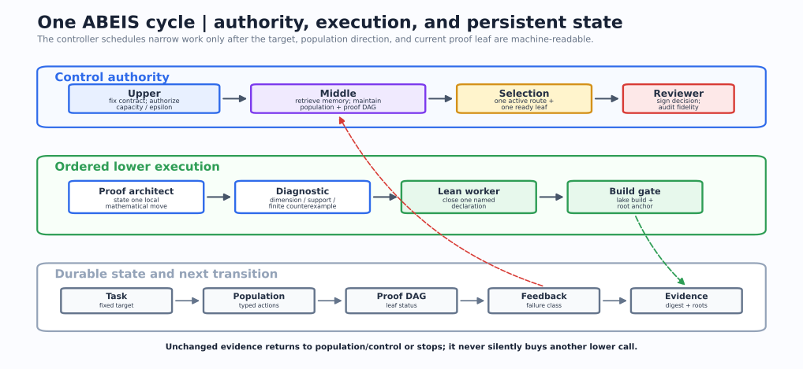

<div align="center">

# ASPBE

### Automatic State Preparation and Block Encoding for Quantum Computing

Lean-checked quantum construction search, executable validation, and the
[Quantumlib](https://dakebu.github.io/Quantum-Computing-Block-Encoding/) textbook.

[](https://lean-lang.org/)
[](https://github.com/leanprover-community/mathlib4)
[](LICENSE)

</div>

ASPBE searches for quantum constructions and admits a result only through a
named Lean certificate. It supports two applications with different contracts:

| Application | Contract | What must be certified |
| --- | --- | --- |
| **State Preparation** | `U |0^n> = |psi>` | target normalization, unitarity, state action, circuit/resources |
| **Block Encoding** | `||A - alpha Pi U Pi†|| <= epsilon` | register layout, clean projection, normalization, unitarity, error, circuit/resources |

A state-preparation theorem may supply a `PREPARE` component to a later
block-encoding route. It does not by itself prove a clean projected block.


## Quantumlib

**Quantumlib** is the website built from this repository. It is organized as a
formal quantum-computing textbook rather than a project dashboard:

- a persistent chapter map on the left;
- formulas beside plain-language readings and exact Lean statements;
- separate State Preparation and Block Encoding learning tracks;
- an exhaustive declaration catalog and implementation map;
- an atlas of ASPBE, Mathlib, and selected external quantum Lean libraries;
- organizers, contribution guidance, and a versioned lemma-packet contract;
- a Live Formalization Workspace for LaTeX, Lean, dependency navigation, and
  local compiler diagnostics;
- the existing Verso Blueprint at `/blueprint/html-multi/`.

The site distinguishes **built here**, **imported**, and **reference atlas**.
External projects are not presented as local proofs merely because Quantumlib
links or explains them.

## Formalization workspace

Build the site, then start the loopback-only companion server:

```bash
bash scripts/build-all.sh
python3 website/scripts/ide_server.py --directory _site
```

Open <http://127.0.0.1:8000/ide/>. The static page always renders mathematics,
reviewed LaTeX↔Lean mappings, and dependency links. The companion server adds
real `lake env lean` compilation in temporary files and never edits repository
source.

An optional local AI adapter can propose Lean drafts:

```bash
python3 website/scripts/ide_server.py \
  --directory _site \
  --translator-command "python3 website/scripts/codex_translator.py"
```

The bundled adapter starts the locally authenticated Codex CLI in an ephemeral,
read-only session and instructs it to inspect current declarations and proof
memory when the local sandbox supports repository reads. Agent output is
labeled as a draft. Compilation proves only that Lean accepts
the submitted code; mathematical equivalence to the LaTeX still receives review.
The workspace can download a contribution packet or open a prefilled GitHub
lemma request. Public GitHub Pages never runs untrusted Lean code.

## What the harness actually does

ASPBE is a file-backed controller around the Lean project. The durable state is
the task contract, candidate population, proof DAG, source correspondence,
typed feedback, trial memory, and compiled declarations. Chat transcripts are
not treated as the system of record.



### Roles and owned artifacts

| Role | Decision boundary | Primary artifacts |
| --- | --- | --- |
| **Upper** | freezes the target; chooses a construction family; authorizes one adjacent capacity or tolerance transition | `tasks/`, `run-presets/`, `runs/*/10_upper_*` |
| **Middle** | maintains candidate populations, retrieves proof memory, refreshes the DAG, and assigns dependency-ordered leaves | `candidate-populations/`, `proof-blueprints/`, `proof-obligations/`, `conversion-windows/` |
| **Lower architect** | states one local mathematical argument and its prerequisites | `proof-attempts/`, current leaf packet |
| **Lower Lean worker** | implements one ready declaration and runs the relevant gate | `QuantumBlockEncoding/`, `ABEISTests/`, verifier feedback |
| **Necessary-condition verifier** | rejects wrong dimensions, register order, matrix entries, normalization, or finite circuit behavior before expensive proof search | diagnostics and `executable-exports/` |
| **Reviewer** | rejects target drift, stale evidence, hidden assumptions, invalid promotion, and unsupported resource claims | `reviews/`, signed feedback, intervention packet |

One worker may fill several roles for a small task. Parallelism increases only
when a current signed decision identifies independent ready leaves or a
specific layer bottleneck.

### One controlled cycle

```text
1  Freeze and hash the application contract
2  Retrieve compatible compiled lemmas and memory cards
3  Choose one candidate and record propose/retain/retire/mutate/crossover
4  Assign the smallest ready proof-DAG leaf
5  Run necessary-condition diagnostics when they can reject the route cheaply
6  Compile the named Lean declaration and tests
7  Run declared Qiskit/QASM/finite exports after the symbolic gate
8  Promote, mutate, change one policy rung, or stop with an intervention packet
```

The next cycle must change at least one of:

- the compiled proof frontier;
- the typed candidate-population action;
- the signed capacity level;
- the adjacent tolerance rung.

Repeating the same leaf against the same Lean-evidence digest is bounded. A
stalled representation bridge is assigned as a prerequisite instead of being
retried by more tactic workers.

### Candidate and evidence policy

Candidates live in three separate populations:

1. **Certified:** all required named Lean declarations compile.
2. **Finite executable:** Qiskit, NumPy, QASM, or exact finite checks pass, but
   the matching symbolic certificate is incomplete.
3. **Insight:** constructions, external suggestions, failed routes, and partial
   arguments that can guide another proposal.

Within one semantic and implementation tier, certified candidates are compared
lexicographically by gate count, depth, auxiliary qubits, and unresolved oracle
calls. Correctness and target fidelity are gates, not weighted score terms. An
opaque oracle and an expanded logical circuit are never ranked as equal-cost
implementations.

### Adaptive capacity and tolerance

The controller stores upper, middle, and lower capacity levels. A privileged
upper/reviewer packet may increase exactly one named layer by one level. Replay
of the same packet is idempotent.

Exact search starts at `epsilon = 0`. Approximation may open only after the
configured exact-stall condition or an explicit external-contract boundary,
then advances one task-declared epsilon rung at a time. It cannot change:

- the target state or operator;
- block-encoding normalization `alpha`;
- register order or clean-state convention;
- the declared state-vector or operator norm.

See [agent orchestration](docs/agent_orchestration.md),
[the proof blueprint](docs/agent_blueprint_formalization.md), and the
[sleep-run guide](docs/sleep_run_guide.md) for the operational protocol.

## Lean library

```text
QuantumBlockEncoding/
├── Core.lean                    finite matrices and basic contracts
├── StatePreparation.lean        state targets, candidates, exact/approx certificates
├── Circuit.lean                 gate and circuit syntax
├── CircuitSemantics.lean        circuit evaluation and register semantics
├── ConcreteSemantics.lean       ket/column and projection bridges
├── BlockEncoding.lean           operator targets and verified block encodings
├── BlockEncodingClassics.lean   permutation, sparse, LCU, product, dilation, QSVT contracts
├── Resources.lean               deterministic resource records and comparison
├── TechnicalLemmas.lean         reusable proof leaves
├── MainCase.lean                BE Case 1 certificates
├── CubicStatePreparation.lean   active state-preparation benchmark
├── ColdStartTransferE1.lean     isolated cold-start construction
├── OptimalControl.lean          candidate evolution and resource comparison
├── GHL2025.lean                 paper-reproduction surface
├── Automation.lean              compiled harness contracts
└── OpenProblems.lean            typed unfinished routes
```


The external quantum Lean atlas currently records Mathlib,
[quantum-computing-lean](https://github.com/duckki/quantum-computing-lean),
[Lean-QuantumInfo](https://github.com/Timeroot/Lean-QuantumInfo), and
[lean-quantum](https://github.com/Hayata-Yamasaki-Group/lean-quantum). Exact
modules, licenses, and adapter rules are under
[`research-wiki/external-lean-libraries/`](research-wiki/external-lean-libraries/).

## Case studies

### BE Case 1: transfer operator

The search retains only candidates in the same implementation tier before
resource comparison. Certified logical candidates improve from resource tuple
`(6, 5, 1, 0)` to `(4, 2, 1, 0)`.

| Certified candidates | Convergence |
| --- | --- |
|  |  |

### BE Case 2: cubic diagonal operator

Cold and hinted runs close the same exact family through a rational
Householder construction. The hinted diagonal/product route remains recorded
as reusable clean-block arithmetic; QSVT is not presented as implemented when
only its consumer contract exists.

| Candidate route | Cold and hinted progress |
| --- | --- |
|  |  |

The normalized cubic **state-preparation** benchmark is tracked separately and
is not reported as solved merely because the cubic block-encoding family is
certified.

## Build and verify

Linux/macOS:

```bash
python3 tools/qbe.py check
bash scripts/build-all.sh
```

Windows PowerShell:

```powershell
python tools/qbe.py check
powershell -ExecutionPolicy Bypass -File scripts/build-all.ps1
```

The full site build runs the Lean library and tests, declaration inventory,
proof-trust checks, Blueprint consistency, Verso build, Quantumlib generation,
internal link and fragment checks, source-link checks, and local-path leakage
scan. Generated counts are written to `_site/build-report.json`; this README
does not hard-code declaration totals.

## Contribute

Use the [Quantumlib contribution page](https://dakebu.github.io/Quantum-Computing-Block-Encoding/community/)
or the Live Formalization Workspace. A substantial contribution should provide:

- mathematical source and exact locator;
- plain-language and LaTeX statements;
- explicit conventions and assumptions;
- Lean imports, code, and named dependencies;
- diagnostics for the exact submitted text;
- preferred contributor credit and MIT license consent.

Historical `QBE-*` task IDs, `ABEISBlueprint` module names, and existing URLs
remain unchanged for reproducibility and compatibility. New public prose uses
**ASPBE** for the system and **Quantumlib** for the website.

## License

[MIT](LICENSE). External libraries and cited results retain their own licenses
and attribution; linking or indexing them does not transfer authorship or
proof status.
