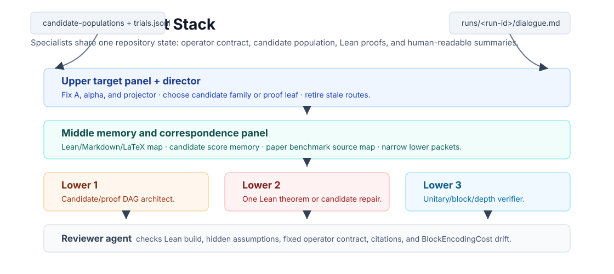
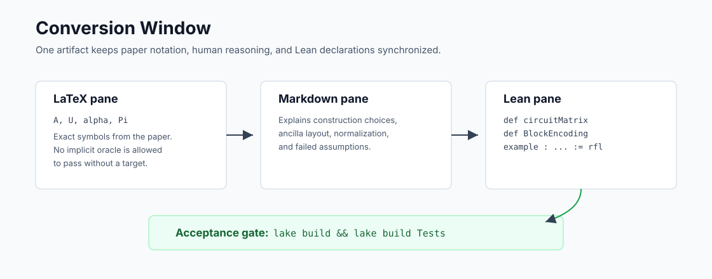

# Auto-Lean-in-Sleep: Block Encoding for Quantum Computing

Lean 4 project for turning quantum oracle assumptions into concrete
gate-level circuit matrices and Lean-checked block-encoding certificates.

The project target is:

```text
specific problem -> concrete circuit matrix -> Lean-checked oracle/block-encoding certificate
```

The project explicitly avoids stopping at "assume an oracle exists". If a paper
uses an oracle, this repository asks for the matrix, circuit schema, ancilla
layout, normalizer, and resource count needed to run it on a quantum computer.


## Primary Target

The first target is the Robin-boundary PDE simulation construction:

- Nikita Guseynov, Xiajie Huang, Nana Liu,
  [Quantum framework for simulating linear PDEs with Robin boundary conditions](https://arxiv.org/abs/2506.20478),
  arXiv 2025 / published 2026. Status: `skeleton`.

The primary Lean file is:

```text
QuantumBlockEncoding/GHL2025.lean
```

## Quick Start

```bash
cd /path/to/Auto-Quantum-Computing-Bloack-Encoding-In-Sleep

python3 tools/qbe.py init
python3 tools/qbe.py list-literature
python3 tools/qbe.py next-task
python3 tools/qbe.py check
```

The mandatory acceptance gate is always:

```bash
lake build && lake build Tests
```

## What This Repository Contains

Compiled Lean source of truth:

- `QuantumBlockEncoding/Core.lean`: base finite index and grid helpers.
- `QuantumBlockEncoding/Circuit.lean`: circuit and gate-level placeholders.
- `QuantumBlockEncoding/BlockEncoding.lean`: block-encoding contracts.
- `QuantumBlockEncoding/GHL2025.lean`: primary Robin-boundary target.
- `QuantumBlockEncoding/Literature.lean`: clickable literature registry.
- `QuantumBlockEncoding/OpenProblems.lean`: Lean-registered open problems.
- `QuantumBlockEncoding/Automation.lean`: compiled automation contracts.

Automation and knowledge artifacts:

- `tools/qbe.py`: no-dependency project CLI.
- `tasks/`: task contracts.
- `conversion-windows/`: synchronized Lean/LaTeX/Markdown workspaces.
- `proof-obligations/`: explicit proof and oracle gaps.
- `proof-blueprints/`: compact task system-of-record snapshots for long runs.
- `open-problem-proposals/`: draft open problems.
- `runs/`: prompt decks, dialogue boards, context packs, efficiency reports,
  trial logs, and summaries.
- `agent-briefs/`: generated context packets for agents.
- `research-wiki/`: persistent paper/idea/claim/gap memory.

Shared external development references live outside this repository:

- `../outer_papers/`: local paper PDFs/TeX sources used by agents during
  source-dependency audits.
- `../outer_repos/`: local checkouts of reference systems such as ARIS,
  Learning Beyond Gradients, EoH, LeanMarathon, MathCode, Lean-QuantumInfo,
  and optimizationproblems.

Public ABEIS/QBE artifacts cite upstream GitHub repositories, arXiv URLs,
theorem/equation anchors, or bundled paper notes. They should not depend on a
machine-specific absolute path.

## Agent Automation

QBE adapts the ARIS plain-file automation pattern to Lean proof work:

```text
literature/open problem -> formal spec -> circuit search -> Lean proof -> review -> docs
```

The implementation also borrows the trial-memory pattern from Learning Beyond
Gradients: append detailed JSONL trial records and rewrite a compact summary
CSV after every attempt.

QBE's automation stack is layered:

| Layer | Similar pattern | QBE role |
|---|---|---|
| Plain-file substrate | ARIS | Skills, task files, conversion windows, manifests, wiki pages, reviews, and run logs. |
| Iterative controller | Learning Beyond Gradients | Upper/middle/lower plus reviewer cycles, trial memory, failure compression, and proof-system maintenance. |
| Exploratory search | EoH | Candidate populations for new circuit/oracle constructions, only after a Lean-checkable target is fixed. |
| Lean harness control | LeanMarathon | Proof-blueprint snapshots, target review, dynamic leaves, refiner-style repair, and deterministic gates. |
| Proof diagnostics | MathCode | Hidden-assumption scans, theorem-reuse memory, and proof-attempt diagnostics. |

The LeanMarathon-like control layer does not replace the LBG-like hierarchy or
the EoH-like exploration layer.  It makes those existing loops more reliable by
forcing agents to work from a current proof blueprint and by retiring stale
dynamic leaves before lower agents spend more proof-search tokens.



The current roles are compiled in `QuantumBlockEncoding/Automation.lean`:

- Upper agent: chooses strategy and compresses memory.
- Middle agent: maintains LaTeX/Markdown/Lean conversion and proof obligations.
- Lower agents: try concrete construction/proof paths.
- Reviewer: checks Lean build, hidden oracle assumptions, resources, and links.

Documentation-writing agents also use
`.agents/skills/qbe-math-writing/SKILL.md`.  The skill keeps mathematical prose
compact: definitions before theorem statements, precise justifications and
citations, Markdown math with `$...$`/`$$...$$`, and no hidden assumptions.
For repeated proof work, agents use
`.agents/skills/qbe-hierarchical-proof-dag/SKILL.md`, which encodes the lesson
of Sonoda--Akiyama--Uezato
([arXiv:2602.10512v2](https://arxiv.org/abs/2602.10512)): successful theorem
proving should reuse named proof blocks as a DAG rather than repeatedly
flattening the same local proof trace.
For Lean proof diagnostics, agents use
`.agents/skills/qbe-proof-diagnostics/SKILL.md`, influenced by similar
diagnostic patterns in [MathCode](https://github.com/math-ai-org/mathcode):
placeholder scans, hidden-axiom checks, proof statistics, theorem-store-like
reuse memory, and fast feedback loops.  In QBE these diagnostics are advisory;
the final acceptance gate remains the Lean theorem plus the explicit
block-encoding proof obligations.
For long-horizon Lean control, agents use
`.agents/skills/qbe-proof-blueprint/SKILL.md`, influenced by similar
blueprint/DAG-control patterns in
[LeanMarathon](https://github.com/YuanheZ/LeanMarathon) and its
[paper](https://arxiv.org/abs/2606.05400).  QBE adapts the idea as
`proof-blueprints/<task-id>.md`: a compact snapshot of the active directive,
dynamic proof leaves, proof obligations, Lean declarations, correspondence
artifacts, and latest dialogue signal.

ABEIS also adopts the compact control-surface discipline used in the sibling
Auto-Sampling-Theory-In-Sleep project: before or after long runs, agents can
write status, context, and efficiency artifacts instead of replaying the full
history.

```bash
python3 tools/qbe.py blueprint-status QBE-AUTO-002 --refresh
python3 tools/qbe.py write-context-pack QBE-AUTO-002 --cycle 1
python3 tools/qbe.py efficiency-report --task QBE-AUTO-002
```

QBE has two hybrid strategy modes:

- Faithful paper reproduction: reproduce a specific paper's circuit/block
  encoding in Lean.  This is the current mode for GHL2025.  The strategy is
  [Learning Beyond Gradients](https://github.com/Trinkle23897/learning-beyond-gradients)-like proof-system maintenance: Lean feedback, failed proof routes, tests,
  and reviewer notes are written into memory and compressed into the next
  cycle.  If a fixed lemma fails, lower agents may maintain a local
  proof-attempt population, but they must not mutate the paper construction.
- Exploratory construction: search for new oracle or block-encoding
  constructions under a precise Lean-checkable target.  The strategy combines
  [Learning Beyond Gradients](https://github.com/Trinkle23897/learning-beyond-gradients)-like memory with an [EoH](https://github.com/FeiLiu36/EoH)-like candidate-evolution layer: lower agents can
  maintain candidate circuit families, mutate or recombine them, score partial
  progress, and archive rejected designs.  Lean proof obligations remain the
  final acceptance gate.

In faithful mode, agents must not invent a replacement construction or add new
hypotheses, side conditions, or easier theorem variants.  Missing oracle
details become proof obligations.  In exploratory mode, agents may search, but
every candidate must be tied to the original acceptance predicate and logged as
trial memory.


## For Paper Authors

Use this repository when your paper says or implies an oracle such as "assume
access to $O_A$", but the eventual quantum algorithm needs a concrete
gate-level circuit matrix, ancilla layout, normalizer, and resource statement.

There are two entry points.

### Reproduce An Existing Paper

Use faithful paper-reproduction mode when the construction already exists in a
paper and you want QBE to formalize it.

1. Register a task:

```bash
python3 tools/qbe.py new-task QBE-PAPER-001 \
  --kind paperReproduction \
  --mode faithfulPaper \
  --title "Formalize my paper's block encoding" \
  --source "arXiv:XXXX.XXXXX" \
  --target-lean "QuantumBlockEncoding/MyPaper.lean"
```

2. Paste the theorem, oracle definition, source equations, and expected
resource statement into the task.

3. Create the conversion window:

```bash
python3 tools/qbe.py conversion-window QBE-PAPER-001 \
  --title "My paper oracle-to-circuit map"
```

4. Run a conservative agent loop:

```bash
python3 tools/qbe.py update-task QBE-PAPER-001 --status active --active
python3 tools/qbe.py sleep-run QBE-PAPER-001 \
  --cycles 3 \
  --lower-count 1 \
  --agent-cmd 'bash tools/qbe_claude_faithful.sh {root} {prompt}' \
  --execute \
  --check-each-cycle
```

Expected outputs:

- Lean declarations in `QuantumBlockEncoding/MyPaper.lean`,
- tests under `Tests/`,
- a symbol map in `conversion-windows/QBE-PAPER-001.md`,
- readable derivations in `paper-notes/`,
- remaining gaps in `proof-obligations/`,
- run memory in `runs/trials.jsonl` and `runs/trials_summary.csv`.

### Search For A New Oracle Construction

Use exploratory construction mode when your theoretical algorithm needs an
oracle, but no paper gives a gate-level implementation yet.

1. Draft the open problem:

```bash
python3 tools/qbe.py new-open-problem QBE-EXP-001 \
  --title "Block encoding for my new oracle condition" \
  --motivation "Theory assumes an oracle; no concrete circuit is known."
```

2. Create a task:

```bash
python3 tools/qbe.py new-task QBE-EXP-001 \
  --kind exploratoryConstruction \
  --mode exploratoryConstruction \
  --title "Search for a circuit realizing my oracle condition" \
  --source "open problem / arXiv:XXXX.XXXXX" \
  --target-lean "QuantumBlockEncoding/OpenProblems.lean"
```

3. State the Lean-checkable acceptance predicate before running agents.  A good
target says:

- the target matrix/operator,
- the allowed ancilla registers,
- the required block entry,
- the normalizer,
- the resource expression,
- what counts as a successful circuit matrix.

4. Run multiple lower agents only after the target is precise:

```bash
python3 tools/qbe.py sleep-run QBE-EXP-001 \
  --cycles 6 \
  --lower-count 3 \
  --agent-cmd 'cd {root} && claude -p --permission-mode bypassPermissions --effort high "$(cat {prompt})"' \
  --execute \
  --check-each-cycle
```

In exploratory mode, failed attempts are first-class results.  They should be
logged, summarized, and either turned into better lemmas or promoted into open
problem statements.

Create one prompt deck:

```bash
python3 tools/qbe.py run-cycle QBE-AUTO-001 --cycle 1 --lower-count 2
```

Create repeated prompt decks for an overnight dry run:

```bash
python3 tools/qbe.py sleep-run QBE-AUTO-001 --cycles 8 --lower-count 3 --dry-run
```

Append role messages to the shared dialogue board:

```bash
python3 tools/qbe.py agent-note latest --role upper \
  --message "Cycle objective: remove one abstract Robin oracle assumption."
```

Log trial memory:

```bash
python3 tools/qbe.py trial-log \
  --task QBE-AUTO-001 \
  --role lower \
  --kind attempt \
  --status blocked \
  --lean-gate not-run \
  --from-git \
  --notes "Coefficient oracle still needs a reversible arithmetic circuit."

python3 tools/qbe.py trial-summary
```

Full guide:

- [Agent orchestration](docs/agent_orchestration.md)
- [Sleep run guide](docs/sleep_run_guide.md)
- [Article to Lean workflow](docs/article_to_lean_workflow.md)
- [ASTIS reference notes](docs/astis_reference_notes.md)

## Faithful GHL2025 Overnight Run

For the current paper-reproduction target, use `QBE-AUTO-002` as the
infrastructure task that makes the GHL2025 circuit semantics concrete:

```bash
cd /path/to/Auto-Quantum-Computing-Bloack-Encoding-In-Sleep
python3 tools/qbe.py update-task QBE-AUTO-002 --status active --active
python3 tools/qbe.py blueprint-status QBE-AUTO-002 --refresh
python3 tools/qbe.py write-context-pack QBE-AUTO-002 --cycle 1

mkdir -p runs/logs
nohup bash -lc '
python3 tools/qbe.py sleep-run QBE-AUTO-002 \
  --cycles 4 \
  --lower-count 1 \
  --context-mode focused \
  --blueprint-refresh \
  --agent-cmd '"'"'bash tools/qbe_claude_faithful.sh {root} {prompt}'"'"' \
  --execute \
  --check-each-cycle
' > runs/logs/claude-qbe-auto-002-$(date +%Y%m%d-%H%M%S).log 2>&1 &
```

Use one lower worker for this faithful mode until the paper's register layout,
matrix semantics, and block-extraction target are stable.

## Lean/LaTeX/Markdown Conversion

Every serious paper target should use a conversion window.



Create one:

```bash
python3 tools/qbe.py conversion-window QBE-AUTO-001 \
  --title "Robin one-term block encoding"
```

The conversion window has three synchronized panes:

- LaTeX: exact theorem/proof notation from the paper.
- Markdown: construction explanation, design choices, and rejected paths.
- Lean: declaration names, target files, and buildable code.

Any symbol that cannot be mapped to Lean becomes a proof obligation or an open
problem. It should not remain an implicit oracle assumption.

When updating Markdown or LaTeX, reuse existing Lean declarations and notation
tables instead of redefining the same object in several places.  The reviewer
agent is expected to flag duplicated definitions and prose that violates the
math-writing skill.

## Command Reference

| Command | Purpose |
| --- | --- |
| `python3 tools/qbe.py init` | Initialize workflow files and state. |
| `python3 tools/qbe.py check` | Run `lake build && lake build Tests`. |
| `python3 tools/qbe.py status` | Show git status and run build gates. |
| `python3 tools/qbe.py list-literature` | Print literature entries with links. |
| `python3 tools/qbe.py list-tasks` | List task files in `tasks/`. |
| `python3 tools/qbe.py next-task` | Suggest the next task. |
| `python3 tools/qbe.py new-task ...` | Create a task contract. |
| `python3 tools/qbe.py update-task ...` | Update task status and active task. |
| `python3 tools/qbe.py conversion-window ...` | Create a Lean/LaTeX/Markdown window. |
| `python3 tools/qbe.py blueprint-refresh ...` | Refresh a compact task proof blueprint. |
| `python3 tools/qbe.py blueprint-status ...` | Write the current blueprint control status as Markdown and JSON. |
| `python3 tools/qbe.py write-context-pack ...` | Write a compact long-run context pack. |
| `python3 tools/qbe.py efficiency-report ...` | Summarize recent long-run efficiency, quota/build signals, and next controls. |
| `python3 tools/qbe.py new-open-problem ...` | Draft an open problem proposal. |
| `python3 tools/qbe.py agent-brief ...` | Generate an agent context packet. |
| `python3 tools/qbe.py run-cycle ...` | Create one multi-agent prompt deck. |
| `python3 tools/qbe.py sleep-run ...` | Create or execute repeated agent cycles. |
| `python3 tools/qbe.py agent-note ...` | Append to a run dialogue board. |
| `python3 tools/qbe.py trial-log ...` | Append one JSONL trial record. |
| `python3 tools/qbe.py trial-summary` | Rewrite and print trial summaries. |

## Literature Roadmap

The source of truth is `QuantumBlockEncoding/Literature.lean`. This README
mirrors the initial checklist with clickable links.

Primary target:

| Status | Paper | Target |
| --- | --- | --- |
| `skeleton` | Guseynov, Huang, Liu, [Quantum framework for simulating linear PDEs with Robin boundary conditions](https://arxiv.org/abs/2506.20478) | `QuantumBlockEncoding/GHL2025.lean` |

Explicit block-encoding and oracle-construction papers:

| Status | Paper | Target |
| --- | --- | --- |
| `planned` | Guseynov, Huang, Liu, [Efficient explicit gate construction of block-encoding for Hamiltonians needed for simulating partial differential equations](https://arxiv.org/abs/2405.12855) | `QuantumBlockEncoding/GHL2025.lean` |
| `planned` | Kharazi, Alkadri, Liu, Mandadapu, Whaley, [Explicit block encodings of boundary value problems for many-body elliptic operators](https://arxiv.org/abs/2407.18347) | `QuantumBlockEncoding/OpenProblems.lean` |
| `planned` | Camps, Lin, Van Beeumen, Yang, [Explicit quantum circuits for block encodings of certain sparse matrices](https://arxiv.org/abs/2203.10236) | `QuantumBlockEncoding/Circuit.lean` |
| `planned` | Camps, Van Beeumen, [FABLE: Fast Approximate Quantum Circuits for Block-Encodings](https://arxiv.org/abs/2205.00081) | `QuantumBlockEncoding/Circuit.lean` |
| `planned` | Li, Ni, Ying, [On efficient quantum block encoding of pseudo-differential operators](https://arxiv.org/abs/2301.08908) | `QuantumBlockEncoding/OpenProblems.lean` |
| `planned` | Guseynov, Liu, [Efficient explicit circuit for quantum state preparation of piece-wise continuous functions](https://arxiv.org/abs/2411.01131) | `QuantumBlockEncoding/OpenProblems.lean` |

Core composition and QSVT framework:

| Status | Paper | Target |
| --- | --- | --- |
| `planned` | Gilyen, Su, Low, Wiebe, [Quantum singular value transformation and beyond](https://arxiv.org/abs/1806.01838) | `QuantumBlockEncoding/BlockEncoding.lean` |
| `planned` | Low, Chuang, [Optimal Hamiltonian simulation by quantum signal processing](https://arxiv.org/abs/1606.02685) | `QuantumBlockEncoding/OpenProblems.lean` |
| `planned` | Childs, Wiebe, [Hamiltonian simulation using linear combinations of unitary operations](https://arxiv.org/abs/1202.5822) | `QuantumBlockEncoding/BlockEncoding.lean` |
| `planned` | Berry, Childs, Cleve, Kothari, Somma, [Exponential improvement in precision for simulating sparse Hamiltonians](https://arxiv.org/abs/1312.1414) | `QuantumBlockEncoding/Resources.lean` |
| `planned` | Rossi, Chuang, [Multivariable quantum signal processing (M-QSP)](https://arxiv.org/abs/2205.06261) | `QuantumBlockEncoding/OpenProblems.lean` |

PDE simulation and Schrodingerisation context:

| Status | Paper | Target |
| --- | --- | --- |
| `planned` | Jin, Liu, Yu, [Quantum simulation of partial differential equations via Schrodingerization](https://arxiv.org/abs/2212.13969) | `QuantumBlockEncoding/OpenProblems.lean` |
| `planned` | Hu, Jin, Liu, Zhang, [Quantum circuits for partial differential equations via Schrodingerisation](https://arxiv.org/abs/2403.10032) | `QuantumBlockEncoding/OpenProblems.lean` |

Arithmetic subroutines for concrete oracle implementation:

| Status | Paper | Target |
| --- | --- | --- |
| `planned` | Draper, Kutin, Rains, Svore, [A logarithmic-depth quantum carry-lookahead adder](https://arxiv.org/abs/quant-ph/0406142) | `QuantumBlockEncoding/Circuit.lean` |
| `planned` | Haener, Roetteler, Svore, [Optimizing quantum circuits for arithmetic](https://arxiv.org/abs/1805.12445) | `QuantumBlockEncoding/Circuit.lean` |

Seed citation graph:

- [Google Scholar citation set supplied by the project owner](https://scholar.google.com/scholar?oi=bibs&hl=zh-CN&cites=14261843797372216914,13308862874802569087)

## Reference Works And Source Links

This repository cites external work by original source link:

- [wanshuiyin/Auto-claude-code-research-in-sleep](https://github.com/wanshuiyin/Auto-claude-code-research-in-sleep):
  ARIS-style plain-file research automation, artifact contracts, and review
  gates. QBE adapts the pattern to Lean proof automation.
- [Learning Beyond Gradients](https://trinkle23897.github.io/learning-beyond-gradients/)
  and its [artifact repository](https://github.com/Trinkle23897/learning-beyond-gradients):
  trial JSONL logs, summary CSVs, and iterative upper/middle/lower plus
  reviewer maintenance of a proof system.
- [FeiLiu36/EoH](https://github.com/FeiLiu36/EoH):
  similar pattern for evolutionary candidate search with initialization,
  mutation, recombination/crossover, selection pressure, and archives. QBE
  keeps this only for exploratory circuit/oracle construction under a fixed
  Lean target; faithful paper mode does not mutate paper constructions.
- [Timeroot/Lean-QuantumInfo](https://github.com/Timeroot/Lean-QuantumInfo):
  style reference for finite-dimensional quantum information formalization.
- [teorth/optimizationproblems](https://github.com/teorth/optimizationproblems):
  style reference for open mathematical problem registries.
- [math-ai-org/mathcode](https://github.com/math-ai-org/mathcode):
  similar pattern for Lean proof diagnostics, theorem reuse memory, persistent
  proof feedback, skills, tools, plugins, and tree-of-subgoals proving. QBE
  adapts those ideas to gate-level quantum block-encoding formalization; see
  [MathCode Reference Notes](docs/mathcode_reference_notes.md).
- [YuanheZ/LeanMarathon](https://github.com/YuanheZ/LeanMarathon) and
  [arXiv:2606.05400](https://arxiv.org/abs/2606.05400):
  similar pattern for Lean blueprint-as-system-of-record design, target review,
  dynamic proof-DAG leaves, bounded worker/refiner scopes, and deterministic
  gates. QBE adapts those ideas to domain-specific block-encoding proof
  snapshots; see [LeanMarathon Reference Notes](docs/leanmarathon_reference_notes.md).

See [Attribution](docs/attribution.md) and [NOTICE](NOTICE.md).
For the sibling auto-Lean control-surface comparison, see
[ASTIS Reference Notes](docs/astis_reference_notes.md).

## Citation

If you use ARIS in your research, please cite:

```bibtex
@misc{huangbu2026autoblockencoding,
  author = {{Bu}, Dake and {Huang}, Xiajie},
  title = {{Auto-Lean-in-Sleep: Block Encoding for Quantum Computing}},
  year = {2026},
  month = {May},
  note = {Project page: \url{https://github.com/DakeBU/Quantum-Computing-Block-Encoding}}
}
```

## Design Lineage

QBE is a Lean-first proof-engineering workflow for a narrow problem class:
turning oracle assumptions in theoretical quantum algorithms into gate-level
circuit matrices and block-encoding certificates.  The comparison below records
similar design patterns with adjacent AI-research systems while keeping the
task boundary explicit.

| Similar pattern | Where it appears | QBE adaptation | Task boundary |
| --- | --- | --- | --- |
| LLM-readable workflow packets | [ARIS](https://github.com/wanshuiyin/Auto-claude-code-research-in-sleep) uses single-purpose `SKILL.md` files for empirical research workflows. | `tools/qbe.py run-cycle` generates task-specific role prompts for upper, middle, lower, and reviewer agents. | ARIS targets literature, experiments, reviews, and paper writing; QBE targets Lean-checked circuit/oracle formalization. |
| Plain-file project memory | ARIS uses Markdown templates, `MANIFEST.md`, research wiki pages, and review artifacts instead of a database. | `tasks/`, `conversion-windows/`, `paper-notes/`, `proof-obligations/`, `runs/`, and `research-wiki/` are plain files that humans and agents can inspect and edit. | QBE adds a stricter Lean/LaTeX/Markdown correspondence layer because theorem proving must preserve source-paper notation. |
| Independent review loop | ARIS uses reviewer models to check claims, experiments, citations, and writing. | The reviewer agent checks Lean build status, hidden oracle assumptions, normalizers, ancilla layout, resource counts, citations, and faithful-vs-exploratory mode discipline. | In QBE, review cannot accept a claim merely because it reads well; the Lean gate and explicit proof obligations control completion. |
| Trial memory and feedback compression | [Learning Beyond Gradients](https://github.com/Trinkle23897/learning-beyond-gradients) records policy attempts in `trials.jsonl`, `summary.csv`, videos, logs, and rejected directions. | QBE records proof/circuit attempts in `runs/trials.jsonl` and `runs/trials_summary.csv`; rejected constructions become proof obligations or open problems. | LBG optimizes empirical behavior of heuristic policies; QBE uses similar memory discipline to organize theorem-proving attempts whose final target is formal verification. |
| Hierarchical proof-system maintenance | LBG treats code, tests, logs, summaries, and failure traces as the learnable system, not neural weights. | QBE keeps an upper/middle/lower plus reviewer hierarchy: upper chooses strategy, middle maintains Lean/Markdown/LaTeX and memory, lower proves local leaves, reviewer gates claims. | QBE's maintained object is not a game policy or controller; it is a formal library for oracle/block-encoding construction. |
| Population-style candidate evolution | [EoH](https://github.com/FeiLiu36/EoH) evolves heuristic algorithms with initialization, mutation, crossover, parent selection, objective evaluation, and population archives. | QBE uses a similar idea only in exploratory mode: maintain families of candidate circuit constructions, vary them, evaluate them against Lean-checkable obligations, and keep rejected designs as memory. | EoH is designed for automatic heuristic algorithm design under empirical objective scores; QBE cannot use score alone as correctness. A construction is accepted only when the Lean target and proof obligations are satisfied. |
| Selection and archive pressure | EoH keeps populations and best individuals in JSON files after objective evaluation. | QBE keeps trial summaries, proof-obligation status, and reusable Lean lemmas so future agents prefer constructions that reduce formal gaps. | Faithful paper-reproduction mode should not use evolutionary mutation to change the paper construction; EoH-like exploration belongs only after the acceptance predicate is explicit. |
| Lean proof diagnostics and theorem reuse | [MathCode](https://github.com/math-ai-org/mathcode) provides Lean proof-analysis tools, theorem-store-like reuse, persistent REPL/LSP feedback, tree-of-subgoals proving, multi-planner search, and skills/plugins. | QBE uses a similar idea for reviewer scans, proof-attempt memory, reusable projection/gate lemmas, and future focused-check tooling. | MathCode is a general math formalization agent; QBE is a domain-specific system for quantum oracle/block-encoding circuit matrices. QBE must not accept stored assumptions or proof-search scores as theorem closure. |
| Blueprint and dynamic proof-DAG control | [LeanMarathon](https://github.com/YuanheZ/LeanMarathon) and its [paper](https://arxiv.org/abs/2606.05400) use an evolving Lean blueprint, target review, dynamic leaves, worker/refiner roles, and CI gates for long-horizon Lean autoformalization. | QBE adds `proof-blueprints/`, `blueprint-refresh`, `blueprint-status`, compact context packs, and efficiency reports as system-of-record control artifacts over Lean declarations, conversion windows, proof obligations, cited-results memory, and latest dialogue. | LeanMarathon targets general research-math autoformalization. QBE specializes the idea to quantum block-encoding/oracle-circuit proofs, where source-paper registers, normalizers, ancilla cleanup, and resource contracts must remain explicit. |

The analogy is:

```text
ARIS empirical paper pipeline:
papers -> ideas -> experiments -> review -> paper

Learning Beyond Gradients heuristic loop:
state/test/log feedback -> code edit -> trial record -> summary -> next edit

EoH algorithm-design loop:
population -> mutation/crossover -> objective evaluation -> selection/archive

MathCode proof-agent loop:
goal -> Lean formalization -> proof diagnostics -> theorem reuse -> repair loop

LeanMarathon blueprint loop:
source proof + target statements -> reviewed blueprint -> dynamic proof leaves -> CI gate -> refiner repair

QBE proof pipeline:
paper/open condition -> oracle contract -> circuit matrix -> Lean check -> review -> proof map
```

The practical split is:

```text
faithfulPaper:
LBG-like memory loop + local proof-attempt population for fixed lemmas

exploratoryConstruction:
LBG-like memory loop + EoH-like candidate population for circuit families
```

The LeanMarathon-like control layer in QBE is the proof blueprint:

```bash
python3 tools/qbe.py blueprint-refresh QBE-AUTO-002
python3 tools/qbe.py blueprint-status QBE-AUTO-002 --refresh
python3 tools/qbe.py write-context-pack QBE-AUTO-002 --cycle 1
```

Then generate a prompt deck or sleep run with:

```bash
python3 tools/qbe.py sleep-run QBE-AUTO-002 \
  --cycles 12 \
  --lower-count 1 \
  --context-mode focused \
  --blueprint-refresh \
  --upper-every 6 \
  --middle-every 6 \
  --reviewer-every 6 \
  --check-each-cycle
```

QBE's many Markdown files are therefore not decoration.  They play the same
operational role that ARIS skills, templates, manifests, and research-wiki
pages play: they are the stable interface between humans, agents, and the next
cycle.  The extra QBE-specific layers are the Lean/LaTeX/Markdown conversion
window and the proof blueprint, because a theorem-proving project must preserve
both source-paper notation and checked declaration dependencies.

## Cited Result Memory

Papers often use previous theorems or "standard" circuit primitives inside a
proof.  QBE records those dependencies under
[`research-wiki/cited-results/`](research-wiki/cited-results/) so future
faithful-paper runs and exploratory-construction runs can reuse the same
audited memory.

The important distinction is status:

- `paper-cited`: the source paper invokes the result.
- `classic-unformalized`: the result is widely used but not yet formalized here.
- `contract-only`: QBE has a typed interface or semantic obligation.
- `obligation`: a dependent proof cannot close until this is formalized.
- `formalized`: QBE has a build-tested Lean declaration for the exact statement
  being used.

Reviewer agents must reject hidden dependencies.  A prior result cannot close a
gate-level oracle or block-encoding proof unless the cited-results ledger names
the source, exact statement, Lean status, and dependent use sites.

## Source Dependency Audits

For faithful-paper reproduction, QBE treats repeated Lean failure as a signal
to re-read the source paper before spending more lower-agent proof search.
Middle and upper agents should inspect the local TeX source, nearby citations,
and bibliography, then classify the missing ingredient as an internal paper
step, external cited result, classical Lean lemma, or source-contract gap.

Local TeX sources should be kept in the shared external paper directory,
normally `../outer_papers/`.  For GHL2025, the expected private working source
is `../outer_papers/GHL2025/main.tex` or a similarly named GHL/Guseynov source
folder.  Agents may override the search root with:

```bash
export QBE_PAPER_SOURCE_ROOT=/path/to/paper-sources
```

Public QBE documents should still cite arXiv links and
theorem/lemma/equation/figure anchors, not local machine paths.

If the audit finds an external or standard result, the cited-results ledger
must be updated before lower agents rely on it.  If it finds a source-contract
gap, the relevant proof flags remain false until the gap is resolved by a
paper-backed contract or a precisely recorded external theorem.

When the source TeX contains a proof or proof sketch, QBE also requires a proof
translation map.  Middle agents should break the source proof into steps and
map each step to an existing Lean declaration, a new local lemma, an external
cited result, or a source-contract gap.  Upper agents plan lower work from this
map so faithful-paper mode remains a translation of the paper proof rather
than unconstrained tactic search.

## Proof Exports

Compiled Lean proof blocks are exported for human reading under
[`paper-notes/GHL2025/`](paper-notes/GHL2025/):

- Markdown proof notes: `paper-notes/GHL2025/markdown/`
- Overleaf entry point: `paper-notes/GHL2025/latex/main.tex`
- LaTeX section files: `paper-notes/GHL2025/latex/sections/`

This export is intentionally batch-based.  Lower agents may prove many small
Lean lemmas during a 5-hour run; the middle agent should translate accepted
proof blocks into Markdown and LaTeX once at the end of the batch, not after
every small lemma.
