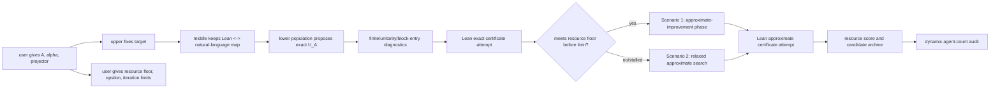
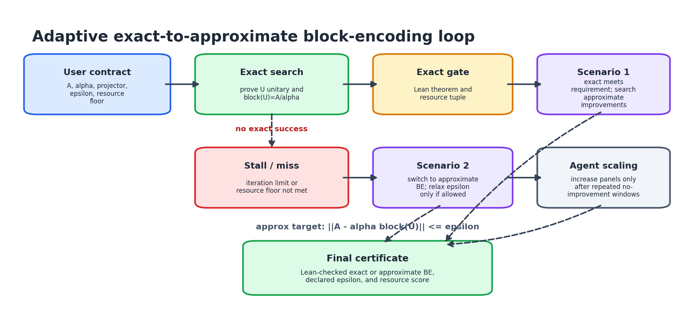
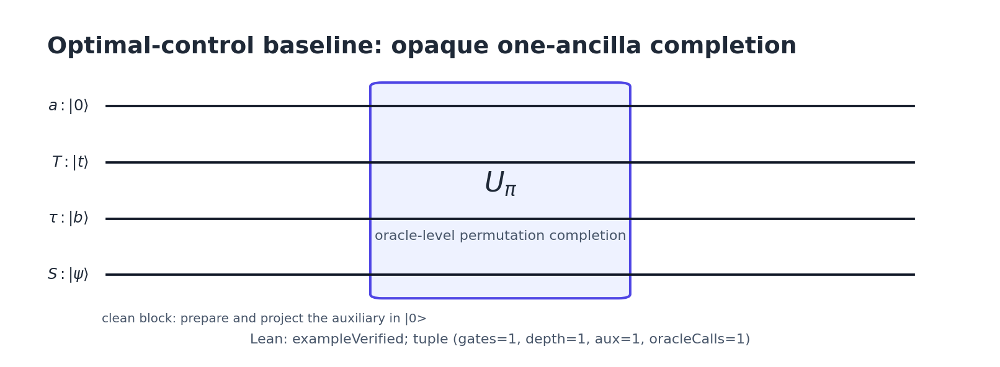
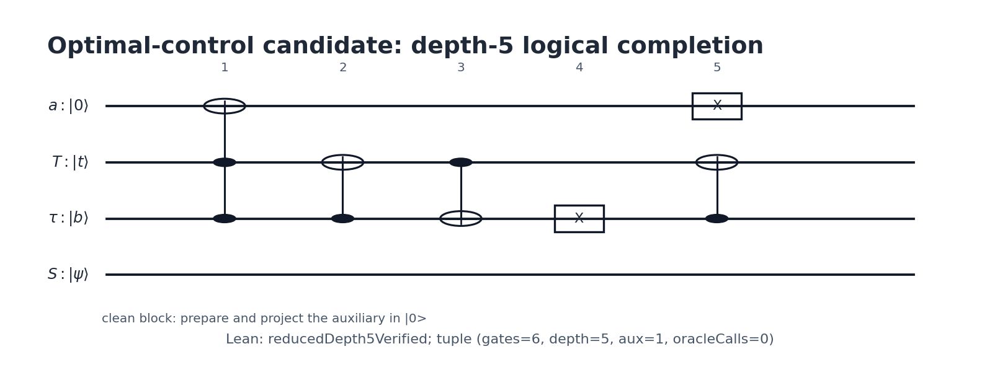
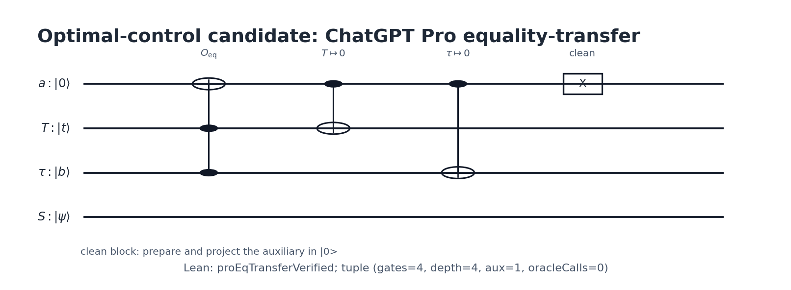
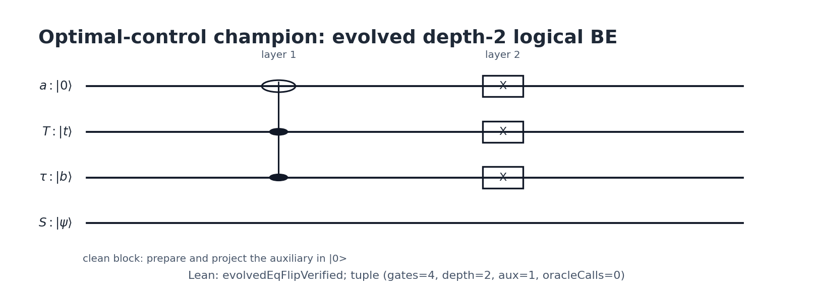
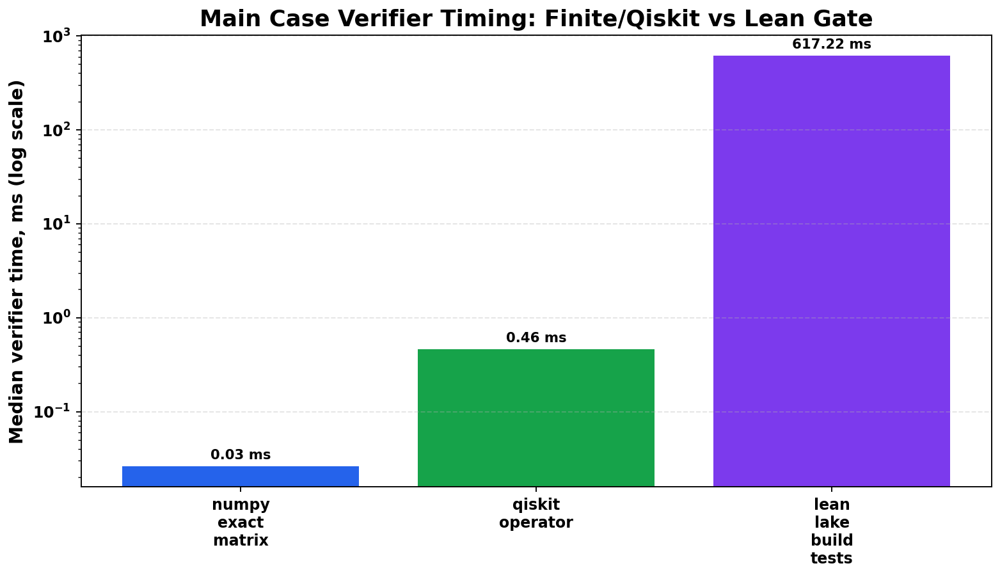
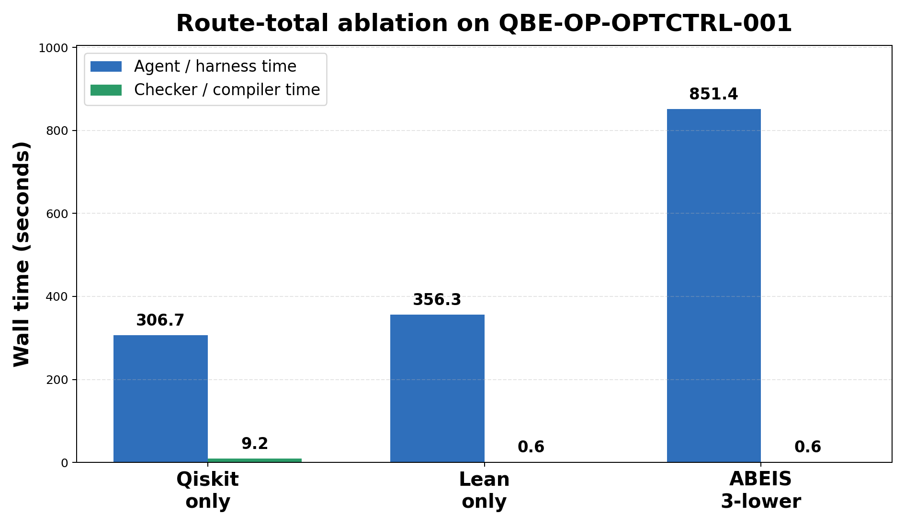
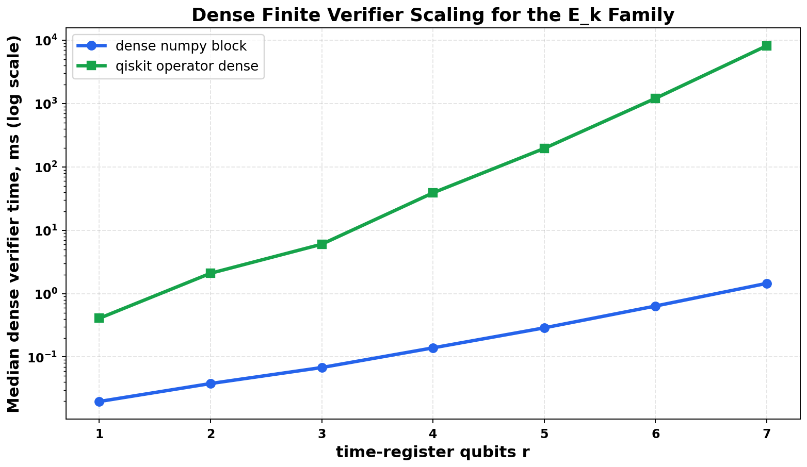
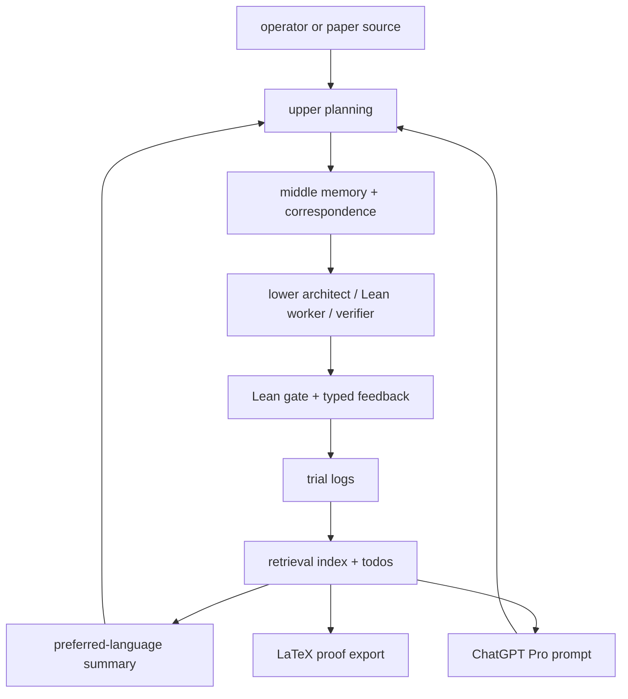

# Auto-Lean-in-Sleep: Block Encoding for Quantum Computing

ABEIS is a Lean 4 project and multi-agent harness for turning a requested
quantum query operator into concrete block-encoding candidates, gate-level
circuit matrices, resource scores, and Lean-checked certificates.

The project is built around one contract:

```text
operator/query-oracle contract A
-> candidate unitary U_A and circuit schedule
-> Lean-checked block-entry and unitarity certificate
-> resource-ranked construction
```

ABEIS does not stop at "assume an oracle exists".  A task should state the
operator `A`, normalizer `alpha`, clean ancilla projector, and the desired
exact block-entry equation:

```text
(<0^a| ⊗ I) U_A (|0^a> ⊗ I) = A / alpha
```

It may also state an accepted approximation budget:

```text
|| A - alpha * ((<0^a| ⊗ I) U_A (|0^a> ⊗ I)) || <= epsilon
```

Among Lean-certified candidates, ABEIS ranks constructions by asymptotic tier
first.  Inside the same tier it compares:

```text
(gateCount, depth, auxiliaryQubits, oracleCalls)
```

Paper constructions are treated as baselines and training data.  Once a paper
baseline is formalized, the same system can try to improve the construction
for the same fixed operator target.


## Core Workflow



ABEIS uses diagnostics as search signals, not as proofs.  A candidate enters
the certified population only after Lean proves the advertised theorem at the
task's semantic tier.



If exact search fails to meet the user-specified resource floor within the
configured budget, the upper layer may switch to approximate BE search.  If a
fixed number of generations does not improve the population, the upper layer
may increase upper/middle/lower parallel agent counts up to the configured
maximum.  More agents are not assumed to be better; the increase is itself a
controlled experiment.

## Main Case Study

The current technical-report case study is the operator task
`QBE-OP-OPTCTRL-001`:

```text
E_k = |0><k|_time ⊗ |0><1|_type ⊗ I
```

The run demonstrates the intended loop:

1. fix the operator target;
2. start from a correct one-ancilla block-encoding seed;
3. maintain a population of candidate completions;
4. keep Pro/simulator/Python ideas in the insight pool until Lean promotes
   them;
5. after exact convergence, enter the approximate phase with the exact
   champion as an `epsilon = 0` incumbent;
6. plot only Lean-certified candidates.

Current certified logical champion:

```text
evolved-eq-flip-r1-k1
Lean certificate = OptimalControl.evolvedEqFlipVerified
zero-error approximate certificate = OptimalControl.evolvedEqFlipZeroErrorApprox
comparison tuple = (gateCount, depth, auxiliaryQubits, oracleCalls) = (4, 2, 1, 0)
```

Certified metric curve, in the EoH-style sense that each plotted point is a
generation champion and lower values are better.  Blue is exact search; green
is the post-convergence approximate phase:


Lean-certified snapshots:

| Generation | Circuit | Lean certificate | Tuple |
| --- | --- | --- | --- |
| 0 |  | `OptimalControl.exampleVerified` | `(1, 1, 1, 1)` |
| 2 |  | `OptimalControl.reducedDepth5Verified` | `(6, 5, 1, 0)` |
| 6 |  | `OptimalControl.proEqTransferVerified` | `(4, 4, 1, 0)` |
| 7 |  | `OptimalControl.evolvedEqFlipVerified` | `(4, 2, 1, 0)` |
| 8-9 | same exact champion reused as approximate incumbent | `OptimalControl.evolvedEqFlipZeroErrorApprox` | `(4, 2, 1, 0)`, `epsilon = 0` |

This is a concrete `r = 1, k = 1` logical reversible permutation-matrix
certificate.  It is not claimed as a hardware-decomposed theorem, a general
arbitrary-register theorem, or a Lean-proved global optimality theorem.

### Verifier Timing

ABEIS does not currently call QASM-Eval or Qiskit QuantumKatas as part of the
default proof loop.  It implements local finite verifier packets and then
requires Lean theorem closure.  For the main case, we added a direct timing
comparison against an optional Qiskit `Operator` verifier:



On the measured environment, the exact finite NumPy verifier and the exact
Qiskit `Operator` verifier are complete for this fully instantiated 4-qubit
matrix instance, and both are much faster than the cached Lean gate.  Lean is
still the final acceptance gate because it records reusable definitions,
theorems, resource tuples, and future dependencies.  QASM-Eval-style
distribution, timing, and pulse checks remain diagnostics unless the task's
theorem has exactly that executable semantics.

Reproduce the comparison:

```bash
python3 tools/compare_verifiers.py
```

If `qiskit` is not installed, the Qiskit row is reported as unavailable rather
than silently replaced by a local check.

This plot measures only checker wall time.  It does not measure the time an AI
agent spends writing Qiskit code, writing Lean declarations/proofs, repairing
failures, coordinating agents, or consuming tokens.  A fair harness comparison
must separately record:

- checker time: parser/simulator/Lean build time;
- artifact-production time: agent wall time to write and repair the code;
- token throughput: input, output, and total tokens per accepted candidate.

The current route-total ablation has been run once with Codex on the same
target:



All three routes passed.  The Qiskit-only route produced and executed a finite
Python/Qiskit artifact, the Lean-only route produced a direct Lean theorem
route, and the ABEIS route used real parallel lower agents
(`lower_count = 3`).  The result is deliberately not presented as "ABEIS is
fastest": this run shows that the current ABEIS Codex profile has substantial
coordination/log overhead.  Its value is the stronger semantic artifact and
the recorded proof/candidate memory.  The next engineering target is to make
upper/middle/reviewer roles deterministic or low-token, while preserving
parallel lower proof/circuit search.

The generated file
`reports/route-ablation/QBE-OP-OPTCTRL-001/latest_results.md` records the
route-total rows.  Exact provider token counts are still marked unavailable
unless the chosen model wrapper reports them.

The second comparison is scaling.  For the family
`E_k = |0><k|_time tensor |0><1|_type tensor I_state`, dense Qiskit
`Operator` checking must materialize a `2^(r+3)` dimensional matrix, where `r`
is the number of time-register qubits:



This is why simulator-style verification is valuable but should not be the
only acceptance layer for block-encoding research.  It is excellent for small
finite instances, counterexamples, and smoke tests.  For large-register
operator families, ABEIS should move toward symbolic Lean theorems about
registers and gates, so proof checking scales with proof structure rather than
dense Hilbert-space dimension.  The current main case is certified for
`r = 1`; the parametric all-`r` theorem is a future strengthening.

The hard-scaling forecast makes the same point without pretending to run
impossible dense checks:


At `r = 20`, a full dense complex128 unitary for this simple family would
already require about `1 PiB` of memory.  At `r = 32`, it is about `16 ZiB`.
This is where ABEIS should stop asking a simulator to materialize the whole
matrix and instead ask Lean for a symbolic theorem about the circuit family.

The experimental comparison has two axes:

- artifact route: Qiskit/OpenQASM task plus executable verifier, direct Lean
  theorem route, and full ABEIS route;
- harness route: their single-benchmark or tool-feedback loops versus ABEIS's
  upper/middle/lower/reviewer loop with candidate populations and retrieval
  memory.

For each route ABEIS records route-total agent time, checker/compile time,
input/output token proxies, repair iterations where available, and the final
semantic level.  The protocol is recorded in
`reports/verifier-comparison/QBE-OP-OPTCTRL-001/agent_ablation_protocol.md`.
Controlled prompt packets for the three route-total ablations are generated at
`reports/route-ablation/QBE-OP-OPTCTRL-001/`.

External repository smoke comparison on the same local checkout:

| System | Direct same finite BE task? | Local result | What it tells ABEIS |
| --- | --- | --- | --- |
| [Qiskit-QuantumKatas][qiskit-quantumkatas] | yes | custom kata passed | Best executable-code route for finite Qiskit comparison. |
| [QASM-Eval][qasm-eval] | no | current local run `blocked-env` | Useful typed feedback/pass@k design; not a block-entry verifier. |
| [QUASAR][quasar-paper] | no | local code not released | Harness/reward comparison only for now. |
| [AI-Mandel][ai-mandel-paper] | no | script compile smoke passed | Useful staged idea-to-tool loop; not a BE verifier. |

Full details are generated by:

```bash
python3 -m pip install qiskit 'openqasm3[parser]'
python3 tools/compare_external_quantum_verifiers.py
```

The report is
`reports/external-quantum-verifier-comparison/latest.md`.
The combined comparison status is
`reports/route-ablation/QBE-OP-OPTCTRL-001/comparison_status.md`.

To prepare the route-total prompts again:

```bash
python3 tools/prepare_route_ablation.py
```

To record checker-only reference baselines:

```bash
python3 -m pip install qiskit
python3 tools/run_route_ablation.py reference_qiskit
python3 tools/run_route_ablation.py reference_lean
```

The current reference and route-total results are stored in
`reports/route-ablation/QBE-OP-OPTCTRL-001/latest_results.md`.

For route-total Qiskit-only runs, `tools/run_route_ablation.py` sets
`QBE_ROUTE_ARTIFACT`; the agent must create a complete Python/Qiskit checker at
that path, and the runner executes it.  Printed code snippets do not count as
accepted artifacts.

The repository includes a deterministic `qiskit_only` harness self-test using
`tools/route_ablation_agents/write_qiskit_reference.py`.  This proves the
artifact enforcement path works, but it is not an AI route-total baseline.

The ABEIS route-total runner uses a short mini-harness: compact upper/middle
handoffs, three parallel lower roles, reviewer, and `lake build Tests`.  Do
not treat a single chat session as evidence of parallel lower-agent search.

## Benchmark Paper Cases

Paper reproduction remains important, but as benchmark data for the core
operator-construction system.

The first active paper benchmark is:

- Guseynov--Huang--Liu,
  [Quantum framework for simulating linear PDEs with Robin boundary conditions](https://arxiv.org/abs/2506.20478).

The benchmark Lean file is:

```text
QuantumBlockEncoding/GHL2025.lean
```

Paper-benchmark mode should reproduce the paper construction and resource
score first.  Any improvement search belongs in a separate operator task with
the same target operator.

## Quick Start

```bash
cd /path/to/Auto-Quantum-Computing-Bloack-Encoding-In-Sleep

python3 tools/qbe.py init
python3 tools/qbe.py list-literature
python3 tools/qbe.py next-task
python3 tools/qbe.py check
```

The mandatory acceptance gate is:

```bash
lake build && lake build Tests
```

## Web Task Builder

ABEIS includes a static web task builder in `web/`.  It lets a user paste a
LaTeX oracle, matrix, or natural-language operator description, choose their
report language, record a baseline construction, and generate a Markdown task
packet for the agent loop.

The page does not run agents and does not certify proofs.  Lean remains the
verification authority.

For a public repository, GitHub Pages can publish `web/` through
`.github/workflows/pages.yml`.  The deployed project page normally has this
shape:

```text
https://<github-user>.github.io/<repo-name>/
```

Report language is also available from the CLI:

```bash
export QBE_REPORT_LANGUAGE=ja
python3 tools/qbe.py sleep-run QBE-OP-OPTCTRL-001 --report-language ja ...
python3 tools/qbe.py cycle-summary QBE-OP-OPTCTRL-001 --run-id latest --language ja
```

## Repository Map

Lean source:

- `QuantumBlockEncoding/Core.lean`: finite-index and grid helpers.
- `QuantumBlockEncoding/Circuit.lean`: circuit and gate-level interfaces.
- `QuantumBlockEncoding/BlockEncoding.lean`: operator targets, candidates,
  verified certificates, and `BlockEncodingCost`.
- `QuantumBlockEncoding/Resources.lean`: gate count, depth, auxiliary qubits,
  oracle calls, and schedule bookkeeping.
- `QuantumBlockEncoding/GHL2025.lean`: first paper-benchmark case.
- `QuantumBlockEncoding/Automation.lean`: compiled automation contracts.

Agent and proof artifacts:

- `tools/qbe.py`: project CLI.
- `tasks/`: task contracts.
- `conversion-windows/`: Lean and natural-language proof maps.
- `candidate-populations/`: certified and rejected candidate records.
- `proof-obligations/`: explicit proof and oracle gaps.
- `proof-blueprints/`: compact system-of-record snapshots.
- `runs/`: prompt decks, dialogue boards, trial logs, summaries, and Pro
  prompts.
- `paper-notes/problem-exports/`: closeout LaTeX proof notes for users.
- `research-wiki/`: persistent cited-result, lemma, and retrieval memory.

Public project artifacts cite original GitHub repositories, arXiv URLs,
theorem/equation anchors, or bundled paper notes.  They should not depend on
machine-specific local paths.

## Agent Harness

ABEIS uses a layered multi-agent harness:

| Layer | Responsibility |
| --- | --- |
| Upper | Fix the operator target, choose strategy, audit source/candidate drift. |
| Middle | Maintain Lean/natural-language correspondence, retrieval memory, and closeout reports. |
| Lower 1 | Natural-language construction/proof architect. |
| Lower 2 | Lean implementation worker for one ready proof leaf. |
| Lower 3 | Necessary-condition verifier for exact finite checks. |
| Reviewer | Reject hidden assumptions, wrong resources, stale routes, and unsupported promotions. |

The harness is vendor-neutral.  A profile under `agent-profiles/` can dispatch
different roles to Codex, Claude, GPT/OpenAI wrappers, Gemini, GLM, Minimax,
or local tools.  The checked-in Codex-only profile is the reproducible default:

```bash
python3 tools/qbe.py sleep-run QBE-OP-001 \
  --cycles 6 \
  --lower-count 3 \
  --parallel-lower \
  --agent-profile codex-parallel.example.json \
  --execute \
  --check-each-cycle
```

Swap in a mixed-vendor profile when those wrappers are available.  The profile
changes search diversity and cost.  It does not change what counts
as success: only Lean-certified declarations and the build gate certify a
candidate.

### Memory And Feedback Loop



Long runs write a human-facing summary in the requested language, a
self-contained ChatGPT Pro prompt when unresolved leaves remain, and a
problem-specific LaTeX note for users to copy into their own manuscripts.
Updates to the ABEIS authors' technical report are maintainer-only and are not
part of the default user workflow.

## Strategy Modes

| Mode | Use when | Main rule |
| --- | --- | --- |
| `operatorBlockEncoding` | The user gives `A`, `alpha`, and a projector. | Search candidate `U_A`, prove unitarity and block entry, rank by cost. |
| `paperBenchmark` | A paper already gives a construction. | Reproduce the paper baseline without mutating the construction. |
| `exploratoryConstruction` | A baseline exists or the paper assumes an oracle. | Improve the same fixed target using candidate populations and Lean gates. |

Create an operator task:

```bash
python3 tools/qbe.py new-task QBE-OP-001 \
  --kind operatorBlockEncoding \
  --mode operatorBlockEncoding \
  --title "Construct a block encoding for my query operator" \
  --source "operator supplied by user / arXiv:XXXX.XXXXX" \
  --target-lean "QuantumBlockEncoding/MyOperator.lean"
```

The task file should also record:

```text
maxExactIterations, exactStallIterations, requiredCost,
requestedEpsilon, allowRelaxedEpsilon,
maxUpperAgents, maxMiddleAgents, maxLowerAgents
```

Run a small search batch:

```bash
python3 tools/qbe.py update-task QBE-OP-001 --status active --active
python3 tools/qbe.py sleep-run QBE-OP-001 \
  --cycles 2 \
  --lower-count 3 \
  --parallel-lower \
  --agent-profile codex-parallel.example.json \
  --execute \
  --check-each-cycle
```

For longer unattended runs and theorem-closure batches, see
[`docs/sleep_run_guide.md`](docs/sleep_run_guide.md).

## Human Outputs

Use the curated public artifacts first:

- [`tasks/QBE-OP-OPTCTRL-001.md`](tasks/QBE-OP-OPTCTRL-001.md): the main
  operator task.
- [`candidate-populations/QBE-OP-OPTCTRL-001.md`](candidate-populations/QBE-OP-OPTCTRL-001.md):
  Lean-checked candidate population and final choice.
- [`candidate-populations/QBE-OP-OPTCTRL-001-metrics.png`](candidate-populations/QBE-OP-OPTCTRL-001-metrics.png):
  convergence plot for the main case.
- `paper-notes/problem-exports/<task-id>/latest.tex`: problem-specific LaTeX
  proof note.

Local runs also generate maintainer-only summaries such as
`HUMAN_STATUS.md`, `REPORTS.<lang>.md`, `runs/<run-id>/summary.<lang>.md`,
and `runs/<run-id>/chatgpt_pro_prompt.md`. These files are intentionally
ignored by git so public releases do not accumulate raw agent traces.

## Related Work And Similar Patterns

ABEIS adapts patterns from adjacent systems, but specializes them to
gate-level quantum block-encoding certificates.

| Work | Similar pattern | ABEIS use |
| --- | --- | --- |
| [ARIS][aris] | Plain-file autonomous research workflow and review. | Task files, skills, manifests, reviews, run logs. |
| [Learning Beyond Gradients][lbg] | Layered feedback and trial memory. | Upper/middle/lower/reviewer loops and compact summaries. |
| [EoH][eoh] | Evolutionary candidate populations. | Mutate/recombine candidate block-encoding circuits under a fixed target. |
| [LeanMarathon][leanmarathon] | Proof blueprint, dynamic leaves, CI gates. | Proof-blueprint snapshots and focused theorem-closure work. |
| [MathCode][mathcode] | Proof diagnostics and theorem reuse. | Hidden-assumption scans and reusable proof-attempt memory. |
| [Lean4Agent][lean4agent-paper] | Workflow/trajectory verification. | Lean-side process contracts in `Automation.lean`. |
| [Lean-QuantumInfo][lean-quantuminfo], [lean-quantum][lean-quantum] | Quantum formalization references. | Style and semantic references for finite-dimensional quantum objects. |
| [QASM-Eval][qasm-eval], [Qiskit QuantumKatas][qiskit-quantumkatas] | Typed circuit/test feedback and executable Qiskit/QASM checks. | ABEIS distinguishes inspired feedback, optional exact finite Qiskit checks, and Lean-certified theorem closure. |
| [QUASAR][quasar-paper], [AI-Mandel][ai-mandel-paper] | Tool-feedback loops for quantum artifacts. | Search signals only; not proof certificates. |
| [LLM4AD_Next][llm4ad-next] | Low-entry-barrier web interface. | Static oracle-to-task-packet builder. |
| [Lexicographic bandits][lexelim-bandits] | Lexicographic active-set filtering. | Prioritize correctness, diagnostics, asymptotic tier, and cost tuple. |
| [Hierarchical provers][hierarchical-provers], [statistical provability][statistical-provability] | Reusable proof cuts and finite-budget proof progress. | Named proof-DAG nodes and run-efficiency metrics. |

More detail is in [`docs/automation_deployment.md`](docs/automation_deployment.md),
[`docs/attribution.md`](docs/attribution.md), and [`NOTICE.md`](NOTICE.md).

## Literature Roadmap

The source of truth is `QuantumBlockEncoding/Literature.lean`.

Selected block-encoding and oracle-construction targets:

| Status | Paper | Target |
| --- | --- | --- |
| `active` | Guseynov--Huang--Liu, [Quantum framework for simulating linear PDEs with Robin boundary conditions](https://arxiv.org/abs/2506.20478) | `QuantumBlockEncoding/GHL2025.lean` |
| `planned` | Guseynov--Huang--Liu, [Efficient explicit gate construction of block-encoding for Hamiltonians needed for simulating partial differential equations](https://arxiv.org/abs/2405.12855) | `QuantumBlockEncoding/GHL2025.lean` |
| `planned` | Camps--Lin--Van Beeumen--Yang, [Explicit quantum circuits for block encodings of certain sparse matrices](https://arxiv.org/abs/2203.10236) | `QuantumBlockEncoding/Circuit.lean` |
| `planned` | Camps--Van Beeumen, [FABLE: Fast Approximate Quantum Circuits for Block-Encodings](https://arxiv.org/abs/2205.00081) | `QuantumBlockEncoding/Circuit.lean` |
| `planned` | Gilyen--Su--Low--Wiebe, [Quantum singular value transformation and beyond](https://arxiv.org/abs/1806.01838) | `QuantumBlockEncoding/BlockEncoding.lean` |
| `planned` | Childs--Wiebe, [Hamiltonian simulation using linear combinations of unitary operations](https://arxiv.org/abs/1202.5822) | `QuantumBlockEncoding/BlockEncoding.lean` |

## Citation

```bibtex
@misc{abeis2026,
  author = {{Anonymous ABEIS Contributors}},
  title = {{Auto-Lean-in-Sleep: Block Encoding for Quantum Computing}},
  year = {2026},
  note = {Project page: \url{https://github.com/DakeBU/Quantum-Computing-Block-Encoding}}
}
```

[aris]: https://github.com/wanshuiyin/Auto-claude-code-research-in-sleep
[lbg]: https://github.com/Trinkle23897/learning-beyond-gradients
[eoh]: https://github.com/FeiLiu36/EoH
[leanmarathon]: https://github.com/YuanheZ/LeanMarathon
[mathcode]: https://github.com/math-ai-org/mathcode
[llm4ad-next]: https://github.com/Optima-CityU/LLM4AD_Next
[lexelim-bandits]: https://xueb1996.github.io/pdf/AAAI-2026-Xue.pdf
[lean4agent-paper]: https://arxiv.org/abs/2606.06523
[quasar-paper]: https://arxiv.org/abs/2510.00967
[qasm-eval]: https://github.com/fuzhenxiao/QASM-Eval
[qiskit-quantumkatas]: https://github.com/qiskit-community/Qiskit-QuantumKatas
[ai-mandel-paper]: https://arxiv.org/abs/2511.11752
[hierarchical-provers]: https://arxiv.org/abs/2602.10512
[statistical-provability]: https://arxiv.org/abs/2602.10538
[lean-quantuminfo]: https://github.com/Timeroot/Lean-QuantumInfo
[lean-quantum]: https://github.com/Hayata-Yamasaki-Group/lean-quantum
