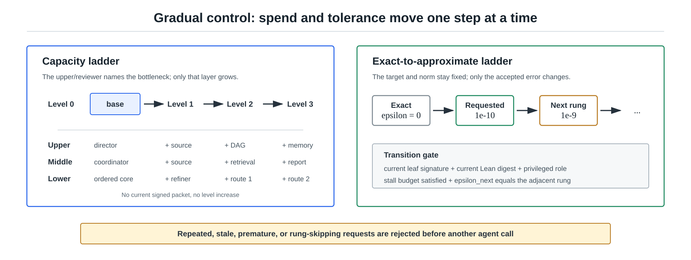

# Sleep Run Guide

Sleep run mode is for unattended state-preparation or block-encoding
construction and proof search.
It creates repeated upper/middle/lower/reviewer cycles, can run bounded upper
and middle panels at checkpoints, and uses Lean as the acceptance gate.



## What It Does

`sleep-run` does these things:

1. Optionally refreshes a task proof blueprint under `proof-blueprints/`.
2. Creates a prompt deck for each cycle under `runs/<run-id>/`.
3. Gives each role a precise prompt and shared dialogue board.
4. Logs each cycle to `runs/trials.jsonl`.
5. Optionally calls an external agent command and runs `lake build`.
6. Refreshes compact memory after each executed cycle.
7. In the 6h wrapper, runs upper/middle panels and writes preferred-language
   summaries, compact memory, and a problem-specific LaTeX proof note once at
   the final audit.
8. When a task requests executable outputs and the matching Lean certificate
   has closed, writes post-Lean Qiskit, QuantumKatas-style, or OpenQASM/QASM
   artifacts and records their export checks.

Before step 2 can execute agents, the deterministic controller reduces the
latest proof-DAG table, latest obligation table, latest feedback per leaf, and
task-relevant Lean source digest.  It then chooses one mode:

- `execute`: a named leaf has a concrete Lean declaration and explicit ready
  status; lower 1 runs before lower 2, and lower 3 runs first only when a named
  necessary-condition diagnostic exists;
- `decompose`: open work exists but no Lean-ready leaf exists, so one bounded
  upper/middle decomposition pass runs and no lower worker runs;
- `dependency_decision`: only an external contract gap blocks progress, so one
  bounded decision pass chooses a local lemma, pinned dependency, explicit
  contract, or human escalation;
- `human_blocked`: no model process is started and `sleep-run` exits with code
  75 after writing a control packet; `closeout` also starts no model process
  and exits successfully because no open work remains.

The controller also rejects a prompt deck before execution when its local
input-token proxy exceeds a per-prompt, per-cycle, or persistent per-task run
budget.  Defaults are configurable with `--max-prompt-tokens`,
`--max-cycle-input-tokens`, `--max-run-input-tokens`,
`--max-no-progress-cycles`, and `--max-external-gap-cycles`.  Generated cycle
directories are bounded by `--retain-run-dirs`; durable Lean, proof ledgers,
trial memory, and control state are retained.  After a human reviews an
intervention packet, `--reset-control-state` is the explicit override that
clears counters and the persistent run-token budget; it should not be placed
in an unattended retry loop.

Technical-report updates for the ABEIS project paper are maintainer-only.  A
normal user run does not update the repository authors' technical report; use
`--project-article-update` only when maintaining the ABEIS paper itself.
Problem-specific proof notes and executable exports are user-facing outputs;
they may be generated by ordinary task runs.

It does not require a specific vendor. The external command can be Codex CLI,
Claude Code, a GPT/OpenAI wrapper, Gemini, GLM, Minimax, or a manual script
that reads one prompt file.  Use `--agent-cmd` for one backend across every
role, or `--agent-profile` when each layer or lower slot should use a
different backend.

## Verifier Feedback Layers

QBE can borrow parser/unit-test/simulator-style feedback from quantum-circuit
benchmarks, but only as diagnostics before Lean theorem closure.

For every substantial lower attempt, record typed verifier feedback.  The
summary CSV now exposes fields such as `feedback_leaf`,
`feedback_error_class`, `source_correspondence_ok`, `lean_parse_ok`,
`lean_build_ok`, `finite_matrix_ok`, `block_entry_ok`,
`ancilla_cleanup_ok`, `normalizer_ok`, `closed_theorem_ok`, and `next_route`.

Use:

```bash
python3 tools/qbe.py trial-log --task QBE-AUTO-002 \
  --role lower \
  --kind attempt \
  --status failed \
  --feedback-field leaf=slot-three-branch-vanish \
  --feedback-field leaf_signature=<current-controller-signature> \
  --feedback-field evidence_digest=<current-lean-evidence-digest> \
  --feedback-field source_correspondence_ok=true \
  --feedback-field lean_build_ok=false \
  --feedback-field finite_matrix_ok=true \
  --feedback-field error_class=symbolic_bridge_gap \
  --feedback-field next_route="prove evalWith-level entry bridge for full index 48"
```

Only privileged upper/reviewer feedback may request `capacity_decision` values
`increase_upper`, `increase_middle`, `increase_lower`, or
`increase_exploration`.  The signature and evidence digest must match the
current controller state; stale requests are ignored.
The latest middle/lower status for a leaf does not erase a privileged policy
packet.  Policy changes commit atomically, and a previous-cycle signature is
accepted for one frontier refresh only when the Lean-evidence digest is
unchanged.

For an operator-construction task, the useful feedback layers are dimension
checks, finite unitarity checks, block-entry checks, ancilla-cleanup checks,
normalizer checks, circuit depth estimates, and Lean build status.  For the
GHL2025 paper benchmark, source correspondence and register/shape checks are
also required because the construction is fixed by the source.  Timeline,
pulse, hardware transpilation, and output-distribution-only checks are not
proofs of a block-encoding contract.

## Choose The Mode First

Before an unattended run, decide which mode the task uses.

Operator block-encoding construction:

- use when the user gives a target operator \(A\), normalizer \(\alpha\), and
  clean-block convention,
- record `maxExactIterations`, `exactStallIterations`, `requiredCost`,
  `requestedEpsilon`, `allowRelaxedEpsilon`, and maximum upper/middle/lower
  agent counts,
- search for exact candidate unitaries or circuits \(U_A\) first,
- score candidates by asymptotic scale first, then gate count, parallel depth,
  auxiliary qubits, and unresolved oracle calls within one concrete tier,
- after exact convergence, continue approximate-improvement search only with
  the exact champion as an `epsilon = 0` incumbent,
- if exact search stalls or misses the resource floor, switch to approximate
  search and report any relaxed epsilon explicitly,
- use `candidate-populations/` for alternative candidates and rejected routes,
- use non-Lean verifier feedback only as necessary-condition diagnostics,
- accept a construction only after Lean proves unitarity plus the exact
  block-entry theorem or the declared approximation-bound theorem.

Paper benchmark:

- use when translating GHL2025 or another cited paper construction,
- keep the paper construction fixed,
- record missing oracle details as proof obligations,
- use `proof-attempts/` for competing proof routes of the same fixed lemma,
- require Markdown/LaTeX updates for Lean declarations tied to the paper,
- prefer three lower roles for hard theorem closure: proof architect, Lean
  worker, and necessary-condition verifier.  Use one lower worker only for
  cheap maintenance cycles.

Exploratory improvement:

- use when starting from a paper benchmark or baseline candidate and searching
  for a better implementation of the same operator contract,
- keep the target operator and block-entry predicate fixed,
- use `candidate-populations/` for competing circuit families and partial
  Lean scores,
- let lower agents try alternative constructions in separated file scopes,
- record failed attempts as trial memory,
- promote repeated failures to open-problem proposals.

The upper prompt must state the mode.  The reviewer should reject a run that
changes the operator contract, mutates a paper benchmark inside the benchmark
task, or accepts a diagnostic score as if it were a Lean theorem.

## Dry Run

Start with a dry run:

```bash
cd /path/to/Auto-Quantum-Computing-Bloack-Encoding-In-Sleep
python3 tools/qbe.py blueprint-status QBE-AUTO-001 --refresh
python3 tools/qbe.py write-context-pack QBE-AUTO-001 --cycle 1
python3 tools/qbe.py sleep-run QBE-AUTO-001 --cycles 2 --dry-run
python3 tools/qbe.py trial-summary
```

`sleep-run` uses adaptive capacity by default.  It starts with a small ordered
queue.  A current upper/reviewer packet may increase one named layer by one
level; the same packet cannot be replayed to grow again.  Exact search opens
the requested tolerance only after its stall budget, or when only explicit
external exact gaps remain and no exact leaf is executable.  Every later
epsilon change must use the adjacent task-declared rung.  Keep exactly one
`## Current Obligation State [ACTIVE]` table with explicit phase, Lean target,
and `active next Lean leaf` status.  Add
`--fixed-capacity --lower-count 3` only for an intentional ablation or stress
test.

Provider rejection is not a repair cycle.  `qbe_codex_agent.sh` returns 78 on
an explicit usage limit, authentication failure, permission failure, or model
access failure; unattended launchers stop immediately.  Exit 75 remains the
deterministic controller/human-intervention stop.  Only transient failures use
bounded retry backoff.

Open the generated files:

```bash
ls runs
sed -n '1,200p' runs/*QBE-AUTO-001-cycle01/10_upper_director.md
sed -n '1,200p' runs/*QBE-AUTO-001-cycle01/dialogue.md
```

## Manual Multi-Agent Use

If you do not want to execute agent CLIs automatically:

1. Run `run-cycle`.
2. Open each prompt file in a different agent session.
3. Tell each agent to work in the same repository.
4. Ask every agent to append a handoff through `agent-note`.
5. Run `trial-summary` and `check`.

Commands:

```bash
python3 tools/qbe.py run-cycle QBE-AUTO-001 \
  --cycle 1 \
  --lower-count 3 \
  --upper-panel \
  --middle-panel \
  --blueprint-refresh
python3 tools/qbe.py blueprint-status QBE-AUTO-001 --refresh
python3 tools/qbe.py agent-note latest --role upper --message "Objective selected."
python3 tools/qbe.py trial-summary
python3 tools/qbe.py check
```

## Automatic Use With An Agent CLI

The command template receives these placeholders:

```text
{root}     repository root
{prompt}   role prompt path
{run_dir}  run directory
{task}     task id
{cycle}    cycle number
{role}     upper, middle, lower, or reviewer
```

Example shape:

```bash
python3 tools/qbe.py sleep-run QBE-OP-001 \
  --cycles 8 \
  --context-mode focused \
  --blueprint-refresh \
  --agent-cmd 'cd {root} && codex exec --full-auto "$(cat {prompt})"' \
  --execute \
  --check-each-cycle
```

After a long run, summarize the log and trial memory before assigning the next
round:

```bash
python3 tools/qbe.py efficiency-report --task QBE-OP-001
```

Use your own agent CLI flags. The only QBE-side expectation is that the command
returns success or failure and leaves artifacts in the repository.

## Mixed-Backend Profiles

For ARIS-style user choice, put a JSON profile under `agent-profiles/` and map
each role to the command installed on the user's machine.  ABEIS resolves
prompt-specific keys first, then role keys, then `default`.

```json
{
  "commands": {
    "upper": "cd {root} && codex exec --dangerously-bypass-approvals-and-sandbox \"$(cat {prompt})\"",
    "middle": "cd {root} && claude -p --permission-mode bypassPermissions \"$(cat {prompt})\"",
    "lower1": "cd {root} && bash tools/vendor_agent_wrapper.example.sh gpt \"{prompt}\"",
    "lower2": "cd {root} && codex exec --dangerously-bypass-approvals-and-sandbox \"$(cat {prompt})\"",
    "lower3": "cd {root} && bash tools/vendor_agent_wrapper.example.sh gemini \"{prompt}\"",
    "reviewer": "cd {root} && bash tools/vendor_agent_wrapper.example.sh glm \"{prompt}\"",
    "default": "cd {root} && codex exec --dangerously-bypass-approvals-and-sandbox \"$(cat {prompt})\""
  }
}
```

Then run:

```bash
python3 tools/qbe.py sleep-run QBE-OP-001 \
  --cycles 4 \
  --lower-count 3 \
  --parallel-lower \
  --agent-profile codex-parallel.example.json \
  --execute \
  --check-each-cycle
```

The profile only chooses who attempts each role.  It does not change the
acceptance standard: a candidate becomes certified only after the configured
Lean gate proves the advertised theorem.

Use panels deliberately:

```bash
python3 tools/qbe.py sleep-run QBE-AUTO-002 \
  --cycles 1 \
  --lower-count 0 \
  --upper-panel \
  --middle-panel \
  --agent-cmd 'cd {root} && codex exec --dangerously-bypass-approvals-and-sandbox "$(cat {prompt})"' \
  --execute \
  --check-each-cycle
```

This is appropriate for final audits or repeated drift.  It is usually too
expensive for every inner proof-search cycle.

## State-Preparation And Operator Construction Run

For a new target, first decide whether it is state preparation or block
encoding.  A state-preparation task should name the target state, normalization
status, initial state, desired exact equation `U |0^n> = |psi>`, tolerated
epsilon, and resource budget.  A block-encoding task should name the
matrix/operator \(A\), the normalizer \(\alpha\), the clean ancilla state, the
desired exact block-entry equation, the tolerated \(\varepsilon\)-approximate
equation, and the exact-search resource budget.

Run one small dry-run first:

```bash
python3 tools/qbe.py new-task QBE-SP-001 \
  --kind statePreparation \
  --mode statePreparation \
  --title "Prepare the target state"
python3 tools/qbe.py blueprint-refresh QBE-SP-001
python3 tools/qbe.py sleep-run QBE-SP-001 \
  --cycles 1 \
  --lower-count 3 \
  --context-mode focused \
  --blueprint-refresh \
  --dry-run
```

For a block-encoding target:

```bash
python3 tools/qbe.py new-task QBE-OP-001 \
  --kind operatorBlockEncoding \
  --mode operatorBlockEncoding \
  --title "Block encoding for the target operator A"
python3 tools/qbe.py blueprint-refresh QBE-OP-001
python3 tools/qbe.py sleep-run QBE-OP-001 \
  --cycles 1 \
  --lower-count 3 \
  --context-mode focused \
  --blueprint-refresh \
  --dry-run
```

Then start a Codex unattended run:

```bash
mkdir -p runs/logs
nohup bash -lc '
python3 tools/qbe.py sleep-run QBE-OP-001 \
  --cycles 4 \
  --lower-count 3 \
  --parallel-lower \
  --context-mode focused \
  --blueprint-refresh \
  --agent-cmd '"'"'cd {root} && codex exec --dangerously-bypass-approvals-and-sandbox "$(cat {prompt})"'"'"' \
  --execute \
  --check-each-cycle
' > runs/logs/codex-qbe-op-001-$(date +%Y%m%d-%H%M%S).log 2>&1 &
```

Lower 1 proposes the candidate family and proof DAG, lower 2 proves one Lean
leaf, and lower 3 runs necessary-condition diagnostics such as finite unitarity
or block-entry checks.  Candidate changes belong in `candidate-populations/`
and must keep the same target operator.

## GHL2025 Paper Benchmark Run

`QBE-AUTO-002` is the first paper benchmark.  It translates the
Guseynov--Huang--Liu Robin construction into the same operator/circuit
semantics used by the general platform.  The paper construction is fixed in
this mode; improvements belong in a separate operator-improvement task.

```bash
python3 tools/qbe.py blueprint-refresh QBE-AUTO-002
python3 tools/qbe.py sleep-run QBE-AUTO-002 \
  --cycles 1 \
  --lower-count 3 \
  --context-mode focused \
  --blueprint-refresh \
  --dry-run
```

## Overnight Checklist

Before starting:

```bash
python3 tools/qbe.py check
python3 tools/qbe.py list-literature
python3 tools/qbe.py next-task
python3 tools/qbe.py blueprint-refresh QBE-OP-001
```

Prepare the active task:

```bash
python3 tools/qbe.py update-task QBE-OP-001 --status active --active
python3 tools/qbe.py conversion-window QBE-OP-001 --title "Target operator block encoding"
```

Start the run:

```bash
python3 tools/qbe.py sleep-run QBE-OP-001 \
  --cycles 8 \
  --lower-count 3 \
  --blueprint-refresh \
  --dry-run
```

Replace `--dry-run` with an `--agent-cmd ... --execute` template only after the
prompt decks look right.

After waking up:

```bash
python3 tools/qbe.py trial-summary
python3 tools/qbe.py status
git status --short
```

Review:

- `runs/trials_summary.csv`,
- latest `runs/<run-id>/90_handoff.md`,
- latest `runs/<run-id>/dialogue.md`,
- latest `proof-blueprints/<task-id>.md`,
- changed Lean files,
- proof obligations and open-problem proposals.

## How This Borrows From Learning Beyond Gradients

Learning Beyond Gradients logs repeated heuristic-search trials as JSONL and
rewrites compact summaries for later agent iterations. QBE applies the same
shape to proof search:

- environment score becomes Lean gate status and `BlockEncodingCost`,
- replay artifacts become conversion windows, proof obligations, and diffs,
- policy edits become Lean/circuit edits,
- failure modes become open problems or rejected directions,
- summary CSV becomes the upper agent's short-term memory.

This is not gradient learning. It is a maintainable heuristic system for
technical block-encoding construction.
