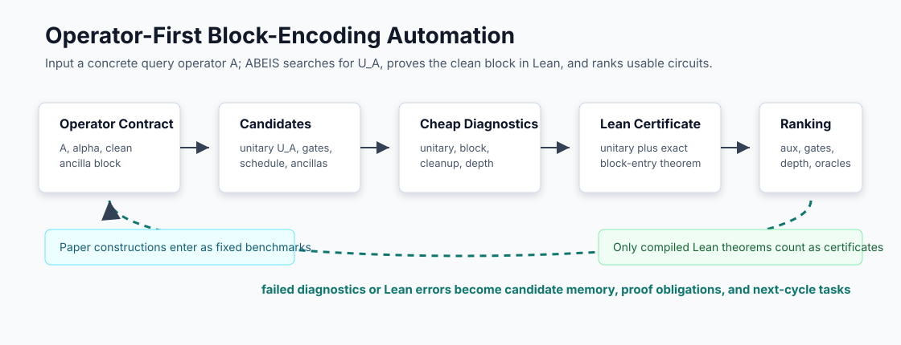

# Sleep Run Guide

Sleep run mode is for unattended block-encoding construction and proof search.
It creates repeated upper/middle/lower/reviewer cycles, can run bounded upper
and middle panels at checkpoints, and uses Lean as the acceptance gate.



## What It Does

`sleep-run` does these things:

1. Optionally refreshes a task proof blueprint under `proof-blueprints/`.
2. Creates a prompt deck for each cycle under `runs/<run-id>/`.
3. Gives each role a precise prompt and shared dialogue board.
4. Logs each cycle to `runs/trials.jsonl`.
5. Optionally calls an external agent command and runs `lake build`.
6. Refreshes compact memory after each executed cycle.
7. In the 6h wrapper, runs upper/middle panels and writes Chinese summaries,
   human status, and article-facing status once at the final audit.

It does not require a specific vendor. The external command can be Codex CLI,
Claude Code, a shell wrapper, or a manual script that reads one prompt file.

## Verifier Feedback Layers

QBE can borrow parser/unit-test/simulator-style feedback from quantum-circuit
benchmarks, but only as diagnostics before Lean theorem closure.

For every substantial lower attempt, record typed verifier feedback.  The
summary CSV now exposes fields such as `feedback_leaf`,
`feedback_error_class`, `source_correspondence_ok`, `lean_parse_ok`,
`lean_build_ok`, `finite_matrix_ok`, `block_entry_ok`,
`ancilla_cleanup_ok`, `normalizer_ok`, `closed_theorem_ok`, and `next_route`.

Use:

```bash
python3 tools/qbe.py trial-log --task QBE-AUTO-002 \
  --role lower \
  --kind attempt \
  --status failed \
  --feedback-field leaf=slot-three-branch-vanish \
  --feedback-field source_correspondence_ok=true \
  --feedback-field lean_build_ok=false \
  --feedback-field finite_matrix_ok=true \
  --feedback-field error_class=symbolic_bridge_gap \
  --feedback-field next_route="prove evalWith-level entry bridge for full index 48"
```

For an operator-construction task, the useful feedback layers are dimension
checks, finite unitarity checks, block-entry checks, ancilla-cleanup checks,
normalizer checks, circuit depth estimates, and Lean build status.  For the
GHL2025 paper benchmark, source correspondence and register/shape checks are
also required because the construction is fixed by the source.  Timeline,
pulse, hardware transpilation, and output-distribution-only checks are not
proofs of a block-encoding contract.

## Choose The Mode First

Before an unattended run, decide which mode the task uses.

Operator block-encoding construction:

- use when the user gives a target operator \(A\), normalizer \(\alpha\), and
  clean-block convention,
- search for candidate unitaries or circuits \(U_A\),
- score candidates by parallel depth, gate count, auxiliary qubits, and
  unresolved oracle calls,
- use `candidate-populations/` for alternative candidates and rejected routes,
- use non-Lean verifier feedback only as necessary-condition diagnostics,
- accept a construction only after Lean proves unitarity and the exact
  block-entry theorem.

Paper benchmark:

- use when translating GHL2025 or another cited paper construction,
- keep the paper construction fixed,
- record missing oracle details as proof obligations,
- use `proof-attempts/` for competing proof routes of the same fixed lemma,
- require Markdown/LaTeX updates for Lean declarations tied to the paper,
- prefer three lower roles for hard theorem closure: proof architect, Lean
  worker, and necessary-condition verifier.  Use one lower worker only for
  cheap maintenance cycles.

Exploratory improvement:

- use when starting from a paper benchmark or baseline candidate and searching
  for a better implementation of the same operator contract,
- keep the target operator and block-entry predicate fixed,
- use `candidate-populations/` for competing circuit families and partial
  Lean scores,
- let lower agents try alternative constructions in separated file scopes,
- record failed attempts as trial memory,
- promote repeated failures to open-problem proposals.

The upper prompt must state the mode.  The reviewer should reject a run that
changes the operator contract, mutates a paper benchmark inside the benchmark
task, or accepts a diagnostic score as if it were a Lean theorem.

## Dry Run

Start with a dry run:

```bash
cd /path/to/Auto-Quantum-Computing-Bloack-Encoding-In-Sleep
python3 tools/qbe.py blueprint-status QBE-AUTO-001 --refresh
python3 tools/qbe.py write-context-pack QBE-AUTO-001 --cycle 1
python3 tools/qbe.py sleep-run QBE-AUTO-001 --cycles 2 --lower-count 3 --dry-run
python3 tools/qbe.py trial-summary
```

Open the generated files:

```bash
ls runs
sed -n '1,200p' runs/*QBE-AUTO-001-cycle01/10_upper_director.md
sed -n '1,200p' runs/*QBE-AUTO-001-cycle01/dialogue.md
```

## Manual Multi-Agent Use

If you do not want to execute agent CLIs automatically:

1. Run `run-cycle`.
2. Open each prompt file in a different agent session.
3. Tell each agent to work in the same repository.
4. Ask every agent to append a handoff through `agent-note`.
5. Run `trial-summary` and `check`.

Commands:

```bash
python3 tools/qbe.py run-cycle QBE-AUTO-001 \
  --cycle 1 \
  --lower-count 3 \
  --upper-panel \
  --middle-panel \
  --blueprint-refresh
python3 tools/qbe.py blueprint-status QBE-AUTO-001 --refresh
python3 tools/qbe.py agent-note latest --role upper --message "Objective selected."
python3 tools/qbe.py trial-summary
python3 tools/qbe.py check
```

## Automatic Use With An Agent CLI

The command template receives these placeholders:

```text
{root}     repository root
{prompt}   role prompt path
{run_dir}  run directory
{task}     task id
{cycle}    cycle number
{role}     upper, middle, lower, or reviewer
```

Example shape:

```bash
python3 tools/qbe.py sleep-run QBE-OP-001 \
  --cycles 8 \
  --lower-count 3 \
  --context-mode focused \
  --blueprint-refresh \
  --agent-cmd 'cd {root} && codex exec --full-auto "$(cat {prompt})"' \
  --execute \
  --check-each-cycle
```

After a long run, summarize the log and trial memory before assigning the next
round:

```bash
python3 tools/qbe.py efficiency-report --task QBE-OP-001
```

Use your own agent CLI flags. The only QBE-side expectation is that the command
returns success or failure and leaves artifacts in the repository.

Use panels deliberately:

```bash
python3 tools/qbe.py sleep-run QBE-AUTO-002 \
  --cycles 1 \
  --lower-count 0 \
  --upper-panel \
  --middle-panel \
  --agent-cmd 'cd {root} && codex exec --dangerously-bypass-approvals-and-sandbox "$(cat {prompt})"' \
  --execute \
  --check-each-cycle
```

This is appropriate for final audits or repeated drift.  It is usually too
expensive for every inner proof-search cycle.

## Operator Construction Run

For a new target, create an operator-first task.  The task file should name
the matrix/operator \(A\), the normalizer \(\alpha\), the clean ancilla state,
and the desired block-entry equation.

Run one small dry-run first:

```bash
python3 tools/qbe.py new-task QBE-OP-001 \
  --kind operatorBlockEncoding \
  --mode operatorBlockEncoding \
  --title "Block encoding for the target operator A"
python3 tools/qbe.py blueprint-refresh QBE-OP-001
python3 tools/qbe.py sleep-run QBE-OP-001 \
  --cycles 1 \
  --lower-count 3 \
  --context-mode focused \
  --blueprint-refresh \
  --dry-run
```

Then start a Codex unattended run:

```bash
mkdir -p runs/logs
nohup bash -lc '
python3 tools/qbe.py sleep-run QBE-OP-001 \
  --cycles 4 \
  --lower-count 3 \
  --parallel-lower \
  --context-mode focused \
  --blueprint-refresh \
  --agent-cmd '"'"'cd {root} && codex exec --dangerously-bypass-approvals-and-sandbox "$(cat {prompt})"'"'"' \
  --execute \
  --check-each-cycle
' > runs/logs/codex-qbe-op-001-$(date +%Y%m%d-%H%M%S).log 2>&1 &
```

Lower 1 proposes the candidate family and proof DAG, lower 2 proves one Lean
leaf, and lower 3 runs necessary-condition diagnostics such as finite unitarity
or block-entry checks.  Candidate changes belong in `candidate-populations/`
and must keep the same target operator.

## GHL2025 Paper Benchmark Run

`QBE-AUTO-002` is the first paper benchmark.  It translates the
Guseynov--Huang--Liu Robin construction into the same operator/circuit
semantics used by the general platform.  The paper construction is fixed in
this mode; improvements belong in a separate operator-improvement task.

```bash
python3 tools/qbe.py blueprint-refresh QBE-AUTO-002
python3 tools/qbe.py sleep-run QBE-AUTO-002 \
  --cycles 1 \
  --lower-count 3 \
  --context-mode focused \
  --blueprint-refresh \
  --dry-run
```

## Overnight Checklist

Before starting:

```bash
python3 tools/qbe.py check
python3 tools/qbe.py list-literature
python3 tools/qbe.py next-task
python3 tools/qbe.py blueprint-refresh QBE-OP-001
```

Prepare the active task:

```bash
python3 tools/qbe.py update-task QBE-OP-001 --status active --active
python3 tools/qbe.py conversion-window QBE-OP-001 --title "Target operator block encoding"
```

Start the run:

```bash
python3 tools/qbe.py sleep-run QBE-OP-001 \
  --cycles 8 \
  --lower-count 3 \
  --blueprint-refresh \
  --dry-run
```

Replace `--dry-run` with an `--agent-cmd ... --execute` template only after the
prompt decks look right.

After waking up:

```bash
python3 tools/qbe.py trial-summary
python3 tools/qbe.py status
git status --short
```

Review:

- `runs/trials_summary.csv`,
- latest `runs/<run-id>/90_handoff.md`,
- latest `runs/<run-id>/dialogue.md`,
- latest `proof-blueprints/<task-id>.md`,
- changed Lean files,
- proof obligations and open-problem proposals.

## How This Borrows From Learning Beyond Gradients

Learning Beyond Gradients logs repeated heuristic-search trials as JSONL and
rewrites compact summaries for later agent iterations. QBE applies the same
shape to proof search:

- environment score becomes Lean gate status and `BlockEncodingCost`,
- replay artifacts become conversion windows, proof obligations, and diffs,
- policy edits become Lean/circuit edits,
- failure modes become open problems or rejected directions,
- summary CSV becomes the upper agent's short-term memory.

This is not gradient learning. It is a maintainable heuristic system for
technical block-encoding construction.
